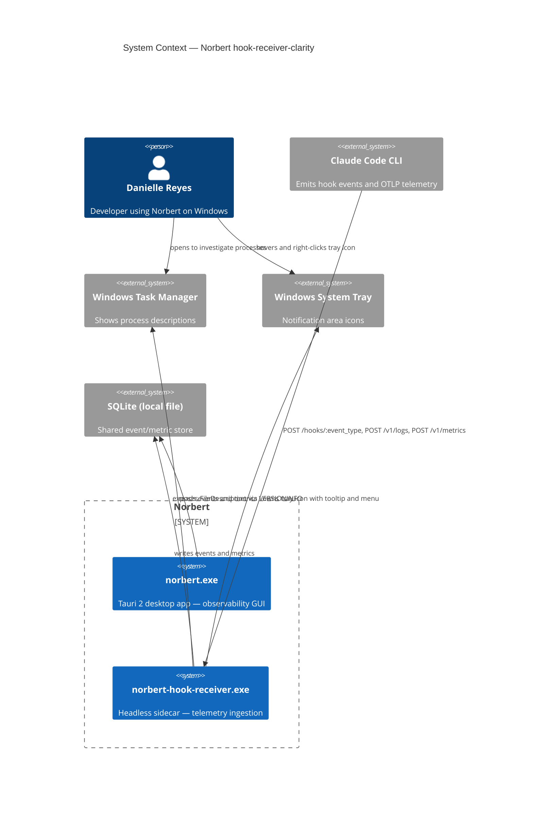
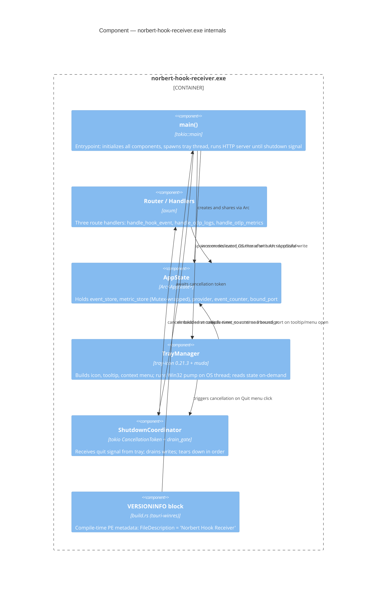

# Architecture: hook-receiver-clarity

**Feature**: Two-part improvement to `norbert-hook-receiver.exe`
**Wave**: DESIGN
**Date**: 2026-03-25
**Paradigm**: Functional (per CLAUDE.md)
**Stories**: US-HRC-01 (VERSIONINFO), US-HRC-02 (system tray)

---

## System Context

### Existing System Analysis

The codebase contains a single Cargo package (`norbert`) that produces two binaries sharing the same crate:

| Binary | Target | Current state |
|--------|--------|---------------|
| `norbert` | `src/main.rs` | Tauri 2 desktop app with tray icon; VERSIONINFO embedded via `tauri_build::build()` |
| `norbert-hook-receiver` | `src/hook_receiver.rs` | Headless Axum/tokio HTTP server; **no VERSIONINFO**; **no tray icon**; exits on port failure |

Key finding from codebase analysis:
- `tray-icon 0.21.3` is already in `Cargo.lock` as a transitive dep via `tauri = { features = ["tray-icon"] }`.
- `tauri-winres 0.3.5` is already in `Cargo.lock` as a transitive dep via `tauri-build`.
- The current `build.rs` calls only `tauri_build::build()` — embeds VERSIONINFO for the Tauri binary only.
- `tray-icon 0.21.3` depends on `crossbeam-channel` + `windows-sys 0.60.2` on Windows. **No `winit` dependency.** The crate drives its own Win32 message pump via `windows-sys` — it does not require a `winit` event loop.

### Spike Resolution

**Question**: Can `tray-icon` be used directly in a non-Tauri binary, or does it need `winit`?

**Answer**: Yes — `tray-icon` is usable standalone. Version 0.21.3 ships its own Win32 message pump on Windows (using `windows-sys` directly). It does not require `winit`. The crate's README explicitly documents standalone usage via `TrayIconEvent::set_event_handler`. A dedicated OS thread runs the message pump loop; no `winit` runtime is involved.

**Evidence**: `Cargo.lock` — `tray-icon 0.21.3` dependency list contains no `winit` entry.

---

## C4 — System Context (L1)



---

## C4 — Container (L2)

```mermaid
C4Container
  title Container — norbert-hook-receiver.exe (post hook-receiver-clarity)

  Person(danielle, "Danielle Reyes")

  Container_Boundary(hr_binary, "norbert-hook-receiver.exe") {
    Container(http_server, "Axum HTTP Server", "Rust / tokio", "Handles POST /hooks, /v1/logs, /v1/metrics on port 3748")
    Container(tray_thread, "Tray OS Thread", "Rust / tray-icon + windows-sys", "Owns Win32 message pump; drives tray icon lifecycle")
    Container(state_store, "Process State", "Rust / Arc<AtomicU64> + Option<u16>", "Shared event counter and bound port; tray reads on-demand")
    Container(shutdown_coord, "Shutdown Coordinator", "Rust / tokio CancellationToken + drain gate", "Receives quit signal; drains SQLite writes; exits cleanly")
  }

  ContainerDb(sqlite, "SQLite", "local file", "Events and metrics")
  System_Ext(taskmanager, "Windows Task Manager")
  System_Ext(systemtray, "Windows System Tray")
  System_Ext(claudecode, "Claude Code CLI")

  Rel(claudecode, http_server, "POST telemetry")
  Rel(http_server, sqlite, "writes via EventStore/MetricStore ports")
  Rel(http_server, state_store, "increments event counter after each write")
  Rel(danielle, systemtray, "hovers and right-clicks")
  Rel(systemtray, tray_thread, "delivers Win32 tray messages")
  Rel(tray_thread, state_store, "reads event_count and port on-demand")
  Rel(tray_thread, shutdown_coord, "signals quit when Quit menu item selected")
  Rel(shutdown_coord, http_server, "cancels tokio server task")
  Rel(shutdown_coord, sqlite, "awaits drain completion (max 2s)")
  Rel(shutdown_coord, tray_thread, "removes tray icon then joins thread")
  Rel(hr_binary, taskmanager, "exposes FileDescription via PE VERSIONINFO")
```

---

## C4 — Component (L3): norbert-hook-receiver.exe

Justification for L3: 5+ distinct internal concerns with cross-cutting interactions.



---

## Component Architecture

### US-HRC-01: VERSIONINFO Embedding

**Approach**: Extend `build.rs` with a per-binary VERSIONINFO block for `norbert-hook-receiver`. `tauri-winres` (already in the dep graph via `tauri-build`) supports this pattern. Since `tauri_build::build()` only instruments the default binary (`norbert`), a separate `winres`/`tauri-winres` call for the hook receiver binary is required.

**Pattern**: Detect `CARGO_BIN_NAME` in `build.rs`. When building the hook receiver binary, emit a second resource file with `FileDescription = "Norbert Hook Receiver"`. When building the main GUI binary, `tauri_build::build()` handles it as today.

**Why not modify the existing resource.rc**: `tauri_build::build()` generates the `.rc` file into `OUT_DIR`. There is no supported API to override individual fields. A `cfg(bin = "norbert-hook-receiver")` conditional in `build.rs` + direct `tauri_winres::WindowsResource` call is the correct approach.

**Compile-time only**: Zero runtime changes. No new binary deps.

### US-HRC-02: System Tray

#### Event Loop Architecture

The `tray-icon` crate on Windows uses a dedicated Win32 message pump. On non-Tauri binaries this must be driven explicitly. The minimal approach:

1. Spawn one OS thread (`std::thread::spawn`) before the tokio runtime starts.
2. That thread creates the `TrayIcon`, sets an event handler closure, and enters a `loop { std::thread::sleep(Duration::from_millis(16)) }` tick loop to drain the `TrayIconEvent` channel.
3. The Axum/tokio HTTP server runs on the main thread (or a tokio task) — fully independent.

**Why dedicated OS thread, not tokio task**: `tray-icon`'s Win32 pump is synchronous/blocking; mixing it with an async tokio executor risks blocking the runtime. An OS thread is isolated and has negligible cost.

**Why not `winit`**: `tray-icon` 0.21.3 does not require `winit`. Adding `winit` would introduce ~12 transitive crates and force a full `EventLoop` abstraction with no benefit for this use case.

#### Shared State Design

Two values are shared between the HTTP request handlers and the tray:

| Value | Type | Sharing pattern |
|-------|------|----------------|
| `event_count` | `AtomicU64` | Lock-free; incremented by handlers, read by tray |
| `bound_port` | `Option<u16>` stored as `AtomicU32` (0 = unavailable) | Set once after bind, read by tray |

Both values live on the existing `AppState` struct (already `Arc`-shared). No new synchronization primitives are introduced beyond what `AppState` already uses.

**Tooltip refresh**: Read on-demand when `TrayIconEvent::MouseMove` or tooltip open event fires. No background polling timer. This satisfies the AC "no background polling" requirement.

**Event count accuracy**: The counter increments after a confirmed successful `write_event` or `accumulate_delta` call inside the handler. Tray reads the atomic directly — no lock required.

#### Graceful Shutdown Flow

```
Quit clicked
    -> tray thread: cancels CancellationToken
    -> main task: axum::serve() select! cancels
    -> main task: signals drain gate (in-flight SQLite Mutex guards release naturally)
    -> main task: waits tokio::time::timeout(DRAIN_TIMEOUT_SECS) for drain gate
    -> on timeout: log warning "SQLite drain incomplete — forced exit"
    -> main task: signals tray thread to remove icon + join
    -> process exits with code 0
```

`DRAIN_TIMEOUT_SECS` is a named constant (2 seconds). It is not a magic number.

**Port-bind-fail path**: If `TcpListener::bind` fails, `bound_port` is set to 0 (unavailable). The tray icon still appears. Tooltip and menu display "Port: unavailable".

---

## Technology Stack

| Component | Technology | Version | License | Rationale |
|-----------|-----------|---------|---------|-----------|
| Tray icon (Windows) | `tray-icon` | 0.21.3 (already in Cargo.lock) | MIT | Transitive dep already present; no new cargo dep; standalone usage confirmed |
| Context menu | `muda` | 0.17.1 (already in Cargo.lock) | MIT | Pulled by `tray-icon`; provides `Menu`, `MenuItem`, `PredefinedMenuItem` |
| VERSIONINFO embedding | `tauri-winres` | 0.3.5 (already in Cargo.lock) | MIT | Already pulled via `tauri-build`; `WindowsResource` API used in `build.rs` |
| Async runtime | `tokio` | 1 (existing) | MIT | No change |
| HTTP server | `axum` | 0.7 (existing) | MIT | No change |
| Shared counter | `std::sync::atomic::AtomicU64` | std | — | Zero-cost; no new dep |
| Shutdown coordination | `tokio_util::sync::CancellationToken` | via tokio (existing) | MIT | Clean async cancellation primitive |

**New Cargo.toml dependencies added**: Zero. All required crates are already in the dependency graph.

---

## Integration Patterns

### Build Pipeline Integration

`build.rs` extended with conditional VERSIONINFO emission:

- Detect `CARGO_BIN_NAME` at build time
- When `== "norbert-hook-receiver"`: call `tauri_winres::WindowsResource` with `FileDescription = "Norbert Hook Receiver"` and emit compiled resource
- When `== "norbert"` (or default): `tauri_build::build()` handles as today — no change to GUI binary

Validation: PowerShell `(Get-ItemProperty 'norbert-hook-receiver.exe').VersionInfo.FileDescription` or `sigcheck -a`.

### HTTP Handler → Tray State Integration

Event counter increment occurs at the **effect boundary** (adapter layer): after a confirmed successful persistence call inside each handler. This keeps the increment co-located with the mutation it measures.

### Tray Thread → Shutdown Integration

`CancellationToken` (from `tokio_util`) is the interface contract between the tray OS thread (synchronous) and the tokio async runtime. The tray thread calls `.cancel()` — a thread-safe synchronous operation. The tokio `main` task `select!`s on `.cancelled()`.

---

## Quality Attribute Strategies

### Performance
- Atomic counter: lock-free read/write — zero contention between handlers and tray
- Tray tooltip reads state on-demand (no polling loop) — zero CPU overhead between interactions
- Dedicated OS thread for tray pump: isolated from tokio thread pool

### Reliability
- Port-bind failure: tray still appears, shows "Port: unavailable" — no crash
- Drain timeout: forced exit after 2s with log warning — no hang on shutdown
- VERSIONINFO: compile-time — no runtime risk

### Maintainability
- `DRAIN_TIMEOUT_SECS` named constant — adjustable in one place
- All tray logic isolated in `TrayManager` component — no coupling to HTTP handlers
- Shutdown coordination flows in one direction: tray → `CancellationToken` → tokio main

### Observability
- Tray tooltip is live observability for the process state
- Shutdown warning logged to stderr (consistent with existing `eprintln!` pattern)

---

## Dependency-Inversion Compliance

This feature adds platform UI (tray) and build-time metadata. The existing ports-and-adapters structure of `norbert_lib` is not modified. The hook receiver `main()` is the composition root — it assembles adapters. The tray component is a **driving adapter** (it reads process state and signals quit). It depends inward on `AppState` (domain state), never the reverse.

---

## Rejected Simple Alternatives

### Alternative 1: Console window title as status indicator
- What: Set the console window title (via `SetConsoleTitleW`) to "Norbert Hook Receiver — :3748 — 42 events"
- Expected Impact: Solves 10% of the problem (process identity only when console visible; invisible on headless startup)
- Why Insufficient: Hook receiver starts hidden (no console window); Task Manager Description column is not the console title; provides no tray presence or graceful quit

### Alternative 2: Named pipe / IPC status endpoint (no tray)
- What: Expose a `/status` HTTP endpoint; Danielle queries via browser or curl
- Expected Impact: Solves ~30% (port confirmation, event count readable on demand) but zero passive visibility
- Why Insufficient: Requires active lookup; no Windows-idiomatic passive "I am running" signal; no graceful quit affordance; does not address Task Manager Description column at all

### Why the specified solution is necessary
1. VERSIONINFO is the only mechanism that populates Task Manager's Description column — no alternative exists on Windows
2. System tray is the Windows platform idiom for "background process presence + control" — alternatives (taskbar button, console window, HTTP endpoint) fail the passive visibility and graceful-quit requirements

---

## ADRs

- [ADR-039](../../../adrs/ADR-039-hook-receiver-versioninfo-strategy.md) — VERSIONINFO embedding approach for hook receiver binary
- [ADR-040](../../../adrs/ADR-040-hook-receiver-tray-icon-architecture.md) — Tray icon event loop and state-sharing architecture

---

## Implementation Roadmap

See: `roadmap.yaml` in this directory.

---

## Handoff Package

Receiver: **acceptance-designer** (DISTILL wave)

| Artifact | Path |
|----------|------|
| Architecture document | `docs/feature/hook-receiver-clarity/design/architecture.md` |
| Roadmap | `docs/feature/hook-receiver-clarity/design/roadmap.yaml` |
| ADR-039 | `docs/adrs/ADR-039-hook-receiver-versioninfo-strategy.md` |
| ADR-040 | `docs/adrs/ADR-040-hook-receiver-tray-icon-architecture.md` |
| JTBD analysis | `docs/feature/hook-receiver-clarity/discuss/jtbd-analysis.md` |
| User stories + BDD scenarios | `docs/feature/hook-receiver-clarity/discuss/user-stories.md` |
| Shared artifacts registry | `docs/feature/hook-receiver-clarity/discuss/shared-artifacts-registry.md` |
| Journey visual | `docs/feature/hook-receiver-clarity/discuss/journey-hook-receiver-clarity-visual.md` |

Development paradigm: **Functional** (CLAUDE.md). Roadmap AC uses FP framing: values not mutations, effect boundaries explicit, named constants over magic numbers.
