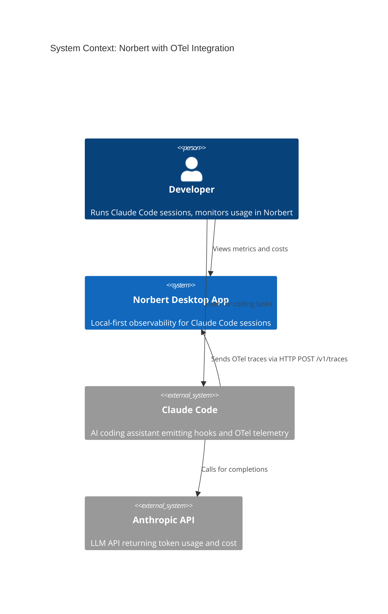
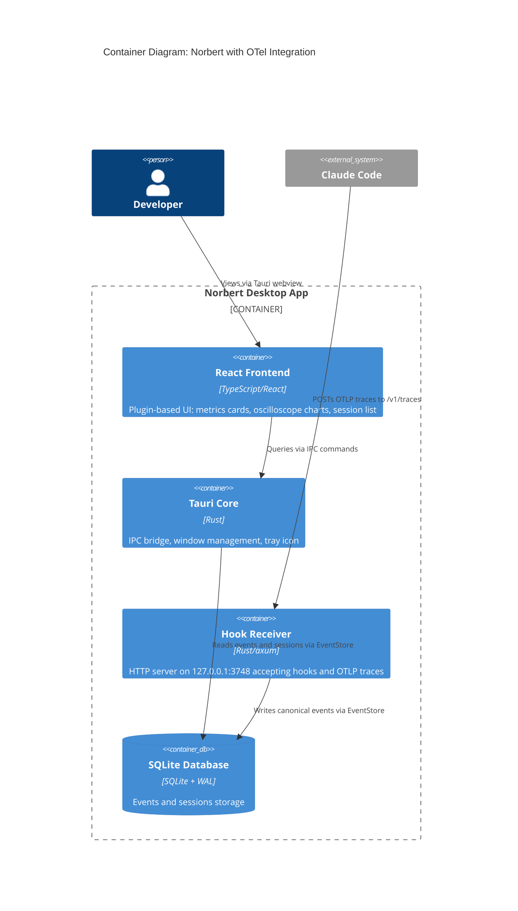
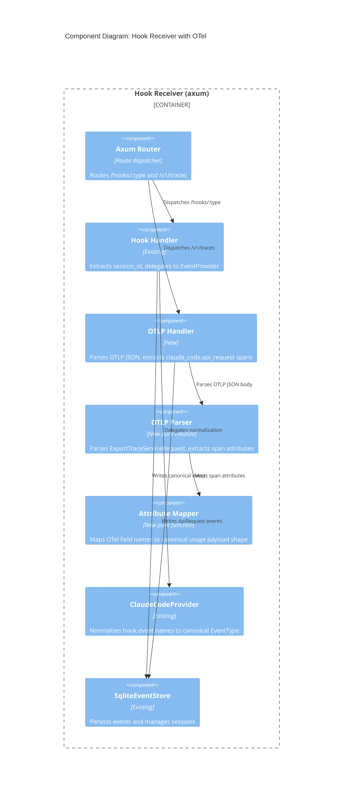

# Architecture Design: Claude Code OTel Integration

**Feature ID**: claude-otel-integration
**Date**: 2026-03-20
**Architect**: Morgan (solution-architect)

---

## System Context

Norbert is a local-first desktop observability app. Claude Code sessions emit hook events and (with this feature) OTel trace data. Both data streams converge on the same axum HTTP server, flow through the EventStore, and surface in the React frontend.

### C4 Level 1: System Context



### C4 Level 2: Container Diagram



### C4 Level 3: Component Diagram (Hook Receiver)

The hook receiver gains a second ingestion path alongside the existing hook handler.



---

## Architecture Approach

**Style**: Modular monolith with ports-and-adapters (existing). This feature extends the existing axum adapter with a new ingestion path. No new processes, services, or databases.

**Justification**: Solo developer, sub-second latency requirement, existing infrastructure handles the workload. Adding a route to the existing HTTP server is the simplest viable approach. See ADR-030.

### Rejected Simpler Alternatives

1. **Configuration-only (point OTel at existing hook route)**: OTel OTLP format differs fundamentally from hook JSON payloads. The existing `/hooks/:type` handler expects `session_id` at the top level and delegates to `EventProvider.normalize()`. OTLP uses `ExportTraceServiceRequest` with nested `resourceSpans[].scopeSpans[].spans[]`. Cannot reuse without a new parser. Impact: 0% of problem solved.

2. **Separate OTel collector process (e.g., otel-collector-contrib)**: Adds process management complexity, 50MB+ binary, configuration overhead. Norbert's local-first single-binary philosophy (ADR-005) opposes this. The only OTLP operation needed is extracting 6 attributes from one span type. Impact: 100% of problem solved but violates constraints.

---

## Data Flow

```
Claude Code API Response
    |
    +-- OTel SDK emits span --> POST /v1/traces (OTLP/HTTP JSON)
    |                               |
    |                               v
    |                         otlp_handler (axum)
    |                               |
    |                         Parse ExportTraceServiceRequest
    |                         Filter: name == "claude_code.api_request"
    |                         Extract session_id from span/resource attributes
    |                         Map: cache_read_tokens -> cache_read_input_tokens
    |                               cache_creation_tokens -> cache_creation_input_tokens
    |                               |
    |                               v
    |                         Event { event_type: ApiRequest,
    |                                 payload: { usage: {...} },
    |                                 provider: "claude_code" }
    |                               |
    +-- Hook SDK emits -----> POST /hooks/:type
    |                               |
    |                         EventProvider.normalize()
    |                               |
    +----> Both paths ---------> EventStore.write_event()
                                    |
                                    v
                              SQLite (WAL mode)
                                    |
                              Frontend polls via IPC
                                    |
                              tokenExtractor -> pricingModel -> metricsAggregator
                                    |
                              Charts + metric cards
```

---

## Key Design Decisions

### 1. OTLP JSON Parsing Without opentelemetry-proto

Parse OTLP JSON with `serde_json` (already a dependency) using hand-written Rust structs matching the OTLP JSON schema subset we need. Avoids adding `opentelemetry-proto` + `prost` dependencies (~2-5MB binary impact). See ADR-031.

### 2. Session ID Extraction Strategy

OTel spans from Claude Code carry session_id as a span attribute or resource attribute. The OTLP handler checks span attributes first, then resource attributes, for a `session_id` key. If the same session sends both hooks and OTel, the session_id format must match. If not found, the span is dropped with a warning log. See ADR-032.

### 3. Authoritative Cost Bypass

When `cost_usd` is present in an ApiRequest event payload, the frontend cost pipeline uses it directly, bypassing `pricingModel.ts`. The pricing model remains as fallback for transcript-polled events. This is a frontend-only change in `metricsAggregator.ts`. See ADR-033.

### 4. Transcript Polling Suppression

Per-session detection: if a session has received any `api_request` events (via `get_session_events` IPC or accumulated in frontend state), transcript polling is skipped for that session. Detection is derived, not stored -- no database schema change. See ADR-034.

---

## Quality Attribute Strategies

| Attribute | Strategy | Measurable Target |
|-----------|----------|-------------------|
| **Latency** | Direct HTTP push (no polling), synchronous write, WAL mode for concurrent read | <50ms from span receipt to SQLite persistence |
| **Correctness** | Authoritative `cost_usd` from Anthropic replaces estimated pricing | Cost matches Anthropic billing exactly |
| **Backward Compatibility** | OTel path is additive; transcript polling continues for non-OTel sessions | Zero regression for existing users |
| **Reliability** | Malformed payloads return 400/200 (never crash); missing attributes drop span with warning | Hook receiver never panics from bad OTel data |
| **Maintainability** | OTLP parser is a pure module with no IO; attribute mapper is a pure function | Testable in isolation without HTTP/DB |

---

## Deployment Architecture

No change. Hook receiver binary (`norbert-hook-receiver`) is launched as a sidecar by the Tauri app. The new `/v1/traces` route is added to the same axum router on the same port (3748). No new processes, ports, or configuration files.

User enablement: set two environment variables before starting Claude Code:
```
CLAUDE_CODE_ENABLE_TELEMETRY=1
OTEL_EXPORTER_OTLP_ENDPOINT=http://127.0.0.1:3748
```
