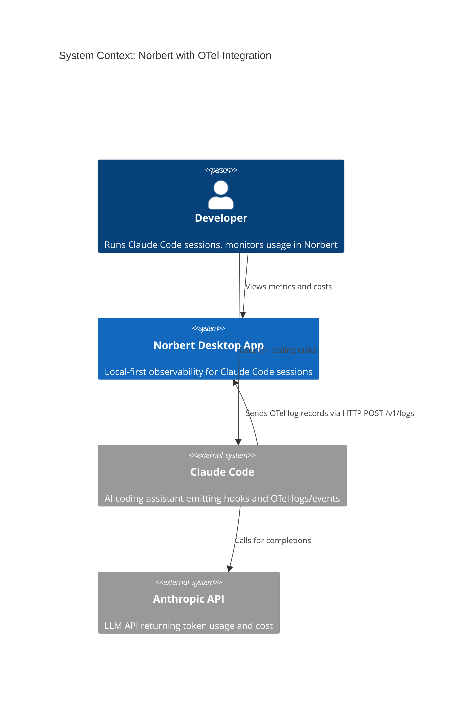
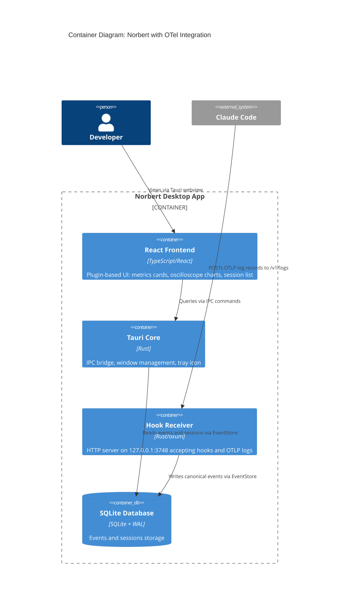
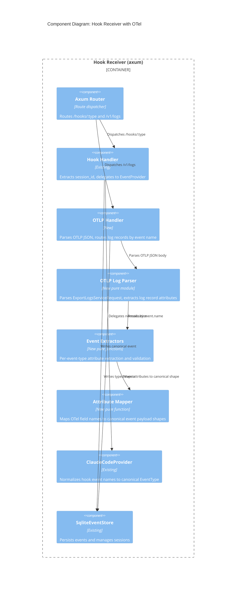

# Architecture Design: Claude Code OTel Integration

**Feature ID**: claude-otel-integration
**Date**: 2026-03-23 (corrected from 2026-03-20 based on research findings)
**Architect**: Morgan (solution-architect)
**Research Reference**: `docs/research/claude-code-otel-telemetry-actual-emissions.md`

---

## Critical Corrections from Research

The 2026-03-20 design incorrectly assumed Claude Code sends OTel **traces** (`ExportTraceServiceRequest` to `/v1/traces`). Research confirmed:

| Assumption | Previous Design | Corrected |
|-----------|----------------|-----------|
| OTel signal type | Traces (spans) | **Logs** (log records / events) |
| OTLP route | `POST /v1/traces` | **`POST /v1/logs`** |
| Payload wrapper | `resourceSpans / scopeSpans / spans` | **`resourceLogs / scopeLogs / logRecords`** |
| Session ID attribute | `session_id` (underscore) | **`session.id`** (dot-separated) |
| Session ID location | Span or resource attributes | **Standard attribute on log records** (not resource) |
| Event types | 1 (`api_request` only) | **5** (api_request, user_prompt, tool_result, api_error, tool_decision) |
| cost_usd accuracy | "Authoritative from billing" | **"Estimated"** (per Anthropic docs; still more accurate than local table) |

---

## System Context

Norbert is a local-first desktop observability app. Claude Code sessions emit hook events and (with this feature) OTel log/event data. Both data streams converge on the same axum HTTP server, flow through the EventStore, and surface in the React frontend.

### C4 Level 1: System Context



### C4 Level 2: Container Diagram



### C4 Level 3: Component Diagram (Hook Receiver)

The hook receiver gains a second ingestion path alongside the existing hook handler. The OTLP path handles 5 event types via a generic log record parser with event-type-specific attribute extractors.



---

## Architecture Approach

**Style**: Modular monolith with ports-and-adapters (existing). This feature extends the existing axum adapter with a new ingestion path. No new processes, services, or databases.

**Justification**: Solo developer, sub-second latency requirement, existing infrastructure handles the workload. Adding a route to the existing HTTP server is the simplest viable approach. See ADR-030.

### Rejected Simpler Alternatives

1. **Configuration-only (point OTel at existing hook route)**: OTel OTLP format differs fundamentally from hook JSON payloads. The existing `/hooks/:type` handler expects `session_id` at the top level and delegates to `EventProvider.normalize()`. OTLP uses `ExportLogsServiceRequest` with nested `resourceLogs[].scopeLogs[].logRecords[]`. Cannot reuse without a new parser. Impact: 0% of problem solved.

2. **Separate OTel collector process (e.g., otel-collector-contrib)**: Adds process management complexity, 50MB+ binary, configuration overhead. Norbert's local-first single-binary philosophy (ADR-005) opposes this. The only OTLP operation needed is extracting attributes from 5 event types. Impact: 100% of problem solved but violates constraints.

---

## Key Design Decisions

### 1. Generic OTLP Log Parser with Per-Event-Type Extractors

Parse the `ExportLogsServiceRequest` envelope generically (shared across all event types). Route individual log records by `event.name` to type-specific attribute extractors. Each extractor validates required attributes and maps to a canonical payload shape.

**Rationale**: The OTLP envelope structure (`resourceLogs/scopeLogs/logRecords`) is identical for all 5 event types. Only the per-record attributes differ. A generic parser + specific extractors avoids duplicating envelope parsing 5 times while keeping each event type's validation clean and independent.

**Alternative rejected**: Separate parser per event type. Would duplicate ~80% of the parsing logic (envelope traversal, attribute value type handling, session.id extraction). See ADR-031.

### 2. Five New EventType Variants

Add `ApiRequest`, `UserPrompt`, `ToolResult`, `ApiError`, and `ToolDecision` to the `EventType` enum. Each maps 1:1 to a Claude Code OTel event name.

**Rationale**: Each event type has distinct attributes, distinct required fields, and distinct frontend handling. A single generic "OtelEvent" variant would push type discrimination to the frontend (stringly-typed), losing the compile-time exhaustiveness checking that Rust provides.

**Alternative rejected**: Single `OtelEvent` variant with event_name as a payload field. Loses type safety, forces runtime string matching in all consumers.

### 3. Session ID from `session.id` (Not `session_id`)

Research confirmed: the session identifier is `session.id` (dot-separated) as a standard attribute on each log record, NOT `session_id` (underscore) and NOT a resource attribute. The parser extracts `session.id` from log record attributes only. See ADR-032.

### 4. OTel-Reported Cost Bypass

When `cost_usd` is present in an ApiRequest event payload, the frontend cost pipeline uses it directly, bypassing `pricingModel.ts`. The pricing model remains as fallback for transcript-polled events. Note: Anthropic describes `cost_usd` as "estimated" -- it is not authoritative billing data but is closer to actual pricing than Norbert's local table. See ADR-033.

### 5. Transcript Polling Suppression

Per-session detection: if a session has received any events via the OTel path (`api_request` event type), transcript polling is skipped for that session. Detection is derived, not stored -- no database schema change. See ADR-034.

### 6. OTel Metrics (`/v1/metrics`) -- Deferred to `otel-rich-dashboard`

Claude Code also sends `ExportMetricsServiceRequest` to `/v1/metrics` with 8 aggregated counters (token.usage, cost.usage, session.count, active_time.total, lines_of_code.count, commit.count, pull_request.count, code_edit_tool.decision). These are deferred to the follow-on feature `otel-rich-dashboard` because:
- The log/event path already provides per-request granular data (strictly more useful than aggregates)
- Metrics use delta temporality, requiring cumulative state management
- The 5 event types in `/v1/logs` cover the full scope of 9 user stories
- Adding `/v1/metrics` later is additive and does not affect the `/v1/logs` design

**Also deferred to `otel-rich-dashboard`**:
- Full standard attribute storage (terminal.type, user.email, organization.id, etc.)
- UI components for user_prompt, tool_result, api_error, tool_decision events
- Session enrichment from resource attributes (service.version, os.type, host.arch)
- Model name normalization (metrics use `claude-opus-4-6[1m]`, events use `claude-opus-4-6`)

See `docs/feature/otel-rich-dashboard/README.md` for the complete scope.

---

## Data Flow

```
Claude Code API Response
    |
    +-- OTel SDK emits log record --> POST /v1/logs (OTLP/HTTP JSON)
    |                                      |
    |                                      v
    |                                otlp_handler (axum)
    |                                      |
    |                                Parse ExportLogsServiceRequest
    |                                Extract logRecords from resourceLogs/scopeLogs
    |                                Route by event.name attribute:
    |                                  api_request   -> ApiRequest extractor
    |                                  user_prompt   -> UserPrompt extractor
    |                                  tool_result   -> ToolResult extractor
    |                                  api_error     -> ApiError extractor
    |                                  tool_decision -> ToolDecision extractor
    |                                Extract session.id from log record attributes
    |                                Map: cache_read_tokens -> cache_read_input_tokens
    |                                     cache_creation_tokens -> cache_creation_input_tokens
    |                                      |
    |                                      v
    |                                Event { event_type: ApiRequest|UserPrompt|...,
    |                                        payload: { usage: {...} | ... },
    |                                        provider: "claude_code" }
    |                                      |
    +-- Hook SDK emits --------> POST /hooks/:type
    |                                      |
    |                                EventProvider.normalize()
    |                                      |
    +----> Both paths ------------> EventStore.write_event()
                                           |
                                           v
                                     SQLite (WAL mode)
                                           |
                                     Frontend polls via IPC
                                           |
                                     tokenExtractor -> pricingModel -> metricsAggregator
                                           |
                                     Charts + metric cards
```

---

## Quality Attribute Strategies

| Attribute | Strategy | Measurable Target |
|-----------|----------|-------------------|
| **Latency** | Direct HTTP push (no polling), synchronous write, WAL mode for concurrent read | <50ms from log record receipt to SQLite persistence |
| **Correctness** | OTel-reported `cost_usd` from Anthropic replaces estimated pricing (described as "estimated" by Anthropic, still closer to actual than local table) | Cost closer to billing than local pricing model |
| **Backward Compatibility** | OTel path is additive; transcript polling continues for non-OTel sessions | Zero regression for existing users |
| **Reliability** | Malformed payloads return 400/200 (never crash); missing attributes drop log record with warning | Hook receiver never panics from bad OTel data |
| **Maintainability** | OTLP parser is a pure module with no IO; attribute extractors are pure functions | Testable in isolation without HTTP/DB |

---

## Deployment Architecture

No change. Hook receiver binary (`norbert-hook-receiver`) is launched as a sidecar by the Tauri app. The new `/v1/logs` route is added to the same axum router on the same port (3748). No new processes, ports, or configuration files.

User enablement: the norbert-cc-plugin already configures these environment variables in Claude Code's settings.json:
```
CLAUDE_CODE_ENABLE_TELEMETRY=1
OTEL_EXPORTER_OTLP_ENDPOINT=http://127.0.0.1:3748
OTEL_EXPORTER_OTLP_PROTOCOL=http/json
OTEL_LOGS_EXPORTER=otlp
```
