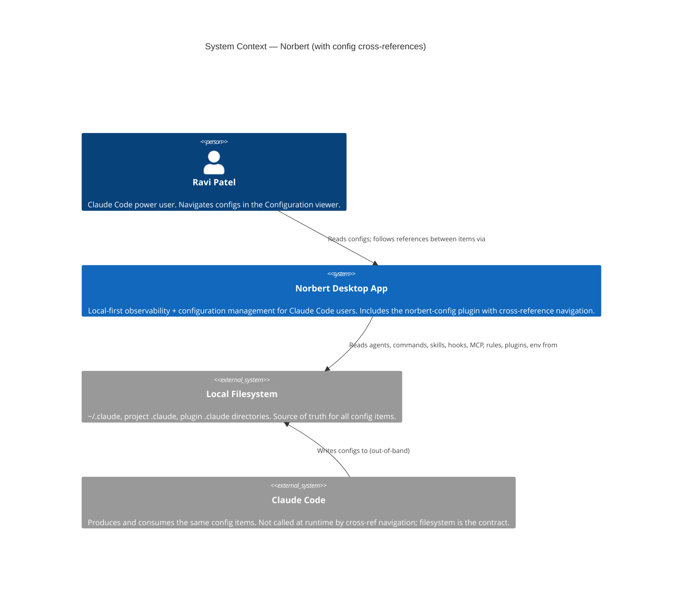
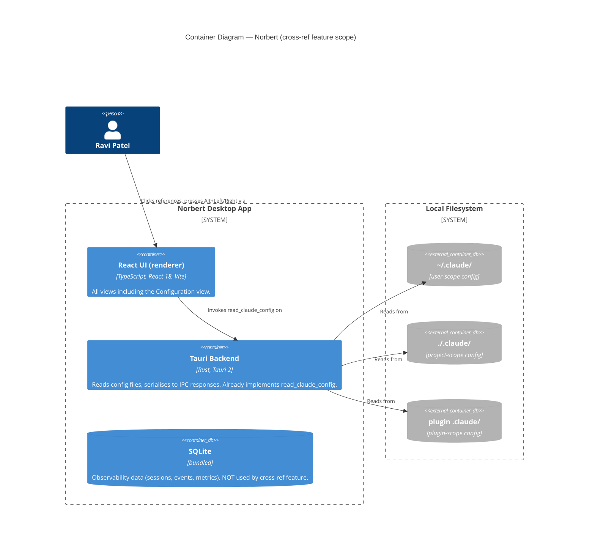
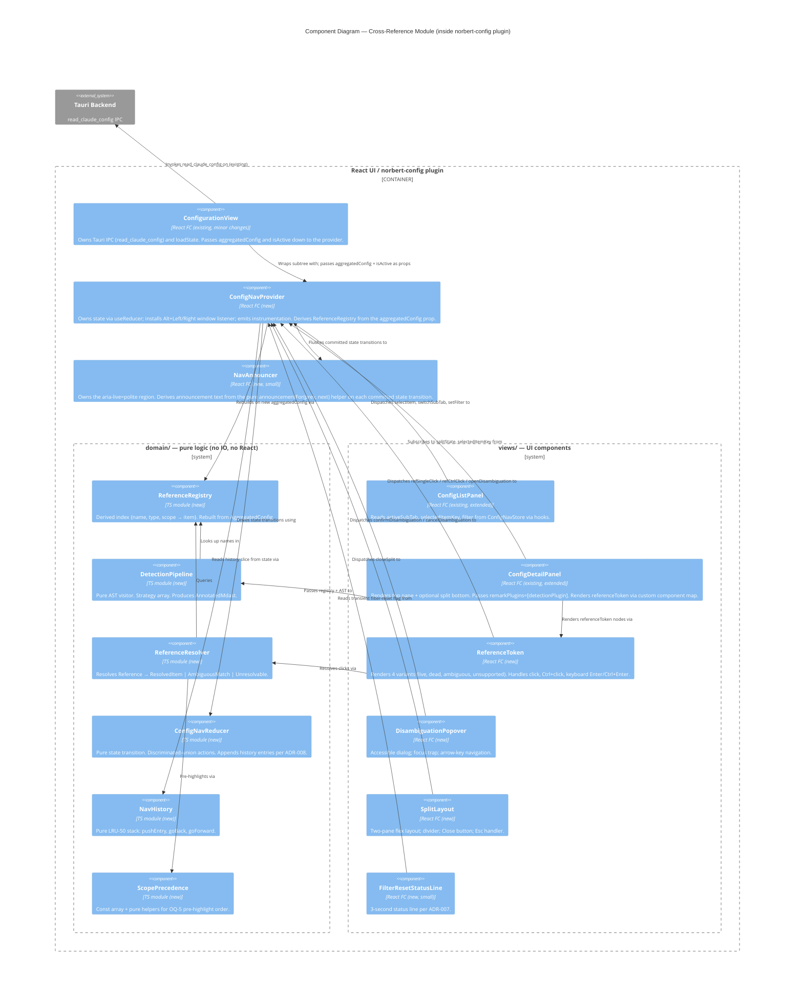

# C4 Diagrams — config-cross-references

All diagrams are Mermaid. Labels on arrows are verbs. Three levels included:

- **L1 System Context** — Norbert desktop app in Ravi's environment (reused from parent plugin, cross-ref module annotated).
- **L2 Container** — the Tauri + React containers, emphasising where this feature's code sits inside the `norbert-config` plugin.
- **L3 Component** — internal modules of the cross-reference feature. Warranted because 6 cooperating components.

---

## L1 — System Context

Notes:
- Cross-reference navigation is **pure read**: no writes to the filesystem, no calls to Claude Code. This is a hard feature constraint (System Constraint #2 in user-stories.md).
- No external web services, no third-party APIs. No contract tests needed (confirmed below).

---

## L2 — Container

Notes:
- Cross-ref feature lives **entirely inside the React UI container**. No backend changes.
- No new IPC commands. No new Rust code. Feature consumes the existing `read_claude_config` response.
- SQLite is mentioned for completeness but is not on the cross-ref feature's critical path.

---

## L3 — Component (cross-reference feature)

Detailed view of the React-UI container, zoomed into the `norbert-config` plugin with the new cross-reference module boundaries.

### Component responsibilities (one sentence each)

| Component | Responsibility |
|-----------|---------------|
| **ConfigurationView** | Mount point; existing; owns Tauri IPC + `loadState`; passes `aggregatedConfig: AggregatedConfig \| null` and `isActive: boolean` props to the provider. |
| **ConfigNavProvider** | Owns reducer state; installs window keydown listener (ADR-003); isolates effects (focus management, instrumentation, end-of-history timer, live-region flush). Derives `ReferenceRegistry` from the `aggregatedConfig` prop via `useMemo`. |
| **NavAnnouncer** | Owns the single `aria-live="polite"` region for the Configuration view. Derives text from the pure `announcementFor(prev, next)` helper. WCAG 2.2 AA / SC 4.1.3. |
| **ConfigNavReducer** | Pure state transition for all cross-reference actions. Tested without React. |
| **NavHistory** | Pure LRU-50 stack (ADR-006). `fast-check` property tests. |
| **ReferenceRegistry** | Derived `(name, type, scope → item)` index, plus reverse `filePath → item`. Rebuilt when `AggregatedConfig` changes (memoised). |
| **DetectionPipeline** | Remark AST visitor; strategy array; returns annotated root. Pure (ADR-001). |
| **ReferenceResolver** | Classifies a `Reference` as `live` / `ambiguous` / `dead` / `unsupported`. Pure. |
| **ScopePrecedence** | Const array `['project','plugin','user']` + pure `preHighlight(candidates)` (ADR-004). |
| **ConfigListPanel** | Existing component, extended: reads state from provider via hooks, emits actions via dispatch. No longer owns `useState` for `activeSource`/`sortMode`. |
| **ConfigDetailPanel** | Existing, extended: routes through DetectionPipeline, renders split via SplitLayout when `splitState` is non-null. |
| **ReferenceToken** | New; renders 4 variants; handles click/keyboard; dispatches actions. |
| **DisambiguationPopover** | New; accessible dialog (ADR-004). |
| **SplitLayout** | New; two-pane flex layout + divider + Close button + Esc handler. |
| **FilterResetStatusLine** | New; 3-second transient status line (ADR-007). |

### Why L3 is warranted

Six new cooperating components around a shared store justify an L3 diagram. Without it, the coupling between `DetectionPipeline` and `ReferenceRegistry` (rendering) versus `ReferenceResolver` and `ReferenceRegistry` (click-time resolution) is easy to miss — and that coupling is the subject of the highest-risk shared artifact (`reference_registry`, HIGH risk per shared-artifacts-registry).

---

## Arrow-label hygiene check

Every arrow in every diagram above uses a verb. Spot check:
- "Clicks references, presses Alt+Left/Right via" ✓
- "Invokes read_claude_config on" ✓
- "Dispatches selectItem, switchSubTab, setFilter to" ✓
- "Subscribes to activeSubTab, selectedItemKey, filter from" ✓
- "Rebuilds on new AggregatedConfig via" ✓
