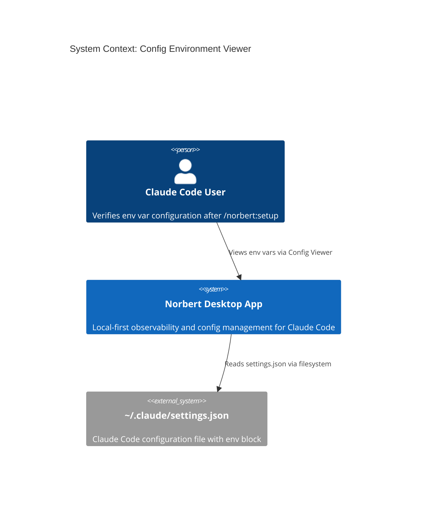
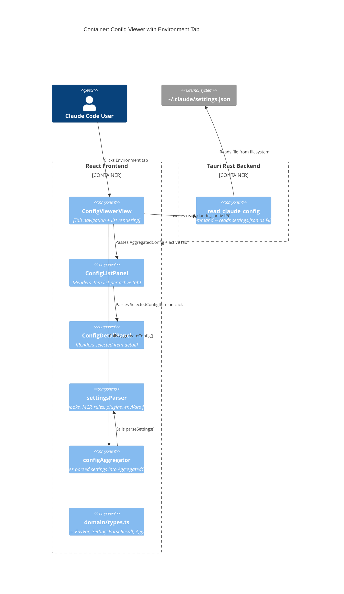

# Architecture Design: config-env-viewer

## System Context

This feature adds an "Environment" tab to the existing Config Viewer plugin, displaying environment variables from the `env` block of `~/.claude/settings.json`. It is a brownfield extension -- no new systems, no new IPC commands, no new dependencies.

## C4 System Context (L1)



## C4 Container (L2)



## Component Architecture

### Touched Components (all existing, extended)

| Component | Change | Responsibility |
|-----------|--------|----------------|
| `domain/types.ts` | Extend | Add `EnvVarEntry` type with scope/source; extend `SettingsParseResult`, `AggregatedConfig`, `SelectedConfigItem`, `CONFIG_SUB_TABS` |
| `domain/settingsParser.ts` | Extend | Add top-level `env` block extraction (reuse existing `extractEnvVars` pattern) |
| `domain/configAggregator.ts` | Extend | Pass env vars from `ParsedSettings` through to `AggregatedConfig` |
| `views/ConfigViewerView.tsx` | Extend | Add "env" to `SUB_TAB_LABELS` and `SUB_TAB_ICONS` maps |
| `views/ConfigListPanel.tsx` | Extend | Add `case "env"` branch rendering env var rows |
| `views/ConfigDetailPanel.tsx` | Extend | Add `case "env"` branch rendering env var detail |

### New Components: None

No new files required. All changes extend existing modules.

## Data Flow

```
settings.json (filesystem)
  -> read_claude_config IPC (Rust, unchanged)
  -> FileEntry { path, content, scope, source }
  -> settingsParser.parseSettings() (add envVars extraction)
  -> SettingsParseResult { ..., envVars: EnvVarEntry[] }
  -> configAggregator.aggregateConfig() (pass envVars through)
  -> AggregatedConfig { ..., envVars: EnvVarEntry[] }
  -> ConfigListPanel renders "env" tab
  -> ConfigDetailPanel renders selected env var
```

## Quality Attribute Strategies

| Attribute | Strategy |
|-----------|----------|
| Maintainability | Follow all existing patterns exactly: tab registration, list rendering, detail panel, empty state |
| Testability | Pure functions for extraction/aggregation; components testable via props |
| Time-to-market | Zero new infrastructure; extend 6 existing files |
| Reliability | Gracefully handle missing env block (empty state) and non-string values (filter out) |

## Integration Patterns

- **Backend-Frontend**: Existing `read_claude_config` IPC call -- no changes to Rust backend
- **Settings parsing**: Reuse `extractEnvVars` pattern from MCP server parsing, applied to top-level `env` block
- **Tab navigation**: Add to `CONFIG_SUB_TABS` const array (drives tab rendering automatically)
- **Detail selection**: Add `{ tag: "env" }` variant to `SelectedConfigItem` discriminated union

## Deployment Architecture

No deployment changes. Feature ships with the next Norbert desktop build.
