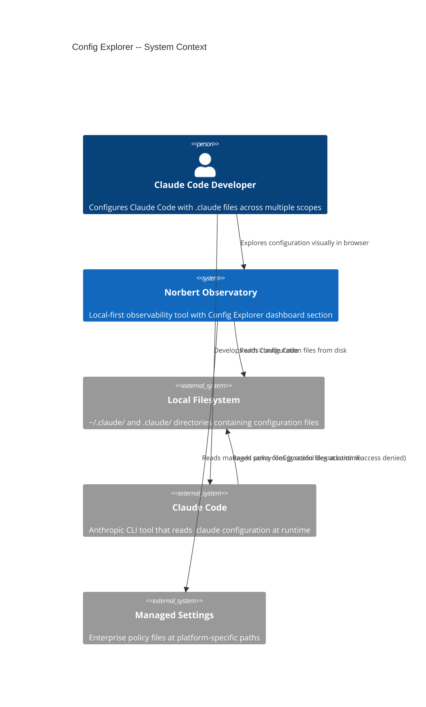
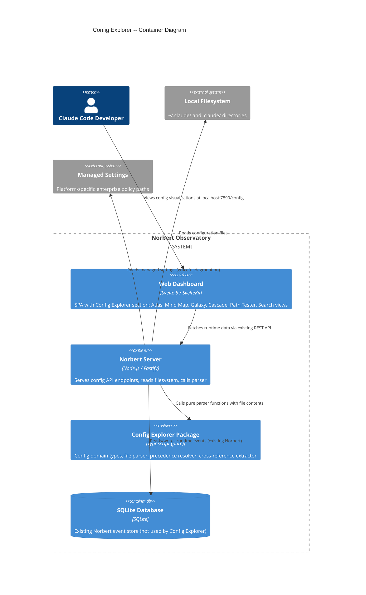
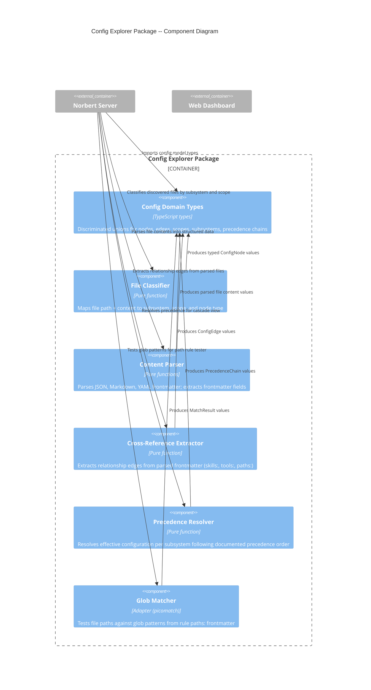

# Architecture Design: Config Explorer

**Feature ID**: config-explorer
**Architect**: Morgan (Solution Architect)
**Date**: 2026-03-03
**Status**: DRAFT -- pending peer review

---

## 1. System Overview

Config Explorer is a configuration observatory within the Norbert dashboard. It reads the `.claude` configuration ecosystem from the local filesystem, parses it into a typed configuration model, serves it via REST API, and renders it through 6 interactive views: Atlas (tree), Mind Map, Galaxy (relationship graph), Cascade (precedence waterfall), Path Rule Tester, and Search.

**Primary characteristic**: Static filesystem analysis. Config Explorer reads files -- it never writes, modifies, or watches them in v1.
**Integration**: New section within the existing Norbert dashboard, sharing Fastify server, Svelte 5 SPA, and D3.js.

---

## 2. Quality Attribute Priorities

| Priority | Attribute | Business Driver | Measurable Target |
|----------|-----------|-----------------|-------------------|
| 1 | Usability | Make complex config visually navigable | 100% task completion across all 6 views (validated Phase 3) |
| 2 | Maintainability | Evolve with Claude Code config ecosystem changes | New subsystem parseable in < 1 day |
| 3 | Testability | Pure config parsing testable without filesystem | Config parser pure functions: 100% unit-testable |
| 4 | Time-to-market | Solo developer, ~2-3 weeks | MVP (walking skeleton + 4 core views) in 10 dev-days |
| 5 | Performance | Smooth graph rendering | Galaxy graph interactive within 2s for 100 nodes |

---

## 3. Architectural Decision: Integrate Into Existing Monolith

**Selected approach**: Distribute Config Explorer across existing Norbert packages plus one new package (`@norbert/config-explorer`).

**Rationale from quality attributes**:
- Maintainability: Config parsing logic is a distinct domain from runtime event processing. A dedicated package isolates the config parsing pure functions and types from the core event-processing domain.
- Testability: Parsing logic in its own package ensures zero-dependency testing without importing server, storage, or runtime event types.
- Time-to-market: Dashboard, server, and D3.js already exist. Reuse them directly. Only the parser and its types are new.

**Package allocation**:

| Component | Package | Justification |
|-----------|---------|---------------|
| Config domain types (nodes, edges, scopes, subsystems) | `@norbert/config-explorer` (new) | Distinct domain from runtime events. Keeps `@norbert/core` focused on hook events. |
| Config parser (pure functions: filesystem data -> config model) | `@norbert/config-explorer` (new) | Parsing is the core domain logic for this feature -- pure, testable, isolated. |
| Precedence resolver (pure function) | `@norbert/config-explorer` (new) | Precedence resolution is complex enough to warrant its own isolated tests. |
| Glob matcher adapter | `@norbert/config-explorer` (new) | Wraps picomatch; adapter at the boundary. |
| API endpoints (`/api/config/*`) | `@norbert/server` (existing) | Fastify routes follow existing pattern. Server depends on config-explorer for types and parsing. |
| Dashboard views (Atlas, Mind Map, Galaxy, Cascade, Path Tester, Search) | `@norbert/dashboard` (existing) | Svelte components added as new route. Dashboard communicates via REST API. |
| Filesystem adapter (reads `~/.claude/` and `.claude/`) | `@norbert/server` (existing) | Filesystem I/O is a side effect. Server orchestrates: read filesystem -> call pure parser -> serve API. |

**Rejected alternatives**:
1. **All in `@norbert/core`**: Core is for hook event domain types. Config Explorer is a separate domain (static files, not runtime events). Mixing them violates SRP for the core package.
2. **Two new packages (types + parser)**: Over-decomposition. The types and parser are tightly coupled and change together. One package is sufficient.
3. **All in `@norbert/server`**: Would mix pure parsing logic with Fastify routes. Untestable without server infrastructure.

See **ADR-009** for full decision record.

---

## 4. C4 Diagrams

### 4.1 System Context (L1)



### 4.2 Container Diagram (L2)



### 4.3 Component Diagram (L3) -- Config Explorer Package

The `@norbert/config-explorer` package has 6 internal components, warranting L3 detail.



---

## 5. Data Flow

```
User opens Config Explorer tab in browser
    |
    v
Dashboard fetches GET /api/config/tree
    |
    v
Norbert Server: Config API route handler
    |
    +-- Reads ~/.claude/ directory tree (fs.readdir recursive)
    +-- Reads .claude/ directory tree (fs.readdir recursive)
    +-- Reads managed settings path (graceful degradation)
    +-- Reads plugin cache directory
    |
    v
For each discovered file:
    +-- File Classifier: path -> (subsystem, scope, nodeType)
    +-- Content Parser: raw content -> parsed structure (JSON | Markdown + frontmatter)
    +-- Cross-Ref Extractor: parsed frontmatter -> relationship edges
    |
    v
Assemble ConfigModel (nodes + edges + precedence chains)
    |
    v
Cache in memory (single scan per API request; invalidated on next request)
    |
    +-- GET /api/config/tree        -> file tree for Atlas
    +-- GET /api/config             -> full model for Galaxy + Mind Map
    +-- GET /api/config/precedence/:subsystem -> precedence chain for Cascade
    +-- GET /api/config/search?q=   -> full-text search results
    +-- GET /api/config/test-path?path= -> glob match results for Path Tester
    |
    v
Dashboard renders view (Svelte 5 + D3.js)
```

---

## 6. Component Architecture and Boundaries

### 6.1 New Package: `@norbert/config-explorer`

**Responsibility**: All config-explorer-specific domain types and pure transformation functions. Zero side effects. Zero Node.js built-in dependencies (except what TypeScript type system requires).

**Exports**:
- Config domain types: `ConfigNode`, `ConfigEdge`, `ConfigModel`, `ConfigScope`, `ConfigSubsystem`, `PrecedenceChain`, `PrecedenceEntry`, `MatchResult`, `ParsedFile`, `FileContent`
- File classifier: `(filePath, scope) -> ConfigNode`
- Content parser: `(rawContent, fileFormat) -> ParsedFile`
- Cross-reference extractor: `(parsedFiles) -> ConfigEdge[]`
- Precedence resolver: `(parsedFiles, subsystem) -> PrecedenceChain`
- Glob matcher: `(pattern, filePath) -> MatchResult`
- Search index builder: `(parsedFiles, query) -> SearchResult[]`
- Naming conflict detector: `(configNodes) -> NamingConflict[]`

**Imports**: Nothing. Zero dependencies for the pure functions. picomatch is the sole runtime dependency (for glob matching).

**Boundary rule**: No imports from `@norbert/core`, `@norbert/server`, `@norbert/storage`, or any other `@norbert/*` package. This is a standalone pure domain. Config Explorer types are distinct from runtime event types.

### 6.2 Existing Package Extensions

#### `@norbert/server` additions

New route registrations in `app.ts`:
- `registerConfigRoutes(app, configExplorerPort)` -- registers all `/api/config/*` endpoints
- Config API routes follow the same pattern as existing routes (events, sessions, etc.)

New component:
- `ConfigFileReader` -- filesystem adapter that reads `~/.claude/` and `.claude/` directories, handles cross-platform paths, gracefully degrades on inaccessible managed settings

Dependency addition: `@norbert/config-explorer` (types and pure functions)

#### `@norbert/dashboard` additions

New route: `/config` -- Config Explorer section with sub-navigation
New components:
- `ConfigAtlas.svelte` -- Dual-pane tree view with content preview
- `ConfigMindMap.svelte` -- D3.js tree layout with 8 subsystem branches
- `ConfigGalaxy.svelte` -- D3.js force simulation with typed nodes and edges
- `ConfigCascade.svelte` -- Precedence waterfall per subsystem
- `ConfigPathTester.svelte` -- File path input with match results
- `ConfigSearch.svelte` -- Full-text search across config files
- `ConfigExplorer.svelte` -- Parent layout with tab bar and shared state

No dependency additions. Dashboard communicates via REST API only.

### 6.3 Updated Module Dependency Matrix

```
                core  config  config-explorer  storage  server  cli  dashboard  hooks
core             -      -          -              -       -      -       -        -
config           -      -          -              -       -      -       -        -
config-explorer  -      -          -              -       -      -       -        -
storage          R      -          -              -       -      -       -        -
server           R      R          R              R       -      -       -        -
cli              R      R          -              R       -      -       -        -
dashboard        -      -          -              -       -      -       -        -
hooks            -      R          -              -       -      -       -        -

R = runtime dependency (import)
```

Key observations:
- `@norbert/config-explorer` has zero inbound dependencies from core, config, or storage
- `@norbert/config-explorer` has zero outbound dependencies
- Only `@norbert/server` imports from `@norbert/config-explorer`
- Maximum dependency depth remains 2 (server -> storage -> core) or (server -> config-explorer)
- No circular dependencies introduced

---

## 7. Integration Patterns

### 7.1 Server -> Filesystem (Config Reading)

**Pattern**: Synchronous filesystem scan on API request
**Transport**: Node.js `fs.readdirSync` / `fs.readFileSync`
**Rationale**: Configuration files are small (< 1MB total typical) and local. Synchronous reads complete in milliseconds. No async complexity needed for v1.
**Cross-platform**: `os.homedir()` for `~/.claude/`, `process.cwd()` for `.claude/`, platform-specific paths for managed settings.
**Error handling**: Inaccessible directories (permissions, non-existent) produce empty scope data with warning annotation. Malformed files produce error-annotated nodes. Neither crashes the scan.

### 7.2 Server -> Config Explorer Package (Parsing)

**Pattern**: Pure function calls with data in, data out
**Transport**: Direct function invocation (same process)
**Data flow**: Server reads raw file contents (side effect) -> passes to pure parser functions -> receives typed config model -> serializes to JSON API response

### 7.3 Dashboard -> Server (Config API)

**Pattern**: REST API (same pattern as existing Norbert API)
**Endpoints**: See Section 8
**Caching**: Dashboard caches the config model in a Svelte store. Manual refresh button triggers re-fetch. No automatic file watching in v1.

### 7.4 Config Explorer -> Norbert Core (No Dependency)

Config Explorer does NOT depend on `@norbert/core`. The two domains are intentionally separate:
- `@norbert/core`: Runtime event types (HookEvent, Session, TraceGraph)
- `@norbert/config-explorer`: Static config types (ConfigNode, ConfigEdge, PrecedenceChain)

Future integration (v2): Server could correlate runtime session data with config model (e.g., "show which config was active during session X"). This would happen in the server layer, not by making config-explorer depend on core.

---

## 8. API Contract

### 8.1 Config Explorer API Endpoints

| Method | Path | Response | Used By |
|--------|------|----------|---------|
| GET | /api/config | ConfigModel (full: nodes, edges, scopes, precedence) | Galaxy, Mind Map, landing page |
| GET | /api/config/tree | FileTree (directory structure with scope annotations) | Atlas |
| GET | /api/config/precedence/:subsystem | PrecedenceChain (per-subsystem resolution) | Cascade |
| GET | /api/config/search?q= | SearchResult[] (file path, scope, subsystem, matching line) | Search |
| GET | /api/config/test-path?path= | PathTestResult (rules with MATCH/NO MATCH + reasons) | Path Tester |

All endpoints return JSON. No authentication (local-only, same as existing Norbert API).

### 8.2 Config Explorer WebSocket Events (v2)

Not included in v1. Future: push updates when filesystem changes are detected via file watcher.

---

## 9. Cross-Cutting Concerns

### 9.1 Error Handling

| Layer | Strategy |
|-------|----------|
| Filesystem access | Graceful degradation. Inaccessible scope = empty with warning. Never crash. |
| File parsing | Per-file isolation. Malformed file = error node. Other files unaffected. |
| Managed settings | Access denied = managed scope shows "access denied" message. All other scopes work. |
| API responses | Structured JSON errors with HTTP status codes. Same pattern as existing Norbert API. |
| Dashboard rendering | Graceful degradation. Missing data = empty state with message. |

### 9.2 Cross-Platform Path Resolution

| Scope | macOS/Linux | Windows |
|-------|-------------|---------|
| User | `~/.claude/` via `os.homedir()` | `%USERPROFILE%\.claude\` via `os.homedir()` |
| Project | `.claude/` via `process.cwd()` | `.claude\` via `process.cwd()` |
| Local | `.claude/settings.local.json` | Same |
| Managed | `/Library/Application Support/ClaudeCode/` | `C:\Program Files\ClaudeCode\` |
| Plugin | `~/.claude/plugins/cache/` | Same via `os.homedir()` |
| MCP (user) | `~/.claude.json` | Same via `os.homedir()` |
| MCP (project) | `.mcp.json` | Same |

All path operations use Node.js `path` module for OS-aware joining and resolution. Display paths use forward slashes for consistency.

### 9.3 Scope Color System

Single source of truth in CSS custom properties consumed by all 6 views:

| Scope | Color | Hex | CSS Variable |
|-------|-------|-----|-------------|
| User | Blue | #3B82F6 | `--scope-user` |
| Project | Green | #22C55E | `--scope-project` |
| Local | Yellow | #EAB308 | `--scope-local` |
| Plugin | Purple | #A855F7 | `--scope-plugin` |
| Managed | Red | #EF4444 | `--scope-managed` |

WCAG 2.2 AA: All colors have 4.5:1 contrast against both light and dark backgrounds. Scope labels accompany colors (color is never the sole differentiator).

### 9.4 Performance Budget

| Operation | Target | Rationale |
|-----------|--------|-----------|
| Full config scan + parse | < 2s for 50 files | Typical complex configuration has 30-50 files |
| Galaxy graph render | < 2s for 100 nodes | D3.js force simulation stabilizes quickly for < 200 nodes |
| View transitions | < 200ms | Svelte 5 reactivity handles in-memory model rendering instantly |
| Search | < 500ms | In-memory full-text scan of < 50 files is milliseconds |
| Path rule test | < 100ms | picomatch is sub-millisecond per pattern |

---

## 10. Quality Attribute Strategies

### 10.1 Usability

- 6 complementary views serve different mental models (tree, mind map, graph, waterfall, tester, search)
- Consistent scope coloring across all views (shared-artifacts-registry checkpoint)
- View-to-view navigation preserves context (selected subsystem, element)
- Missing file indicators guide newcomers (dimmed directories with descriptions)

### 10.2 Maintainability

- `@norbert/config-explorer` is a standalone package with zero dependencies on other Norbert packages
- Adding a new subsystem requires: (1) add to FileClassifier mapping, (2) add parser for format, (3) add to PrecedenceResolver rules
- All parser functions are pure -- easy to add, test, and modify
- Subsystem list is data-driven, not hard-coded in UI components

### 10.3 Testability

- Config parser functions are pure: file content in, typed model out
- No filesystem access in parser functions -- filesystem adapter in server provides raw content
- Precedence resolver testable with synthetic file sets (no real `.claude/` directory needed)
- Glob matcher testable with pattern/path pairs
- Dashboard components testable with mock API responses (same pattern as existing Norbert tests)

### 10.4 Performance

- Config scan runs once per API request (no polling, no watching in v1)
- Dashboard caches config model in Svelte store (re-fetch on manual refresh)
- D3.js force simulation uses canvas rendering fallback if SVG is too slow for 100+ nodes
- Search is in-memory substring matching (no index build needed for < 50 files)

---

## 11. Deployment Architecture

Config Explorer adds no new processes, services, or infrastructure. It extends the existing Norbert deployment:

```
User's Machine (localhost only)
+-------------------------------------------------------+
|  Norbert Server (localhost:7890)                      |
|  +--------------------------------------------------+ |
|  | Existing: Event API, Session API, MCP API, WS    | |
|  | New:      Config API (/api/config/*)              | |
|  +--------------------------------------------------+ |
|  |                                                    | |
|  | Reads: ~/.claude/ + .claude/ + managed paths       | |
|  | Reads: SQLite DB (existing Norbert data)           | |
|  +--------------------------------------------------+ |
|                                                       |
|  Browser: http://localhost:7890/config                 |
|  (Existing dashboard with new Config tab)             |
+-------------------------------------------------------+
```

---

## 12. Requirements Traceability

| User Story | Component(s) | Module(s) |
|------------|-------------|-----------|
| US-CE-07: Walking Skeleton | Settings parser, Config API, Basic tree view | config-explorer, server, dashboard |
| US-CE-01: Cascade Waterfall | Precedence resolver, Cascade view, Config API | config-explorer, server, dashboard |
| US-CE-02: Atlas Tree | File classifier, Content parser, Atlas view | config-explorer, server, dashboard |
| US-CE-04: Path Rule Tester | Glob matcher, Path test API, Path tester view | config-explorer, server, dashboard |
| US-CE-05: Mind Map | Config model assembly, Mind map view | config-explorer, server, dashboard |
| US-CE-03: Galaxy Graph | Cross-ref extractor, Conflict detector, Galaxy view | config-explorer, server, dashboard |
| US-CE-06: Search | Search index builder, Search API, Search view | config-explorer, server, dashboard |

---

## 13. Risks and Mitigations

| Risk | Probability | Impact | Mitigation |
|------|------------|--------|------------|
| Precedence resolution inaccuracy | Medium | High | Pure function with comprehensive tests against documented rules (Research Finding 12). Label on-demand items. |
| Glob matching differs from Claude Code | Medium | High | Use picomatch (same ecosystem). Document any known differences. |
| Anthropic changes config file formats | Low | High | Parser designed with format adapters. Monitor Anthropic releases. |
| D3.js graph performance for large configs | Low | Medium | Subsystem filtering. Canvas fallback. Test with 100+ nodes. |
| Managed settings require admin permissions | Medium | Low | Graceful degradation. Show "access denied" for managed scope. |
| Config Explorer scope creep | Medium | Medium | Strict v1: Atlas, Cascade, Galaxy, Mind Map, Path Tester, Search. Team audit deferred to v2+. |

---

## 14. Rejected Simple Alternatives

### Alternative 1: CLI command that prints config summary
- What: `norbert config` command printing a text tree of active configuration
- Expected impact: 40% of problem (anatomy navigation only, no visual relationships or precedence)
- Why insufficient: Text output cannot show force-directed graphs, precedence waterfalls, or interactive path testing. No cross-reference visualization.

### Alternative 2: Static HTML export of config analysis
- What: Generate a single HTML file with config analysis results
- Expected impact: 60% of problem (static view, no interactivity)
- Why insufficient: No interactive graph manipulation, no subsystem filtering, no real-time path testing. Loses the "living map" value proposition.

### Why full dashboard integration necessary
1. Simple alternatives cannot deliver the relationship graph (CO3, score 17) or precedence cascade (CO2, score 17) -- the two highest-value features
2. Existing Norbert dashboard infrastructure (Svelte 5, D3.js, Fastify) makes full integration only marginally more expensive than a standalone tool
