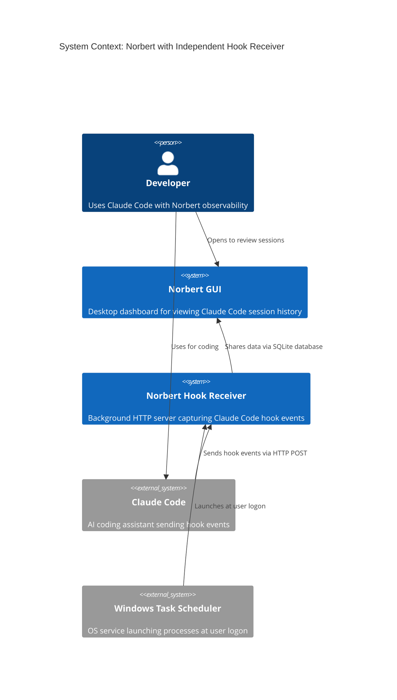
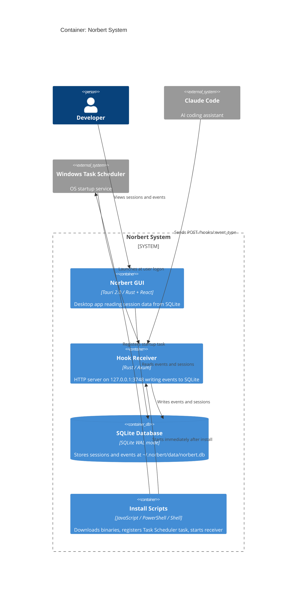

# Architecture: Hook Receiver Independent Lifecycle

## System Context and Capabilities

This feature decouples the hook receiver's lifecycle from the GUI application. After this change:

- The hook receiver starts at Windows user logon via Task Scheduler (registered during install)
- The hook receiver is also started immediately during install (no reboot required)
- The GUI becomes a pure database viewer -- it no longer spawns or manages the hook receiver
- The `tauri_plugin_shell` dependency and sidecar configuration are removed from the GUI

### Scope

| In Scope | Out of Scope |
|----------|-------------|
| Windows Task Scheduler registration | macOS launchd / Linux systemd registration |
| Immediate receiver start during install | Uninstall/cleanup of Task Scheduler task |
| Sidecar spawn removal from GUI | GUI health indicator for hook receiver status |
| tauri_plugin_shell cleanup | Cross-platform startup abstraction |
| install.ps1 and install.sh (Windows path) updates | |
| postinstall.js updates | |

## C4 System Context (L1)



## C4 Container (L2)



## Component Architecture

### Changed Components

#### 1. Install Scripts (postinstall.js, postinstall-core.js, install.ps1, install.sh)

**Current**: Downloads binaries, creates Start Menu shortcut.
**After**: Additionally registers Task Scheduler task and starts hook receiver immediately.

**Responsibilities**:
- Register `NorbertHookReceiver` Task Scheduler task at user logon trigger
- Idempotent: update existing task if already present
- Non-fatal: log warning if registration fails (permissions)
- Start hook receiver process immediately after install
- Stop any running receiver before starting new one (for updates)

**Integration points**:
- `getInstallDirectory()` provides binary path for Task Scheduler target
- `NorbertHookReceiver` is the task name constant (new, in postinstall-core.js)
- PowerShell `Register-ScheduledTask` / `Set-ScheduledTask` for task management
- PowerShell `Start-Process` for immediate receiver launch

#### 2. GUI Application (lib.rs)

**Current**: Calls `spawn_hook_receiver_sidecar(app)` at startup via `tauri_plugin_shell`.
**After**: No sidecar spawning. Pure database viewer.

**Removals**:
- `spawn_hook_receiver_sidecar()` function
- `use tauri_plugin_shell::ShellExt;` import
- `.plugin(tauri_plugin_shell::init())` from builder
- `tauri-plugin-shell` from `Cargo.toml` dependencies
- Sidecar permission from `capabilities/default.json`
- `externalBin` entry from `tauri.conf.json`

#### 3. Hook Receiver (hook_receiver.rs)

**Current**: Already handles port conflict with `exit(1)` and stderr logging.
**After**: No code changes required. Existing singleton behavior is validated as intentional.

### Unchanged Components

- `domain/mod.rs` -- No changes needed. `HOOK_PORT`, `resolve_database_path()` already shared.
- `ports/mod.rs` -- No changes. `EventStore` trait unchanged.
- `adapters/db/mod.rs` -- No changes. WAL mode already supports concurrent access.

## Technology Stack

| Component | Technology | License | Rationale |
|-----------|-----------|---------|-----------|
| Task Scheduler Registration | PowerShell (built-in) | N/A (OS) | Already used for Start Menu shortcut; no new dependency |
| Process Management | PowerShell `Start-Process` / `Stop-Process` | N/A (OS) | Standard Windows process control |
| Task Scheduler Queries | PowerShell `Get-ScheduledTask` | N/A (OS) | Idempotency check before registration |

No new dependencies are introduced. One dependency is removed (`tauri-plugin-shell`).

## Integration Patterns

### Shared Artifacts

| Artifact | Source of Truth | Consumers |
|----------|----------------|-----------|
| `hook_receiver_binary_path` | `getInstallDirectory()` + `norbert-hook-receiver.exe` | postinstall, install.ps1, Task Scheduler task |
| `task_scheduler_task_name` | `TASK_NAME` constant in postinstall-core.js | postinstall, install.ps1, install.sh, future uninstall |
| `hook_port` (3748) | `HOOK_PORT` in domain/mod.rs | hook_receiver.rs, Claude Code config |
| `database_path` | `resolve_database_path()` in adapters/db/mod.rs | hook_receiver.rs, lib.rs |

### Data Flow (Post-Change)

```
Install Time:
  install script -> download binaries -> register Task Scheduler -> start receiver

Boot Time:
  Task Scheduler -> launches hook receiver -> binds port 3748

Runtime:
  Claude Code -> POST /hooks/:event_type -> hook receiver -> write to SQLite
  User opens GUI -> reads from SQLite -> displays sessions/events

GUI Close:
  GUI hides/exits -> hook receiver continues running independently
```

## Quality Attribute Strategies

### Reliability (Highest Priority)
- Hook receiver runs independently of GUI lifecycle
- Singleton via port binding prevents duplicates
- Install script starts receiver immediately (no data gap between install and reboot)
- SQLite WAL mode ensures concurrent reader/writer safety

### Installability
- Task Scheduler registration is automatic during install
- Idempotent: re-running install updates rather than duplicates
- Non-fatal failure: install completes even if Task Scheduler registration fails
- Receiver starts immediately -- no reboot required

### Operational Simplicity
- Zero configuration: install and forget
- Hook receiver is invisible when working correctly
- No new config files, no new services to manage

### Maintainability
- Task name constant in postinstall-core.js (single source of truth)
- PowerShell pattern matches existing Start Menu shortcut creation
- Removing tauri_plugin_shell simplifies the GUI dependency graph

## Deployment Architecture

```
~/.norbert/
  bin/
    norbert.exe              (GUI - launched manually or via Start Menu)
    norbert-hook-receiver.exe (Background - launched by Task Scheduler or install script)
  data/
    norbert.db               (Shared SQLite database, WAL mode)

Windows Task Scheduler:
  Task: NorbertHookReceiver
  Trigger: At log on of current user
  Action: Start ~/.norbert/bin/norbert-hook-receiver.exe
```

## ADR References

- [ADR-008: Hook Receiver Startup Mechanism](../../../adrs/ADR-008-hook-receiver-startup-mechanism.md)
- [ADR-009: Remove Tauri Shell Plugin After Sidecar Decoupling](../../../adrs/ADR-009-remove-tauri-shell-plugin.md)
