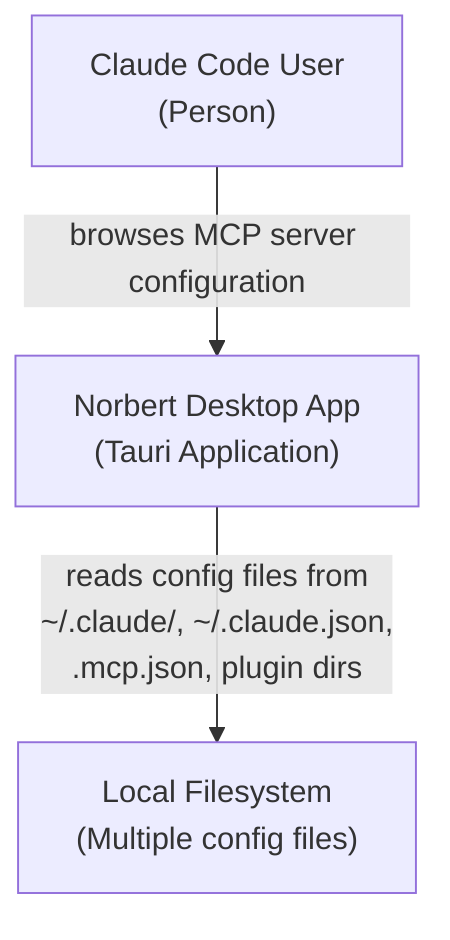
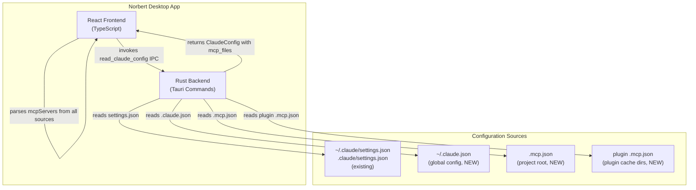
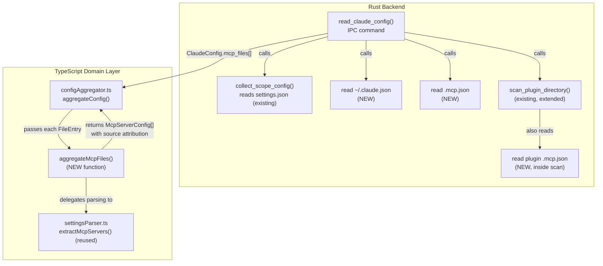

# Architecture Design: mcp-server-discovery

## System Context

Extends norbert-config to discover MCP servers from all local Claude Code configuration sources: `~/.claude/settings.json`, `~/.claude.json` (global config), project `.mcp.json`, and plugin `.mcp.json` files. Currently only `settings.json` is read. All sources share the same `{ "mcpServers": { ... } }` schema. Anthropic cloud connectors are out of scope.

## C4 System Context (L1)

## C4 Container (L2)

## C4 Component (L3) -- Data Flow

## Component Architecture

### Changes by Layer

**Rust Backend (`src-tauri/src/lib.rs`)**
- `ClaudeConfig` struct: add `mcp_files: Vec<FileEntry>` field
- `read_claude_config()` (user scope): read `~/.claude.json` as a FileEntry, push to `mcp_files`
- `read_claude_config()` (project scope): read `<cwd>/.mcp.json` as a FileEntry, push to `mcp_files`
- `scan_plugin_directory()`: also read `.mcp.json` from plugin root, push to `mcp_files` vec
- `merge_configs()`: concat `mcp_files` vectors
- No new dependencies -- uses existing `read_optional_file()` and `std::fs`

**TypeScript Domain (`src/plugins/norbert-config/domain/`)**
- `configAggregator.ts`: add `aggregateMcpFiles()` function that iterates `rawConfig.mcpFiles`, parses each via `extractMcpServers()`, annotates with filePath/scope/source
- `configAggregator.ts`: in `aggregateConfig()`, merge MCP servers from `aggregateMcpFiles()` with existing `settings.mcpServers`
- `types.ts`: add `source` field to `McpServerConfig` (currently missing, needed to show origin file)
- `RawClaudeConfig` interface: add `mcpFiles: readonly FileEntry[]`

**React Views** -- no changes expected. `McpTab` and `ConfigDetailPanel` already render from `McpServerConfig[]`. The `filePath` and new `source` field provide origin attribution.

### Source Attribution Strategy

| File | scope | source | filePath example |
|------|-------|--------|-----------------|
| `~/.claude/settings.json` | user | settings.json | `C:\Users\X\.claude\settings.json` |
| `~/.claude.json` | user | .claude.json | `C:\Users\X\.claude.json` |
| `.mcp.json` (project) | project | .mcp.json | `C:\Users\X\project\.mcp.json` |
| plugin `.mcp.json` | plugin | `<pluginName>` | `...cache\discord\1.0\.mcp.json` |
| `.claude/settings.json` (project) | project | settings.json | `C:\Users\X\project\.claude\settings.json` |

### Deduplication

No deduplication at this stage. If the same MCP server name appears in multiple files, all entries are shown. The `filePath` and `source` fields let the user see the origin. Claude Code's own precedence rules are out of scope for a read-only viewer.

## Technology Stack

No additions. All existing:
- **Rust std::fs** (MIT/Apache-2.0): file reading
- **serde/serde_json** (MIT/Apache-2.0): JSON serialization
- **dirs** (MIT/Apache-2.0): home directory resolution
- **TypeScript/React** (MIT): frontend parsing and rendering

## Integration Patterns

- **IPC contract**: `read_claude_config(scope)` returns `ClaudeConfig` with new `mcpFiles` field
- **Backward compatible**: existing `settings` field unchanged; `mcp_files` is additive
- **Same parsing path**: `.mcp.json` and `.claude.json` both contain `{ "mcpServers": { ... } }` -- reuse `extractMcpServers()`

## Quality Attribute Strategies

- **Maintainability**: single parsing function reused for all MCP sources; new files are just additional FileEntry inputs
- **Reliability**: missing files produce empty results (existing pattern); per-file errors captured in errors array
- **Testability**: all new TypeScript logic is pure functions; Rust uses existing `read_optional_file()` pattern
- **Performance**: 3 additional small file reads (< 10KB each); negligible impact

## Rejected Simpler Alternatives

### Alternative 1: Frontend-only file reading via Tauri fs plugin
- What: Use `@tauri-apps/plugin-fs` to read .claude.json and .mcp.json directly from TypeScript
- Expected Impact: 100% of problem solved
- Why Insufficient: Breaks existing architecture pattern where Rust backend handles all filesystem access. ADR-018 explicitly chose single IPC command. Would require Tauri fs plugin permissions and bypass the centralized error handling in Rust.

### Alternative 2: Parse .claude.json inside settings.json parser
- What: Have the Rust backend concatenate .claude.json content into the settings FileEntry
- Expected Impact: 80% (covers global config but not .mcp.json files)
- Why Insufficient: Conflates two distinct files into one FileEntry, loses source attribution. Doesn't handle project .mcp.json or plugin .mcp.json.

### Why Current Approach Necessary
1. Adding `mcp_files` vec to the existing IPC contract is the minimal change that maintains the pattern
2. All three new sources require distinct source/scope attribution that a simpler merge cannot provide
