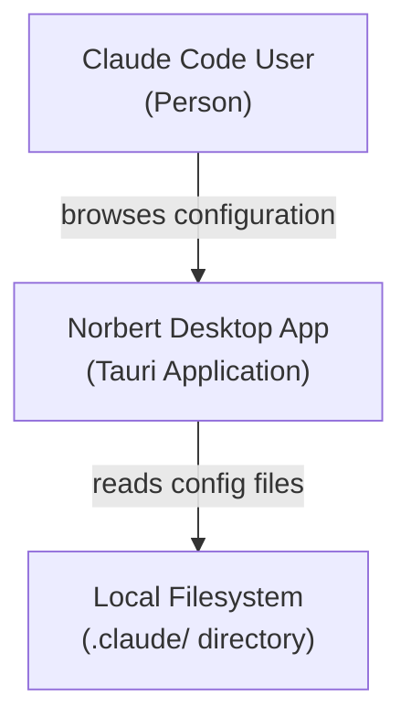
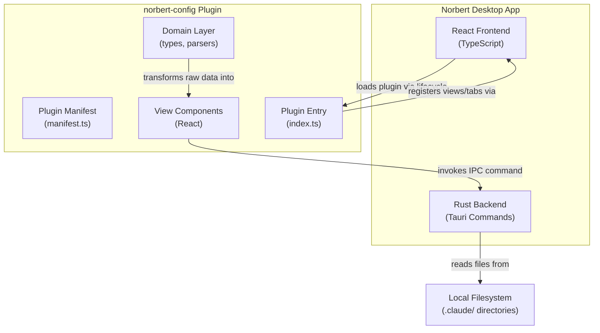
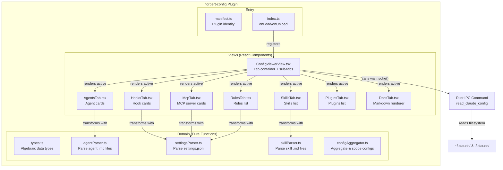

# Architecture Design: norbert-config

## System Context

norbert-config is a read-only Configuration Viewer plugin for Norbert. It reads `.claude/` directory contents (agents, hooks, skills, rules, MCP servers, plugins, CLAUDE.md) and presents them in a tabbed interface. No active Claude Code session required.

## C4 System Context (L1)



## C4 Container (L2)



## C4 Component (L3) -- norbert-config Plugin



## Architecture Approach

**Selected**: Modular monolith with dependency inversion (ports-and-adapters), following existing plugin patterns.

**Rationale**: Solo developer, ~10 day timeline, read-only viewer. The existing plugin architecture already provides the extension mechanism. norbert-config follows the same structure as norbert-session and norbert-usage: manifest + entry + domain + views.

### Key Design Decisions

#### 1. Single Rust IPC Command for All Config Data

One Rust command (`read_claude_config`) reads the entire `.claude/` directory tree and returns a single structured response. Rationale: avoids N round-trips (one per tab); `.claude/` is small (typically <50 files); a single read is fast (<100ms) and simplifies the frontend.

The command accepts a `scope` parameter: `"user"` for `~/.claude/`, `"project"` for `./.claude/`, or `"both"` (default).

#### 2. Frontend Parsing, Backend Reading

The Rust backend reads raw file contents and returns them as strings. The TypeScript domain layer parses and transforms (agent Markdown, settings JSON, skill files). Rationale: parsing logic is presentation-specific (extracting agent metadata for cards) and easier to test/iterate in TypeScript. The backend remains a thin filesystem adapter.

#### 3. Parse Once, Share Across Tabs

`settings.json` content is parsed once when the config view loads. The parsed result feeds Hooks, MCP, Rules, and Plugins tabs. Implemented via a shared state in the ConfigViewer container.

#### 4. No Caching

Files are read fresh each time the Config tab is activated (or the user triggers a refresh). Ensures data is never stale. Filesystem reads of `.claude/` are fast enough (~10-50ms).

#### 5. Sensitive Value Masking (Frontend Only)

MCP server env var values are masked in the React view layer. No backend involvement -- values are read as-is, masked on render, revealed on click. Values are never logged to console.

## Component Architecture

### Rust Backend (src-tauri/src/)

**New IPC command**: `read_claude_config`
- Input: `scope: String` ("user" | "project" | "both")
- Output: `ClaudeConfig` struct containing:
  - `agents: Vec<FileEntry>` -- files from `agents/` directory
  - `commands: Vec<FileEntry>` -- files from `commands/` directory
  - `settings: Option<FileEntry>` -- `settings.json` content
  - `claude_md_files: Vec<FileEntry>` -- CLAUDE.md files found
  - `scope: String` -- which scope was read
  - `errors: Vec<ReadError>` -- per-file errors
- Where `FileEntry = { path: String, content: String, scope: String }`
- Where `ReadError = { path: String, error: String, scope: String }`

This command lives in `lib.rs` alongside existing commands, registered in the invoke_handler. Uses `dirs::home_dir()` (already a dependency via `dirs` crate) for `~/.claude/` resolution. Uses `std::env::current_dir()` or Tauri's app handle for project-level `./.claude/`.

### TypeScript Plugin (src/plugins/norbert-config/)

Follows established plugin structure:

| File | Responsibility |
|------|---------------|
| `manifest.ts` | Plugin identity (id, name, version, dependencies) |
| `index.ts` | onLoad: register view + tab; onUnload: cleanup |
| `domain/types.ts` | Algebraic data types for all config entities |
| `domain/agentParser.ts` | Parse agent .md files -> AgentDefinition |
| `domain/settingsParser.ts` | Parse settings.json -> hooks, mcpServers, rules, plugins |
| `domain/skillParser.ts` | Parse skill .md files -> SkillDefinition |
| `domain/configAggregator.ts` | Combine user + project scopes, annotate sources |
| `views/ConfigViewerView.tsx` | Primary view: sub-tab container, data fetching |
| `views/AgentsTab.tsx` | Agent card list with expand/collapse |
| `views/HooksTab.tsx` | Hook card list with matcher tags |
| `views/McpTab.tsx` | MCP server cards with env var masking |
| `views/SkillsTab.tsx` | Skills list |
| `views/RulesTab.tsx` | Rules list with source annotations |
| `views/PluginsTab.tsx` | Plugins list |
| `views/DocsTab.tsx` | Markdown rendering panels |
| `views/EmptyState.tsx` | Reusable empty state component |
| `views/ErrorIndicator.tsx` | Reusable per-file error display |

### App.tsx Integration

Following existing patterns:
1. Import `norbertConfigPlugin` from `./plugins/norbert-config/index`
2. Add to `loadPlugins()` array alongside norbert-session and norbert-usage
3. Register `ConfigViewerWrapper` FC in the view registry (map key: "config-viewer")

## Technology Stack

| Technology | Purpose | License | Rationale |
|-----------|---------|---------|-----------|
| Tauri 2.x | Desktop framework | MIT/Apache-2.0 | Already in use |
| React 18 | UI framework | MIT | Already in use |
| TypeScript 5 | Type safety | Apache-2.0 | Already in use |
| Rust (stable) | Backend commands | MIT/Apache-2.0 | Already in use |
| serde / serde_json | Rust JSON serialization | MIT/Apache-2.0 | Already a dependency |
| dirs | Home directory resolution | MIT/Apache-2.0 | Already a dependency |
| react-markdown | Markdown rendering (Docs tab) | MIT | Well-maintained OSS, 13k+ stars |
| remark-gfm | GFM support for react-markdown | MIT | Standard companion to react-markdown |

**No new Rust dependencies required.** The backend uses only `std::fs`, `dirs`, and `serde` (all existing).

**One new frontend dependency**: `react-markdown` + `remark-gfm` for US-006 (Docs tab). Alternative considered: raw `dangerouslySetInnerHTML` with a Markdown-to-HTML library -- rejected for XSS risk and lower quality rendering.

## Integration Patterns

### IPC Contract

```
Frontend (TypeScript) --invoke("read_claude_config", { scope })--> Rust Backend
Rust Backend --Result<ClaudeConfig, String>--> Frontend
```

Follows existing pattern: `invoke<T>(command, args)` returns a Promise. Error handling via `.catch()`.

### Plugin Registration

```
norbert-config --api.ui.registerView()--> Plugin Registry
norbert-config --api.ui.registerTab()--> Plugin Registry
```

No hooks registered (read-only, no live events). No status bar items.

### Data Flow

```
User clicks Config tab
  -> ConfigViewerView mounts
  -> invoke("read_claude_config", { scope: "both" })
  -> Rust reads ~/.claude/ and ./.claude/
  -> Returns ClaudeConfig with raw file contents
  -> TypeScript parsers transform to domain types
  -> Sub-tab components render parsed data
```

## Quality Attribute Strategies

| Attribute | Strategy |
|-----------|----------|
| **Performance** | Single IPC call for all data; <500ms for typical .claude/ |
| **Reliability** | Per-file error isolation; missing dirs = empty lists, not errors |
| **Security** | Env var values masked by default; no console logging of sensitive values |
| **Maintainability** | Pure domain functions; stateless views; follows existing plugin patterns |
| **Testability** | All parsers are pure functions; views are stateless; Rust command testable with temp dirs |
| **Usability** | 7 clear sub-tabs; progressive disclosure for long content; empty states explain what belongs where |

## Deployment Architecture

No additional deployment -- norbert-config ships as part of the Norbert binary. The Rust command is compiled into the Tauri backend. The React plugin is bundled with the frontend.

Tauri capability update: none needed. The `core:default` permission is sufficient since `read_claude_config` uses Rust's `std::fs` directly (not Tauri's fs plugin).
