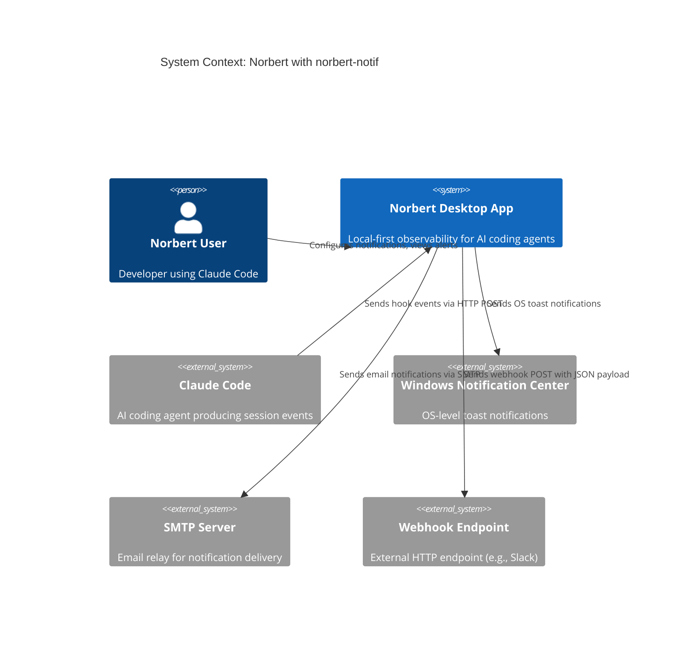
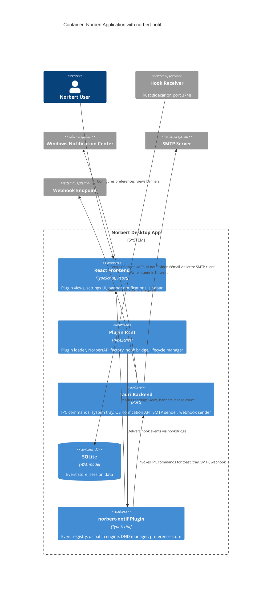
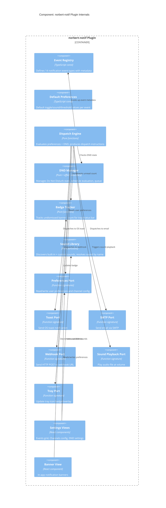

# Architecture Design: norbert-notif (Notification Center)

## System Overview

norbert-notif is a first-party Norbert plugin providing fine-grained notification control for agent events. It receives events via the existing hook bridge, evaluates user preferences, and dispatches notifications to configured channels (OS toast, in-app banner, tray badge, sound, email, webhook). It is Priority 4 in the build order -- foundational infrastructure that all subsequent plugins route notifications through.

**Architectural style**: Modular monolith with dependency inversion (ports-and-adapters), following ADR-001. norbert-notif is a plugin module within the existing Tauri application.

**Development paradigm**: Functional programming (per CLAUDE.md). Pure core with effects at adapter boundaries. Immutable domain types. Composition pipelines over class hierarchies.

---

## C4 System Context (L1)



---

## C4 Container (L2)



---

## C4 Component (L3) -- norbert-notif Plugin



---

## Component Architecture

### Pure Core (no effects)

| Component | Responsibility |
|-----------|---------------|
| Event Registry | Immutable array of 14 event definitions (id, label, category, default channels/sound/threshold) |
| Default Preferences | Record mapping event IDs to default toggle/sound/threshold state |
| Dispatch Engine | Given (event, preferences, dndState) -> produces ReadonlyArray of DispatchInstruction values |
| DND Manager | Given (schedule, currentTime, manualToggle) -> produces DndState value |
| Badge Tracker | Given (currentCount, action: increment/decrement/reset) -> produces new count |
| Sound Library | Given (builtInSounds, customSoundPaths) -> produces merged sound list |
| Preference Validation | Given (rawPreferences) -> produces Result of validated preferences or validation errors |

### Effect Boundary (adapters)

| Adapter | Port it implements | Technology |
|---------|-------------------|------------|
| JSON Preference Store | Preferences Port | fs read/write to `~/.norbert/plugins/norbert-notif/` |
| Tauri Toast Adapter | Toast Port | Tauri IPC command -> `tauri-plugin-notification` |
| Tauri Tray Adapter | Tray Port | Tauri IPC command -> system tray icon update |
| Rust SMTP Adapter | SMTP Port | Tauri IPC command -> `lettre` crate |
| Rust Webhook Adapter | Webhook Port | Tauri IPC command -> `reqwest` crate |
| Web Audio Adapter | Sound Playback Port | Web Audio API in browser context |
| Custom Sound Scanner | Sound Library input | fs scan of `~/.norbert/sounds/` |

### UI Components (React, effect boundary)

| Component | Responsibility |
|-----------|---------------|
| Events Grid | Renders event rows with per-channel toggles, threshold inputs, sound pickers |
| Channels Config | Renders channel setup forms (Toast, Banner, Badge, SMTP, Webhook) with Test buttons |
| DND Settings | Renders DND toggle, schedule grid, behavior radio buttons |
| Notification Banner | Renders in-app notification banners with dismiss action |
| Sound Picker | Dropdown listing built-in + custom sounds with preview |

---

## Integration Patterns

### Event Flow: Hook Event to Notification Delivery

```
Hook Receiver (Rust) -> SQLite -> Frontend poll/push
                                        |
                        Plugin Host delivers via hookBridge.deliverHookEvent()
                                        |
                        norbert-notif hook processor receives payload
                                        |
                        Dispatch Engine evaluates:
                          1. Map hook event name to notification event ID
                          2. Read user preferences for that event
                          3. Check DND state
                          4. Produce DispatchInstruction[] (which channels, what payload)
                                        |
                        Each DispatchInstruction executed independently:
                          - Toast -> Tauri IPC -> OS notification
                          - Banner -> React state update -> in-app banner
                          - Badge -> Tray IPC + badge tracker update
                          - Sound -> Web Audio API playback
                          - Email -> Tauri IPC -> Rust SMTP
                          - Webhook -> Tauri IPC -> Rust HTTP POST
```

### Failure Isolation

Each channel dispatch is independent. A failing webhook does not block toast delivery. Failures are logged and surfaced as a "delivery failed" banner.

### Preference Persistence

Preferences are persisted as JSON to the plugin's config directory. Changes are immediate (no Save button). The same preference data is read by both the settings UI and the dispatch engine -- single source of truth.

### DND Schedule Evaluation

DND schedule is evaluated against system local time. A timer checks schedule every 60 seconds. Manual toggle overrides schedule until next schedule boundary.

---

## Tauri Backend Extensions

norbert-notif requires new Tauri IPC commands in the Rust backend:

| Command | Purpose | Crate |
|---------|---------|-------|
| `send_os_notification` | Send Windows toast via Tauri notification plugin | `tauri-plugin-notification` (MIT) |
| `send_smtp_email` | Send email via SMTP | `lettre` (MIT) |
| `send_webhook` | Send HTTP POST with JSON body | `reqwest` (MIT/Apache-2.0) |
| `update_tray_badge` | Update tray icon with badge overlay | Tauri tray-icon API (already in Cargo.toml) |
| `read_notif_preferences` | Read preferences JSON from plugin config dir | std::fs |
| `write_notif_preferences` | Write preferences JSON to plugin config dir | std::fs |
| `scan_custom_sounds` | List audio files in ~/.norbert/sounds/ | std::fs |

These commands are invoked from the frontend via Tauri's `invoke()` IPC mechanism.

---

## Quality Attribute Strategies

### Maintainability (Priority 1)
- Pure core functions with no side effects enable isolated testing
- Ports-and-adapters pattern allows swapping delivery channels without touching dispatch logic
- Event registry as const array -- adding events requires only a data change
- Plugin boundary enforced by NorbertAPI contract -- no direct imports from host internals

### Testability (Priority 2)
- Dispatch engine is a pure function: input (event, prefs, dnd) -> output (instructions)
- All ports are function signatures -- easily stubbed in tests
- DND manager is pure: (schedule, time) -> state
- Badge tracker is pure: (count, action) -> count

### Time-to-market (Priority 3)
- Reuses existing plugin infrastructure (NorbertPlugin, hookBridge, NorbertAPI)
- Built-in channels (toast, banner, badge) can ship before advanced channels (SMTP, webhook)
- MoSCoW prioritization allows Must Have stories to ship independently

### Fault Tolerance (Priority 4)
- Channel delivery failure isolated -- does not cascade to other channels
- Missing custom sound falls back to default with user notification
- Corrupt preferences file falls back to defaults
- Webhook timeout (10s) does not block other channels
- DND state survives app restart (persisted)

---

## Deployment Architecture

No new deployment units. norbert-notif is a bundled first-party plugin loaded by the existing plugin loader (ADR-011). New Rust IPC commands are compiled into the existing `norbert_lib` crate. Sound assets are bundled in the app's asset directory.

---

## Risk Mitigation

| Risk | Mitigation |
|------|-----------|
| Windows toast API limitations | Use `tauri-plugin-notification` for basic toasts; defer rich actions to v2 |
| SMTP requires Rust backend | New IPC command using `lettre` crate; frontend cannot do SMTP |
| Event flood from misbehaving plugin | Dispatch engine groups >10 same-type events in 5s window |
| DND timezone issues | Store schedule in local time with timezone offset; re-evaluate on tz change |
| Custom sound format incompatibility | Validate format on scan; exclude unsupported with UI tooltip |
