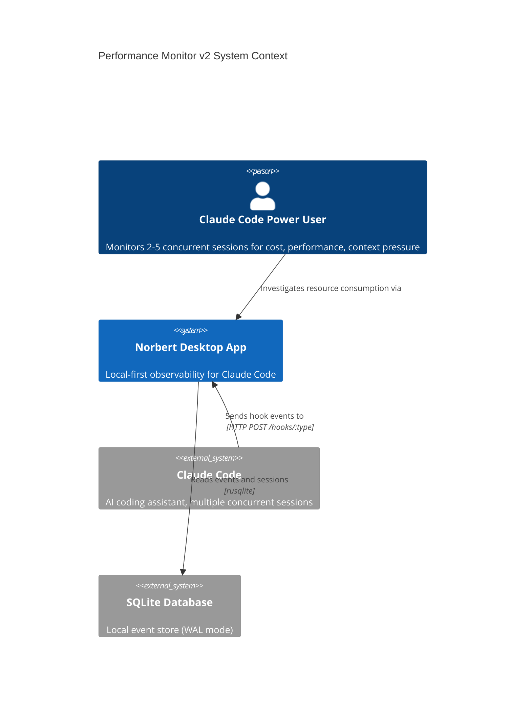
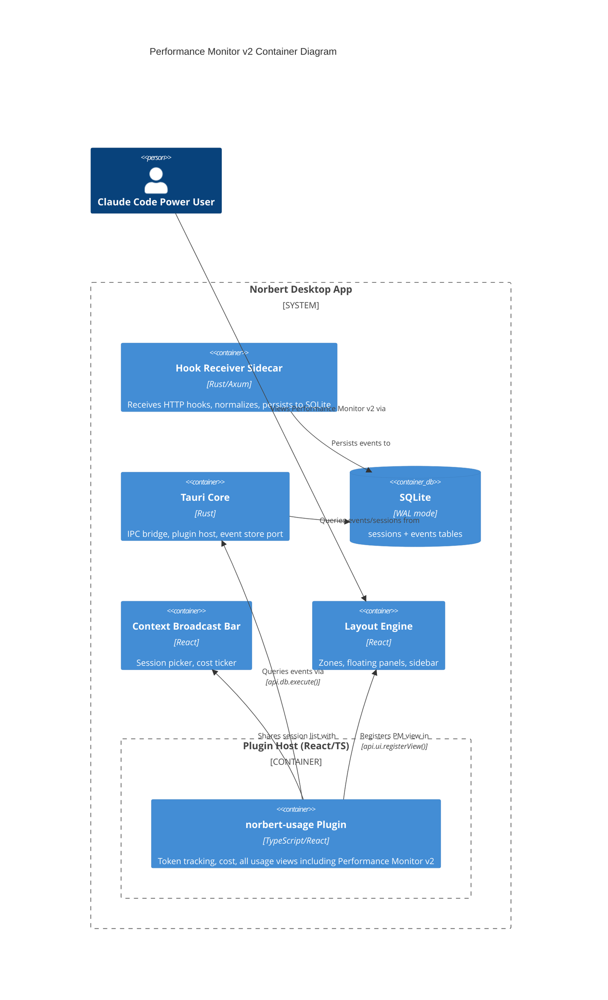

# Architecture Design: norbert-performance-monitor-v2

## System Overview

The Performance Monitor v2 redesigns the view layer from a flat single-pane dashboard into a **sidebar+detail master-detail layout** inspired by Windows Task Manager's Performance tab. Each metric category (Tokens/s, Cost, Agents, Context) gets its own dedicated graph with category-appropriate Y-axis scaling. The detail pane shows an aggregate graph, per-session mini-graph grid, stats grid, and session breakdown table -- all scoped to the selected category.

The domain and adapter layers are largely preserved from v1. The primary changes are:

1. **View layer**: Complete replacement -- sidebar with sparklines, category-scoped detail pane, per-session graph grid, hover tooltip system
2. **Adapter layer**: Extend MultiSessionStore to track per-session time-series buffers per category
3. **Domain layer**: Add category-aware chart data preparation and aggregate applicability rules; extend canvas rendering for filled-area charts, hover crosshair, and tooltip hit-testing

### Design Spec Reference

This architecture implements the design spec at `docs/feature/norbert-performance-monitor/design/performance-monitor-design-spec.md`. All layout decisions, color choices, and interaction patterns derive from that document and its companion HTML mockup.

## Assumptions

- A1-A8: All v1 assumptions remain in effect
- A9: Aggregate graphs are omitted for categories where aggregation is meaningless (Context). The category configuration enforces this via a boolean flag (`aggregateApplicable`) per ADR-009.
- A10: Hover tooltip interaction is canvas-coordinate-based; hit-testing maps mouse X to the nearest time-series sample index. This is a pure domain computation.

## C4 System Context (L1)



## C4 Container (L2)



## C4 Component (L3) -- norbert-usage Plugin with PM v2

```mermaid
C4Component
    title norbert-usage Plugin Components (Performance Monitor v2)

    Container_Boundary(usagePlugin, "norbert-usage Plugin") {

        Component(entryPoint, "Plugin Entry", "TS", "NorbertPlugin impl: manifest, onLoad, onUnload")
        Component(hookProc, "Hook Processor", "TS", "Routes event payloads through pipeline by session_id")

        Component_Boundary(domain, "Domain (Pure Functions)") {
            Component(tokenExtractor, "Token Extractor", "TS", "payload -> TokenUsage | absent")
            Component(pricingModel, "Pricing Model", "TS", "model + tokens -> cost")
            Component(metricsAggregator, "Metrics Aggregator", "TS", "Folds events into SessionMetrics")
            Component(crossSessionAgg, "Cross-Session Aggregator", "TS", "Array<SessionMetrics> -> AggregateMetrics")
            Component(multiWindowSampler, "Multi-Window Sampler", "TS", "Ring buffers for 1m/5m/15m windows")
            Component(oscilloscope, "Oscilloscope Functions", "TS", "Waveform points, grid lines, formatting")
            Component(pmDomain, "PM Domain Functions", "TS", "Urgency, compaction, cost rate")
            Component(urgencyThresholds, "Urgency Thresholds", "TS", "Shared threshold config")
            Component(categoryConfig, "Category Configuration", "TS", "MetricCategory definitions, aggregate applicability, formatting, colors")
            Component(chartRenderer, "Chart Renderer", "TS", "Filled-area line chart, crosshair, tooltip hit-test")
        }

        Component_Boundary(adapters, "Adapters (Effect Boundary)") {
            Component(eventSource, "Event Source Adapter", "TS", "Hook registration wiring")
            Component(stateStore, "Metrics State Store", "TS", "Per-session state cell, notifies subscribers")
            Component(multiSessionStore, "Multi-Session Store", "TS", "SessionMetrics + per-session TimeSeriesBuffers for ALL active sessions")
        }

        Component_Boundary(views, "React Views") {
            Component(pmContainer, "PM Container View", "React", "Master-detail layout, category selection state, time window state")
            Component(pmSidebar, "PM Sidebar", "React", "Category list with sparkline canvases and current values")
            Component(pmDetailPane, "PM Detail Pane", "React", "Aggregate graph, per-session grid, stats, session table")
            Component(pmChart, "PM Chart", "React/Canvas", "Filled-area line chart with hover crosshair support")
            Component(pmTooltip, "PM Tooltip", "React", "Floating tooltip anchored to cursor position")
            Component(pmTimeSelector, "PM Time Window Selector", "React", "Pill button group for 1m/5m/15m/Session")
            Component(pmStatsGrid, "PM Stats Grid", "React", "2-column stats readout, category-dependent content")
            Component(pmSessionTable, "PM Session Table", "React", "Per-session breakdown table, category-dependent columns")
            Component(gaugeCluster, "Gauge Cluster View", "React", "5-card floating HUD (unchanged)")
            Component(oscilloscopeView, "Oscilloscope View", "React/Canvas", "Dual-trace waveform (unchanged)")
            Component(dashboard, "Usage Dashboard View", "React", "6 metric cards + 7-day chart (unchanged)")
            Component(costTicker, "Cost Ticker", "React", "Status bar odometer (unchanged)")
        }
    }

    Rel(entryPoint, hookProc, "Registers")
    Rel(hookProc, tokenExtractor, "Passes payload to")
    Rel(tokenExtractor, pricingModel, "Feeds tokens to")
    Rel(pricingModel, metricsAggregator, "Feeds cost to")
    Rel(metricsAggregator, multiSessionStore, "Emits per-session snapshots to")
    Rel(multiSessionStore, crossSessionAgg, "Feeds all sessions to")
    Rel(crossSessionAgg, pmDetailPane, "Provides AggregateMetrics to")
    Rel(multiSessionStore, pmDetailPane, "Provides per-session time-series to")
    Rel(multiSessionStore, pmSidebar, "Provides aggregate time-series to")
    Rel(categoryConfig, pmContainer, "Drives category selection and rendering")
    Rel(chartRenderer, pmChart, "Provides canvas drawing pipeline to")
    Rel(chartRenderer, pmSidebar, "Provides sparkline drawing to")
    Rel(pmChart, pmTooltip, "Emits hover coordinates to")
    Rel(stateStore, gaugeCluster, "Notifies with broadcast session metrics")
    Rel(stateStore, oscilloscopeView, "Provides time-series buffer to")
    Rel(stateStore, dashboard, "Provides session metrics to")
    Rel(stateStore, costTicker, "Provides cost to")
```

## Data Flow

### Multi-Session Event Pipeline (unchanged from v1)

```
Claude Code hook event (with session_id)
  -> Hook Receiver (Rust, normalizes, persists)
  -> SQLite events table
  -> Hook Processor (routes by session_id)
  -> Token Extractor -> Pricing Model -> Metrics Aggregator (per-session fold)
  -> Multi-Session Store (updates SessionMetrics for specific session)
  -> Cross-Session Aggregator (recomputes AggregateMetrics from all sessions)
```

### v2 Addition: Per-Session Time-Series Buffers

```
Hook Processor (after metrics update)
  -> Compute rate sample (tokenRate, costRate, agentCount, contextPct)
  -> MultiSessionStore.appendSessionSample(sessionId, categorySamples)
  -> Updates per-session ring buffers for each category
  -> Updates aggregate ring buffers (sum for tokens/cost/agents; skip for context)
  -> PM Container re-renders on subscription notification
```

### v2 View Rendering Pipeline

```
PM Container (10Hz animation loop)
  -> Reads selected category from sidebar state
  -> Reads aggregate buffer for selected category from MultiSessionStore
  -> Reads per-session buffers for selected category
  -> Passes buffers to Chart Renderer pure functions
  -> Chart Renderer produces filled-area line chart with optional crosshair
  -> PM Sidebar draws sparklines for all categories using same renderer
```

## Component Architecture

### Category Configuration (New Domain Module)

The design spec defines 4 metric categories, each with distinct properties. This is modeled as a const configuration array:

| Category ID | Label | Y-axis Unit | Line Color | Aggregate Applicable? | Aggregate Strategy |
|---|---|---|---|---|---|
| `tokens` | Tokens/s | tok/s | `--brand` (#00e5cc) | Yes | Sum across sessions |
| `cost` | Cost | $/min | `--amber` (#f0920a) | Yes | Sum across sessions |
| `agents` | Agents | count | #4a9eff | Yes | Sum across sessions |
| `context` | Context | % (0-100) | #7aa89e | **No** | N/A -- per-session only |

The `aggregateApplicable` flag is a discriminated boolean on the category type. When false, the detail pane omits the large aggregate graph and renders per-session graphs as the primary display.

### Chart Renderer (New Domain Module)

Extends existing oscilloscope canvas functions with:

- **Filled-area rendering**: Line chart with gradient fill beneath (15% opacity at line -> 5% at X-axis)
- **Horizontal grid lines**: At major Y-axis intervals (not vertical time grid lines as in v1 oscilloscope)
- **Y-axis labels**: Right-aligned text at each grid line
- **Current value overlay**: Bold monospace in top-left of chart area
- **Crosshair rendering**: Vertical 1px line + 4px dot at data point on hover
- **Hit-test computation**: Mouse X position -> nearest sample index + value (pure function)

The renderer is a composition pipeline of pure functions. It does NOT own the canvas context -- it receives dimensions and returns drawing instructions or operates on a passed-in context.

### MultiSessionStore Extension (Adapter Modification)

Current interface:
```
addSession(id) | removeSession(id) | updateSession(id, metrics) | getSessions() | getSession(id)
```

Extended interface adds:
```
appendSessionSample(id, sample) -- append rate/category sample to per-session buffers
getSessionTimeSeries(id, category) -- get time-series buffer for a session+category
getAggregateTimeSeries(category) -- get aggregate buffer for a category
subscribe(callback) -- notify views of state changes
```

The store maintains:
- `Map<sessionId, Map<categoryId, TimeSeriesBuffer>>` -- per-session, per-category ring buffers
- `Map<categoryId, TimeSeriesBuffer>` -- aggregate ring buffers (recomputed on each sample for applicable categories)

### View Component Boundaries (v2)

| Component | Replaces | Responsibility |
|---|---|---|
| **PMContainerView** | PerformanceMonitorView | Master-detail layout shell. Manages: selected category, time window, hover state. Subscribes to MultiSessionStore. |
| **PMSidebar** | (new) | Renders category list. Each row: label, current value, sparkline canvas. Emits category selection. |
| **PMDetailPane** | PMAggregateGrid + PMSessionDetail | Category-scoped detail: aggregate graph (if applicable), per-session graph grid, stats grid, session table. |
| **PMChart** | PMChart (heavily modified) | Filled-area canvas chart. Supports both large (aggregate, Y-labels, grid) and mini (per-session, compact) modes. Emits hover coordinates. |
| **PMTooltip** | (new) | Floating tooltip. Receives value + time offset + color + position from hover state. Pure presentation. |
| **PMStatsGrid** | (new) | 2-column, 3-row stats. Content driven by selected category configuration. |
| **PMSessionTable** | (new) | Per-session breakdown table. Columns driven by selected category configuration. |
| **PMTimeWindowSelector** | PMTimeWindowSelector | Reused unchanged. |

### State Management

All v2 view state lives in the PMContainerView:

| State | Type | Scope |
|---|---|---|
| `selectedCategory` | CategoryId | Which sidebar item is active |
| `selectedWindow` | TimeWindowId | Time window for all graphs |
| `hoverState` | `{ canvas, mouseX, categoryId, sessionId? }` | Which chart is hovered and where |

The hover state is shared across the container so the tooltip component can render at the correct position. Hover coordinates flow: Canvas mousemove -> PMChart emits -> PMContainerView stores -> PMTooltip renders.

## Technology Stack

| Component | Technology | License | Rationale |
|---|---|---|---|
| Plugin runtime | TypeScript 5.x | Apache-2.0 | Project standard (existing) |
| View framework | React 19 | MIT | Project standard (existing) |
| Chart rendering | HTML Canvas API | N/A (built-in) | Extends existing canvas pipeline. 10Hz multi-chart at 60fps requires Canvas. |
| State notification | Custom pub/sub (functional) | N/A | Existing pattern, extended for per-category buffers. |
| Number formatting | Intl.NumberFormat | N/A (built-in) | Existing. Currency/rate formatting. |

**No new external dependencies.** All capabilities use browser APIs and extend existing patterns.

## Quality Attribute Strategies

### Performance (Priority 1)
- Sidebar sparklines: 4 canvases updated at 1Hz (matching data sample rate)
- Aggregate chart: 1 canvas at 10Hz (smooth scrolling interpolation)
- Per-session grid: N canvases at 10Hz (N = active sessions, typically 2-5)
- Total canvas renders per second: ~4 (sparklines) + ~10 (aggregate) + ~10*N (sessions) = ~54 at 5 sessions
- Each canvas uses the same drawing pipeline (filled-area line + optional crosshair)
- Ring buffers are fixed-capacity (no unbounded growth)
- Hover hit-test is O(1) array index lookup (mouseX -> sample index)

### Maintainability (Priority 2)
- Category configuration is a const array -- adding a new metric category requires only a new entry
- Chart renderer is a composition of pure functions, testable in isolation
- Stats grid and session table content are driven by category config, not hardcoded per-category
- Aggregate applicability is a type-level property, not a runtime check

### Testability (Priority 3)
- Chart renderer pure functions: unit-testable with mock dimensions
- Hit-test computation: pure function, property-testable (mouseX in range -> valid index)
- Category config: const data, snapshot-testable
- Aggregate applicability: type-level, compile-time guarantee
- View components: stateless renderers of pre-computed data

### Backward Compatibility
- Existing Oscilloscope, Gauge Cluster, Dashboard, Cost Ticker views unchanged
- Existing MetricsStore interface unchanged
- MultiSessionStore extended (additive, no breaking changes)
- All existing view registrations preserved

### Resilience
- Context category with no aggregate: gracefully renders per-session graphs as primary
- Session with missing context data: chart slot shows "Data unavailable"
- Session ends: charts freeze at final values, session removed from sidebar counts
- Zero active sessions: empty state with guidance

## Interaction with Existing Views

```
                    Multi-Session Store (extended)
                    /        |        \
                   /         |         \
    Broadcast     /    All Sessions +    \
    Session      /     Per-Session TS     \
       |        /           |              \
  [existing]   /            |               \
  MetricsStore        PM Container View
       |              (sidebar + detail)
  +---------+
  | Gauge   |
  | Cluster |
  | Oscill- |
  | oscope  |
  | Dashbd  |
  | Ticker  |
  +---------+
```

## Rejected Simpler Alternatives

### Alternative 1: Patch v1 layout with CSS grid reorganization
- What: Keep existing PerformanceMonitorView but rearrange into sidebar+detail with CSS
- Expected Impact: ~40% (layout change achieved, but no per-category graphs, no sparklines, no hover system)
- Why Insufficient: The v1 component renders all metrics in a single render loop with a single chart. Category-scoped rendering requires fundamentally different state management and data flow.

### Alternative 2: Add category tabs to v1 detail pane
- What: Keep flat layout but add tab buttons to switch between Tokens/Cost/Agents/Context
- Expected Impact: ~60% (category isolation achieved, per-session breakdown possible)
- Why Insufficient: No sidebar sparklines for at-a-glance overview of all categories simultaneously. The Task Manager pattern's value is seeing all categories in the sidebar while drilling into one -- tabs hide the others.

### Why v2 view replacement is necessary
1. Sidebar with sparklines requires independent canvas rendering per category (not achievable in v1 single-chart model)
2. Per-session graph grid requires per-session time-series buffers (v1 MultiSessionStore lacks these)
3. Hover tooltip with crosshair requires canvas-level mouse tracking per chart instance
4. Aggregate applicability rules (Context has no aggregate) require category-aware rendering logic
