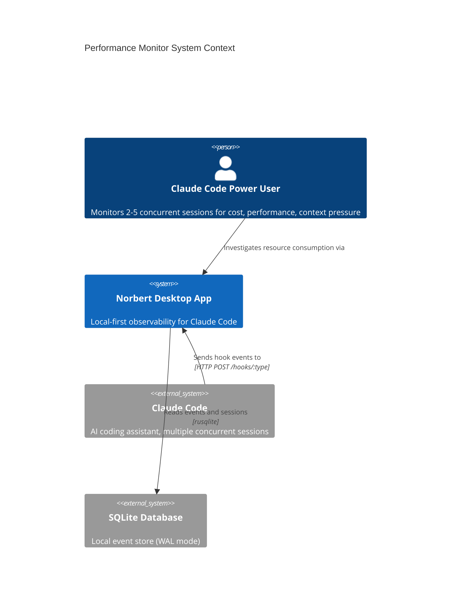
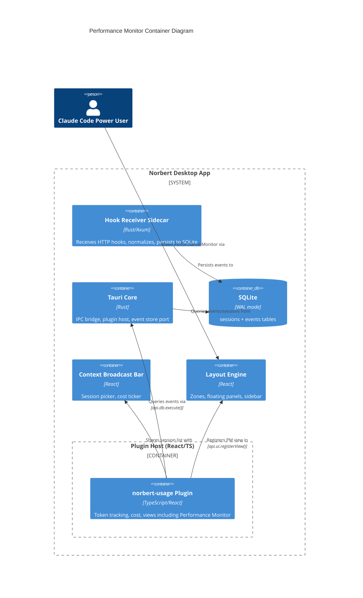

# Architecture Design: norbert-performance-monitor

## System Overview

The Performance Monitor extends the norbert-usage plugin with a multi-metric, multi-scope monitoring dashboard. It introduces cross-session aggregation, configurable time windows, and drill-down navigation while preserving backward compatibility with the existing Oscilloscope, Gauge Cluster, and Usage Dashboard views.

The design follows the existing pure-core/effect-shell pattern: new domain modules are pure functions, effects are confined to the store layer, and React views are stateless renderers of domain-computed data.

## Assumptions

- A1-A5: All existing norbert-usage assumptions remain in effect (see norbert-usage architecture-design.md)
- A6: The sessions table (`started_at` present, `ended_at` null) reliably identifies active sessions. The plugin can query this table to discover all active sessions.
- A7: Hook events include `session_id`, enabling the plugin to attribute events to sessions without relying on broadcast context.
- A8: Agent identification in event payloads (`agent_id` or subagent fields) is best-effort. Agent breakdown in session detail degrades gracefully when agent data is absent.

## C4 System Context (L1)



## C4 Container (L2)



## C4 Component (L3) -- norbert-usage Plugin with Performance Monitor

```mermaid
C4Component
    title norbert-usage Plugin Components (with Performance Monitor)

    Container_Boundary(usagePlugin, "norbert-usage Plugin") {

        Component(entryPoint, "Plugin Entry", "TS", "NorbertPlugin impl: manifest, onLoad, onUnload")
        Component(hookProc, "Hook Processor", "TS", "Routes event payloads through pipeline by session_id")

        Component_Boundary(domain, "Domain (Pure Functions)") {
            Component(tokenExtractor, "Token Extractor", "TS", "payload -> TokenUsage | absent")
            Component(pricingModel, "Pricing Model", "TS", "model + tokens -> cost")
            Component(metricsAggregator, "Metrics Aggregator", "TS", "Folds events into SessionMetrics")
            Component(crossSessionAgg, "Cross-Session Aggregator", "TS", "Array<SessionMetrics> -> AggregateMetrics")
            Component(timeSeriesSampler, "Time-Series Sampler", "TS", "Ring buffer of rate samples")
            Component(multiWindowSampler, "Multi-Window Sampler", "TS", "Manages buffers for 1m/5m/15m windows")
            Component(burnRateCalc, "Burn Rate Calculator", "TS", "tok/s over rolling window")
            Component(oscilloscope, "Oscilloscope Functions", "TS", "Waveform points, grid lines, formatting")
            Component(pmDomain, "PM Domain Functions", "TS", "Chart data, urgency classification, compaction estimate")
        }

        Component_Boundary(adapters, "Adapters (Effect Boundary)") {
            Component(eventSource, "Event Source Adapter", "TS", "Hook registration wiring")
            Component(stateStore, "Metrics State Store", "TS", "Per-session state cell, notifies subscribers")
            Component(multiSessionStore, "Multi-Session Store", "TS", "Manages SessionMetrics for ALL active sessions")
            Component(sessionDiscovery, "Session Discovery Adapter", "TS", "Queries sessions table for active sessions")
        }

        Component_Boundary(views, "React Views") {
            Component(gaugeCluster, "Gauge Cluster View", "React", "5-card floating HUD")
            Component(oscilloscopeView, "Oscilloscope View", "React/Canvas", "Dual-trace waveform")
            Component(dashboard, "Usage Dashboard View", "React", "6 metric cards + 7-day chart")
            Component(pmAggView, "PM Aggregate View", "React/Canvas", "Multi-metric grid, per-session breakdown")
            Component(pmDetailView, "PM Session Detail View", "React/Canvas", "Session-scoped metrics, agent breakdown")
            Component(costTicker, "Cost Ticker", "React", "Status bar odometer")
        }
    }

    Rel(entryPoint, hookProc, "Registers")
    Rel(hookProc, tokenExtractor, "Passes payload to")
    Rel(tokenExtractor, pricingModel, "Feeds tokens to")
    Rel(pricingModel, metricsAggregator, "Feeds cost to")
    Rel(metricsAggregator, multiSessionStore, "Emits per-session snapshots to")
    Rel(multiSessionStore, crossSessionAgg, "Feeds all sessions to")
    Rel(crossSessionAgg, pmAggView, "Provides AggregateMetrics to")
    Rel(multiSessionStore, pmDetailView, "Provides session metrics to")
    Rel(multiSessionStore, multiWindowSampler, "Feeds rate samples to")
    Rel(multiWindowSampler, pmAggView, "Provides windowed time series to")
    Rel(sessionDiscovery, multiSessionStore, "Provides active session list to")
    Rel(stateStore, gaugeCluster, "Notifies with broadcast session metrics")
    Rel(stateStore, oscilloscopeView, "Provides time-series buffer to")
    Rel(stateStore, dashboard, "Provides session metrics to")
    Rel(stateStore, costTicker, "Provides cost to")
    Rel(pmDomain, pmAggView, "Provides chart data to")
    Rel(pmDomain, pmDetailView, "Provides chart data to")
    Rel(oscilloscope, pmAggView, "Provides waveform rendering to")
```

## Data Flow

### Multi-Session Event Pipeline

```
Claude Code hook event (with session_id)
  -> Hook Receiver (Rust, normalizes, persists)
  -> SQLite events table
  -> Hook Processor (routes by session_id)
  -> Token Extractor -> Pricing Model -> Metrics Aggregator (per-session fold)
  -> Multi-Session Store (updates SessionMetrics for specific session)
  -> Cross-Session Aggregator (recomputes AggregateMetrics from all sessions)
  -> Multi-Window Sampler (appends rate sample to per-session + aggregate buffers)
  -> PM Views (re-render on state change)
```

### Session Discovery Flow

```
Plugin onLoad / periodic tick
  -> Session Discovery Adapter (SELECT id FROM sessions WHERE ended_at IS NULL)
  -> Multi-Session Store (add/remove session tracking)
  -> For each new session: load historical events, fold into SessionMetrics
  -> For each ended session: remove from active set (preserve in store for playback)
```

### Time Window Resolution Strategy

| Window | Buffer Capacity | Sample Interval | Resolution |
|--------|----------------|-----------------|------------|
| 1m | 600 samples | ~100ms (10Hz) | Full fidelity (existing behavior) |
| 5m | 600 samples | ~500ms (2Hz) | Downsampled from live feed |
| 15m | 900 samples | ~1000ms (1Hz) | Downsampled from live feed |
| Session | 600-900 samples | Dynamic | Historical query, adaptive resolution |

All windows target 300-900 data points per chart. Wider windows downsample by selecting every Nth sample from the live feed or by querying historical data with appropriate binning.

### Interaction with Existing Views

```
                    Multi-Session Store
                    /        |        \
                   /         |         \
    Broadcast     /     All Sessions    \
    Session      /           |           \
       |        /            |            \
  [existing]   /             |             \
  MetricsStore             PM Aggregate    PM Detail
       |                   View            View
  +---------+
  | Gauge   |
  | Cluster |
  | Oscill- |
  | oscope  |
  | Dashbd  |
  | Ticker  |
  +---------+
```

Existing views continue to operate on the broadcast session via the existing MetricsStore. The Performance Monitor views subscribe to the Multi-Session Store for cross-session data. The broadcast session's data flows to both paths, ensuring metric consistency.

## Plugin Registration (Updated)

| Registration | API Call | Parameters |
|---|---|---|
| Gauge Cluster view | `api.ui.registerView()` | id: "gauge-cluster" (existing, unchanged) |
| Oscilloscope view | `api.ui.registerView()` | id: "oscilloscope" (existing, unchanged) |
| Usage Dashboard view | `api.ui.registerView()` | id: "usage-dashboard" (existing, unchanged) |
| **Performance Monitor view** | `api.ui.registerView()` | id: "performance-monitor", primaryView: false |
| Usage tab | `api.ui.registerTab()` | id: "usage" (existing, unchanged) |
| Cost ticker | `api.ui.registerStatusItem()` | id: "cost-ticker" (existing, unchanged) |
| Hook processor | `api.hooks.register()` | hookName: "session-event" (existing, updated routing) |

The Performance Monitor is registered as a new view, not replacing any existing registration.

## Technology Stack

| Component | Technology | License | Rationale |
|---|---|---|---|
| Plugin runtime | TypeScript 5.x | Apache-2.0 | Project standard (existing) |
| View framework | React 19 | MIT | Project standard (existing) |
| Chart rendering | HTML Canvas API | N/A (built-in) | Reuses existing oscilloscope Canvas pipeline. 10Hz multi-chart requires Canvas over SVG. |
| State notification | Custom pub/sub (functional) | N/A | Existing pattern, extended for multi-session. No new dependencies. |
| Number formatting | Intl.NumberFormat | N/A (built-in) | Existing. Currency formatting for cost/min display. |

**No new external dependencies required.** All new capabilities use browser APIs and extend existing patterns.

## Quality Attribute Strategies

### Performance (Priority 1)
- PM grid renders 4-5 Canvas charts at ~10Hz (1m window) or proportionally lower for wider windows
- Each chart uses the same `prepareWaveformPoints` pipeline as the oscilloscope (proven at 10Hz)
- Cross-session aggregation is O(N) where N = active sessions (typically 2-5, never >20)
- Multi-window buffers are fixed-capacity ring buffers (no unbounded growth)
- Session discovery polls at 2-second intervals (not per-frame)

### Maintainability (Priority 2)
- All new domain modules are pure functions with algebraic types
- Cross-session aggregation is a single pure function: `Array<SessionMetrics> -> AggregateMetrics`
- PM domain functions compose with existing oscilloscope functions (no duplication)
- Effect boundary stays at adapters: Multi-Session Store is the new mutable cell
- Shared urgency thresholds via configuration constant (single source of truth)

### Testability (Priority 3)
- Pure domain functions (crossSessionAgg, pmDomain, multiWindowSampler) are unit-testable in isolation
- Property-based testing: `aggregate(sessions).totalTokenRate === sum(sessions.map(s => s.burnRate))`
- View components receive pre-computed data; rendering logic is in testable pure functions

### Backward Compatibility
- Existing Oscilloscope, Gauge Cluster, Dashboard, Cost Ticker views are unchanged
- Existing MetricsStore interface unchanged; Multi-Session Store is additive
- Floating panel configurations with oscilloscope continue to work
- No existing view registrations removed or modified

### Resilience
- Missing context data per session: chart slot shows "Data unavailable" (layout stable)
- Session ends during detail view: charts freeze at final values, indicator shown
- Agent breakdown unavailable: panel shows session-level metrics only (graceful degradation)
- No active sessions: empty state with guidance and link to most recent session

### Accessibility
- Urgency indicators use both color and shape/pattern (not color alone)
- All animations respect `prefers-reduced-motion`
- Charts have appropriate ARIA labels

## Rejected Simpler Alternatives

### Alternative 1: Add aggregate counters to existing Gauge Cluster
- What: Show total tokens/s and total cost alongside existing broadcast-session gauges
- Expected Impact: ~30% of functionality (aggregate numbers visible, but no per-session breakdown, no drill-down, no time windows)
- Why Insufficient: Does not address the core JTBD: identifying which session is consuming resources. No drill-down path. No extended time windows.

### Alternative 2: Multi-session toggle in existing Oscilloscope
- What: Add a "show all sessions" toggle to the oscilloscope that overlays waveforms from all sessions
- Expected Impact: ~50% (visual aggregate, per-session traces visible)
- Why Insufficient: Oscilloscope is single-chart. Cannot show tokens/s, cost/min, context %, and agents simultaneously. No per-session breakdown list. No drill-down to agent level. Time window still fixed at 60s.

### Why the Performance Monitor view is necessary
1. Simple alternatives cannot show multiple metrics simultaneously (grid layout required)
2. Drill-down navigation (aggregate -> session -> agent) requires view-level state management
3. Configurable time windows require multi-resolution buffer management
4. The grid layout and navigation are fundamentally different from the oscilloscope's single-waveform design
