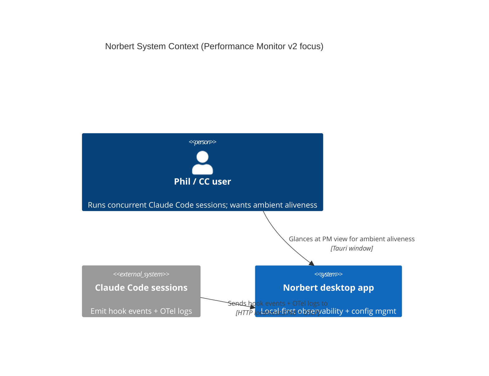
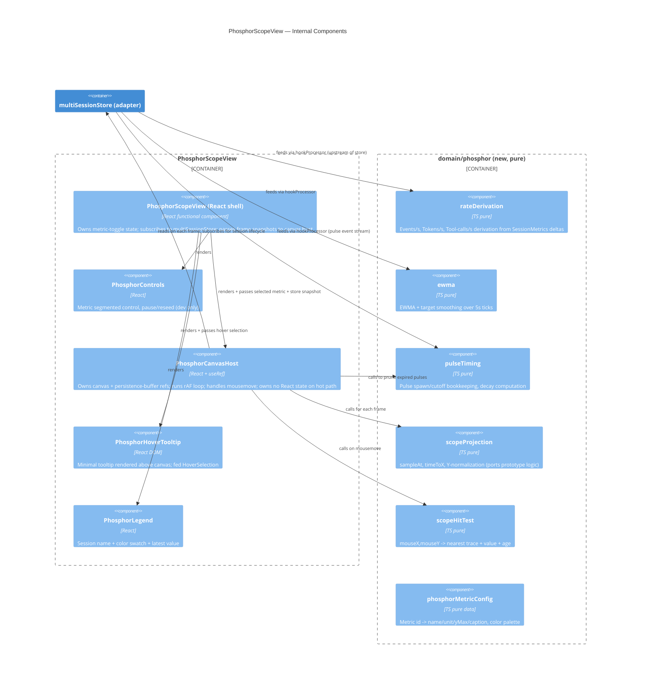

# Performance Monitor v2 — Phosphor Architecture (DESIGN wave)

**Status:** Design proposal (DESIGN wave output, propose mode). Feeds DISTILL (acceptance-designer) and DELIVER (nw-functional-software-crafter).
**Date:** 2026-04-17
**Supersedes:** The v1 PM architecture described in `docs/feature/norbert-performance-monitor/design/architecture-design.md`.
**Inputs:** `v2-phosphor-decisions.md` (plan-of-record), `docs/design/performance-monitor-phosphor-prototype.html` (visual spec), `docs/research/performance-monitor-live-signal-patterns.md`, `docs/research/claude-code-otel-telemetry-actual-emissions.md`.

The plan-of-record locks the anchor job, aesthetic, metric toggle, hover content, view slot, and replacement scope. This document answers the seven open architecture questions with propose-mode tradeoffs and recommendations. Clear-cut decisions (where the prototype or prior constraints leave no real option) are stated directly.

---

## 1. Context Summary

The v2 PM is a single view that visualizes concurrent Claude Code session activity as a phosphor oscilloscope — one color trace per session, with afterglow decay, event-pulse flares, and a user-toggleable Y-axis metric (Events/s, Tokens/s, Tool-calls/s). Hover reveals a minimal tooltip. The view replaces v1 entirely; adjacent views are untouched.

**Quality attributes driving decisions (in priority order):**

1. **Performance efficiency** — 60fps canvas render on a Tauri webview, without blocking hook ingestion or causing React tree thrash.
2. **Maintainability** — functional paradigm, pure derivation, effects confined to canvas and store boundaries.
3. **Testability** — pure functions unit-testable; seam-based acceptance tests for the canvas view (no pixel diffing).
4. **Reliability** — honest signal (no sub-interval interpolation; no zero-fill between arrivals); accurate presence of motion even when data is quiet.

**Constraints:**

- Tauri 2.0 + Rust backend + React/TS frontend. No new runtime deps unless strongly justified.
- Functional paradigm (ADR-004 remains authoritative).
- Phil is the sole user today (solo-developer context).
- Existing `hookProcessor` + OTel ingest pipeline (ADR-030…ADR-038, ADR-044) stays unchanged upstream of the PM.

---

## 2. C4 — System Context (unchanged)



---

## 3. C4 — Container (v2 state)

```mermaid
C4Container
  title Performance Monitor v2 — Containers (unchanged shape; only PM subtree changes)
  Person(user, "User")
  System_Ext(cc, "Claude Code")
  Container(tauri, "Tauri shell", "Rust", "System tray + window host")
  Container(axum, "Hook receiver", "Rust + Axum", "Ingests hook + OTLP events")
  ContainerDb(sqlite, "SQLite", "WAL mode", "Events + sessions")
  Container(react, "Renderer UI", "React + TS + Vite", "Plugin host, views")
  Container_Boundary(plugin, "norbert-usage plugin") {
    Container(hp, "hookProcessor", "TS pure + effect", "Extracts event_type, dispatches")
    Container(ms, "multiSessionStore", "TS adapter", "Per-session state + buffers + subscribe")
    Container(pmv2, "PhosphorScopeView", "TS React + Canvas", "v2 PM view (replaces v1)")
  }
  Rel(cc, axum, "POST hook / OTLP", "HTTP")
  Rel(axum, sqlite, "Persists events", "SQL")
  Rel(axum, react, "Broadcasts events to", "Tauri event bus")
  Rel(react, hp, "Dispatches session-event to")
  Rel(hp, ms, "Updates per-session metrics + derived rate samples in")
  Rel(pmv2, ms, "Subscribes to; reads session buffers and pulse events from")
  Rel(user, pmv2, "Glances at; hovers for tooltip")
```

---

## 4. C4 — Component (PhosphorScopeView + supporting pure modules)



---

## 5. Open Question Resolutions

### Q1. Data Derivation Pipeline

**Summary of decision:** Add three pure derivations (Events/s, Tokens/s, Tool-calls/s) in a new `domain/phosphor/rateDerivation.ts`. Replace v1's four-category per-session buffers with three metric-specific rate buffers plus a pulse event log. Retire `CategorySample` and the "store category value in `tokenRate` field" misnomer.

#### Options considered

**Option A — Reuse existing `CategorySample` shape, add two categories.**
Extend `categoryConfig` with `events` and `toolcalls` alongside existing `tokens`/`cost`/`agents`/`latency`. Keep `CategorySampleInput` with 6 fields. Keep the "store value in `tokenRate`" convention.
*Trade-offs:* minimal churn to `multiSessionStore`'s public shape; but entrenches the field-name misnomer TODO'd in `multiSessionStore.ts`, and forces non-rate categories (agents, latency) to travel through the same pipeline even though they're irrelevant to v2.

**Option B — Replace category model with a purpose-built `RateBuffer<metric>` + `PulseLog` (RECOMMENDED).**
Delete `CategorySample`/`CategorySampleInput`. Introduce:
- `RateSample { t: number; v: number }` (generic time/value pair; value is always a non-negative rate in the metric's unit).
- Three per-session `RateBuffer` instances per metric: `events`, `tokens`, `toolcalls`. Each is a ring buffer (or append-with-cutoff list) of ~2–3 min retention at 5s cadence (~24–36 entries).
- `PulseEvent { t: number; strength: number; kind: 'tool'|'subagent'|'lifecycle' }` per session, with a short cutoff (2.5s visual lifetime, keep 5s in the log to be safe).
`hookProcessor` populates them:
- **Tokens/s**: on OTel `api_request`, compute `(delta input+output+cache tokens) / (delta wallclock seconds)`, feed EWMA, push sample.
- **Tool-calls/s**: on hook `PostToolUse` and OTel `tool_result`, increment a 5s window counter; push `count / 5` as a sample every 5s rate tick.
- **Events/s**: counter of all hook + OTel arrivals per 5s window; push `count / 5` every tick.
- **Pulses**: every hook `PreToolUse`/`PostToolUse`/`SubagentStop`/lifecycle event pushes a pulse on that session's log with a `strength` in [0.5, 1.0] chosen by event type (tool use stronger than lifecycle).
Rate ticker is a 5s `setInterval` (or idle poller) inside the adapter; event counters live in the adapter as the mutable cell.
*Trade-offs:* a focused rewrite of the per-session buffer shape. But: aligns exactly with prototype semantics; resolves the `CategorySample` TODO structurally; eliminates four-category baggage (cost, agents, latency) from the PM data path (they remain in `SessionMetrics` for other consumers); each metric buffer independently testable.

**Option C — Compute derivations inside the view on each frame.**
Keep raw hook + OTel samples in the store; derive rates inside `PhosphorCanvasHost` at 60fps.
*Trade-offs:* simplest store. But violates the functional-paradigm rule (effects at boundaries, not in render), and repeats the same 5s-bucket arithmetic 60× per second. Also couples view to raw event stream, making the hit-test harder to unit-test.

**Recommendation:** **Option B.** It resolves the `CategorySample` mismatch, aligns the store exactly with the prototype's data model, and keeps derivations pure + unit-testable. Option A is an incremental patch that preserves misleading semantics; Option C violates the paradigm.

#### Impact on existing code

| Module | Action | Why |
|---|---|---|
| `adapters/multiSessionStore.ts` | **AMEND** — replace `appendSessionSample` (4-category `CategorySampleInput`) with `appendRateSample(sessionId, metric, value)` and `appendPulse(sessionId, pulse)`. Replace per-category buffer maps with per-metric rate buffers + per-session pulse log. Drop `aggregateBuffers`, `aggregateMultiWindowBuffers`, `aggregateSums`, `lastSessionValues` — v2 does not sum rates across sessions. | v2 does not aggregate across sessions; per-session traces only. |
| `domain/categoryConfig.ts` | **DEPRECATE** (supersede with `domain/phosphor/phosphorMetricConfig.ts`). | Retains 4-category model specific to v1 stats grid. |
| `domain/crossSessionAggregator.ts` | **DEPRECATE** for PM use. Keep file if still consumed by other PM-adjacent views (confirm during DELIVER); if nothing reads it, remove. | Cross-session sums are one of the three things v1 got wrong (plan-of-record). |
| `domain/multiWindowSampler.ts` | **DEPRECATE** per-PM. v2 has a single rolling 60s window. | Time-window selector removed in v2 (superseded US-PM-004). |
| `domain/timeSeriesSampler.ts` (`appendSample`, `createBuffer`) | **KEEP** — reuse the ring-buffer primitives for the new rate buffers. | Proven, tested, O(1), functional. |
| `hookProcessor.ts` | **AMEND** — replace `deriveCategorySamples` with three per-metric derivers + pulse emitter. Keep the OTel-active switching logic. | Same dispatch shape; new derivation targets. |
| `domain/instantaneousRate.ts` | **KEEP** — still useful for internal `burnRate` on `SessionMetrics` and for the Cost Ticker status item. | Not PM-specific. |

---

### Q2. Component Boundaries

**Clear-cut.** The prototype is a single phosphor canvas with a metric segmented control, a legend row, a minimal tooltip, and an axis note. It has no master/detail, no sidebar, no stats grid. Therefore:

**Replace** (delete after DELIVER wave ships v2):
- `views/PerformanceMonitorView.tsx` (v1 master/detail shell)
- `views/PMSidebar.tsx`
- `views/PMChart.tsx`
- `views/PMDetailPane.tsx`
- `views/PMStatsGrid.tsx`
- `views/PMSessionTable.tsx`
- `views/PMTooltip.tsx` (replaced by the minimal phosphor tooltip; see Q3)

**Create** under `views/phosphor/` (new sub-folder to keep the v2 component set cleanly separated during co-existence in the crafter branch):
- `PhosphorScopeView.tsx` — registered view container; owns metric toggle state; subscribes to `multiSessionStore`.
- `PhosphorCanvasHost.tsx` — owns canvas + persistence-buffer refs; rAF loop; pointer events. **This is the sole effect component.**
- `PhosphorControls.tsx` — metric segmented control (Events/s | Tokens/s | Tool-calls/s). No other controls ship in v2 (Pause/Reseed from the prototype are dev-only, omitted from production).
- `PhosphorHoverTooltip.tsx` — minimal tooltip: `session-name · value unit · time-ago`. Pure props-in component.
- `PhosphorLegend.tsx` — color dot + session name + latest value.

**Registration:** `PERFORMANCE_MONITOR_VIEW_ID = "performance-monitor"` in `index.ts` stays identical; only the rendered component changes. `floatMetric: null`, `primaryView: false`, `minWidth: 400`, `minHeight: 300` all preserved (the prototype comfortably fits).

---

### Q3. Render Architecture (Canvas + Persistence Buffer)

**Clear-cut on the major shape; two sub-options on the persistence buffer lifecycle.**

- The persistence buffer (offscreen canvas for afterglow) lives in a `useRef` inside `PhosphorCanvasHost`. Not component state (would trigger re-renders), not module-level (would leak across mounts).
- The primary canvas is a direct `<canvas>` child of `PhosphorCanvasHost`; the component uses `ResizeObserver` + DPR scaling (pattern proven by `OscilloscopeView.tsx`).
- rAF loop runs while the host is mounted. A `visibilitychange` hook pauses the loop when the document is hidden (spec: still ticking the 5s rate/data pipeline, but not drawing — Phil's "peripheral glance" job is served only when the window is visible).
- Pointer events (`mousemove`, `mouseleave`) are attached to the canvas's bounding wrapper via React synthetic events. On each mousemove the host calls the pure `scopeHitTest(mouseX, mouseY, frameSnapshot) -> HoverSelection | null` and updates a `useState<HoverSelection | null>` passed to `PhosphorHoverTooltip` (tooltip DOM element rendered above canvas; not re-renders whole view because the tooltip's only parent state is this one).

**Metric-toggle afterglow reset: two options.**

**Option A — Discard the persistence buffer on metric change (RECOMMENDED).**
When `selectedMetric` changes, the host nulls its `persistenceBufferRef.current`; the next frame recreates an empty offscreen canvas. Prior-metric traces vanish on the next frame.
*Trade-offs:* an instant visual "snap" (no fade). Matches the prototype's `applyMetricUi` line `scopePersist = null`. Simple, bug-free.

**Option B — Crossfade persistence buffer over 500ms.**
On metric change, keep rendering the old buffer at decreasing alpha while the new metric's trace draws at increasing alpha.
*Trade-offs:* prettier. But the old buffer now represents a different Y-scale (e.g., 15 evt/s vs 100 tok/s) — a crossfade would superimpose traces at incompatible scales and is actively misleading. The prototype chose A for this reason.

**Recommendation:** **Option A.** It is honest (no cross-metric scale confusion) and matches the prototype.

**Persistence buffer lifecycle rule (invariant):** the buffer is invalidated and recreated when *any* of `{canvas width, canvas height, selected metric, DPR}` changes. Phil's user tests will only surface issues if this rule slips; enforce via a single `ensurePersistenceBuffer(w, h, metric, dpr)` helper that tracks the last key.

---

### Q4. Functional-Paradigm Structure

**Clear-cut.** The plan-of-record mandates pure functions for derivation/EWMA/pulse-timing; effects confined to canvas rendering + store updates. This implies:

**Pure modules under `src/plugins/norbert-usage/domain/phosphor/`** (new directory):

| Module | Purpose | Signature highlights |
|---|---|---|
| `phosphorMetricConfig.ts` | Metric id → name/unit/yMax/caption; session color palette (5 entries). Pure data. | `METRICS: Record<MetricId, MetricConfig>`, `SESSION_COLORS: readonly string[]` |
| `rateDerivation.ts` | Event-counter → sample conversion + token delta→rate. | `deriveTokensRate(prev, next, dtMs): number`; `deriveEventsRate(count, windowMs): number`; `deriveToolCallsRate(count, windowMs): number` |
| `ewma.ts` | Single- or two-stage EWMA with target attraction (mirrors prototype `current = current*0.55 + target*0.45`). | `ewmaStep(current, target, alpha): number` |
| `pulseTiming.ts` | Pulse lifetime, decay, prune. | `decayFactor(ageMs, lifetimeMs): number`; `prunePulses(log, now, cutoffMs): ReadonlyArray<Pulse>` |
| `scopeProjection.ts` | Time↔X and Y-normalization; `sampleAt` binary search from prototype. | `timeToX(t, now, windowMs, w): number`; `sampleAt(history, t): number`; `valueToY(v, yMax, h, pad): number` |
| `scopeHitTest.ts` | Mouse coordinates → nearest trace, value, age. | `scopeHitTest(args): HoverSelection \| null` |

**Effect boundaries (only these modules may touch `document`, `window.performance.now`, `requestAnimationFrame`, canvas context, or mutate):**

- `views/phosphor/PhosphorCanvasHost.tsx` — rAF loop, canvas drawing, DPR, ResizeObserver.
- `adapters/multiSessionStore.ts` — the one mutable cell for session state (already the effect boundary).
- `hookProcessor.ts` — the ingest effect (already the effect boundary).

**Existing pure modules — disposition:**

| Module | Disposition | Rationale |
|---|---|---|
| `domain/oscilloscope.ts` (`prepareWaveformPoints`, `formatRateOverlay`, etc.) | **KEEP** — used by `OscilloscopeView` (out-of-scope per decision #4). | Untouched by v2 per scope boundary. |
| `domain/chartRenderer.ts` | **KEEP** for the existing oscilloscope; not used by v2 phosphor (different projection math). | v2 has its own projection in `scopeProjection.ts`. |
| `domain/crossSessionAggregator.ts` | **DEPRECATE for PM.** If no other consumer, remove; else leave with a comment marking non-PM usage. | v2 does not aggregate across sessions. |
| `domain/urgencyThresholds.ts` | **KEEP** — used by fuel gauge / notifier. | Orthogonal to PM v2. |
| `domain/multiWindowSampler.ts` | **DEPRECATE for PM.** v2 uses a single fixed 60s window. | Time-window selector removed (US-PM-004 superseded). |
| `domain/performanceMonitor.ts` | **AUDIT** — functions used by v1 PM should move to deprecated status; any still-used by other views keep. | Needs a per-export grep in DELIVER. |
| `domain/categoryConfig.ts` | **DEPRECATE** → replaced by `phosphor/phosphorMetricConfig.ts`. | Models 4-category v1 design. |
| `domain/heartbeat.ts` (`createHeartbeatSample`) | **DEPRECATE** — prototype's 60fps render provides continuous motion from data alone. No need for zero-fill heartbeats. | Research finding: zero-fill is an anti-pattern; continuous feel comes from render, not fabricated data. |
| `domain/timeSeriesSampler.ts` (`createBuffer`, `appendSample`) | **KEEP** — reused for rate buffers. | Proven O(1) ring buffer primitive. |
| `domain/contextWindow.ts`, `tokenExtractor.ts`, `pricingModel.ts`, `metricsAggregator.ts` | **KEEP** — upstream ingest, unrelated to PM rendering. | Broadcast-session metrics, cost ticker, etc. |

---

### Q5. Migration / Cutover Strategy

**Clear-cut for Phil's context (sole user, plan-of-record says clean replace).**

**Recommendation: hard replace in a single PR, no feature flag.**

**Rationale:**
- Plan-of-record explicitly specifies clean replacement (decision #4).
- Phil is the sole user. No user data loss (the PM view has no persistent user state — no saved filters, no bookmarked sessions).
- The v2 view ID is identical (`performance-monitor`), so existing window layouts keyed on view ID continue to resolve; the window simply shows the new component.
- The upstream data pipeline (hookProcessor, OTel ingest, multiSessionStore adapter) changes in a compatible way *through* the PR; no multi-PR migration fence needed.
- A feature flag adds a codepath we'd never ship to production and would have to remember to delete.

**PR sequencing within the single PR:**

1. Add new `domain/phosphor/` pure modules and their tests.
2. Add new `views/phosphor/` components (not yet wired).
3. Rewrite `multiSessionStore` buffers to the new shape. Adapt `hookProcessor` derivations. Keep public `addSession`/`getSessions`/`subscribe` signatures stable.
4. Swap `index.ts` registration to render `PhosphorScopeView` for the `performance-monitor` view ID.
5. Delete `views/PerformanceMonitorView.tsx` + the other v1 PM view components.
6. Delete `domain/categoryConfig.ts`, `domain/heartbeat.ts`, and any other modules marked DEPRECATE with zero remaining references.

**Rollback plan:** git revert of the single PR. Phil can build from the previous main commit; state is entirely in-memory per run.

---

### Q6. Adjacent Views (Oscilloscope, Gauge Cluster)

**Clear-cut per decision #4 (out of scope).** Two confirmations:

1. **Oscilloscope view** (`OscilloscopeView.tsx`, registered under ID `oscilloscope` by whatever registrar owns it today — verify during DELIVER): left registered and untouched. It consumes `domain/oscilloscope.ts` and the broadcast-session `metricsStore` — neither of which v2 PM modifies.
2. **Gauge Cluster + Session Status** (`GaugeClusterView.tsx`, `SessionStatusView.tsx`): left registered and untouched. They consume per-session `SessionMetrics` from `multiSessionStore.getSession()` + `getSessions()` — public API preserved under Option B (Q1).

**Future removal (not this wave):** per plan-of-record, "likely candidates for removal" but explicitly out of scope. The v2 delete list in this document is confined to v1 PM view components; adjacent views stay.

**Risk flag for DELIVER:** if `GaugeClusterView` or `SessionStatusView` *happens* to import from `domain/categoryConfig.ts` or `domain/heartbeat.ts`, the deprecation list in Q4 must retain those modules (or extract the needed parts to a new home). Grep to verify during crafter's GREEN phase.

---

### Q7. Test Strategy

**Outside-In TDD seam:** the public boundary of the PhosphorScopeView subtree is `(multiSessionStore, selectedMetric) -> {frames, hoverSelections}`. Frames are the pure output of `scopeProjection` given a store snapshot; hover selections are the pure output of `scopeHitTest` given `(mouseXY, frame)`. Acceptance tests target this seam, not canvas pixels.

**Test layers:**

| Layer | What | Tools |
|---|---|---|
| **Pure domain** (highest mutation coverage) | `rateDerivation`, `ewma`, `pulseTiming`, `scopeProjection`, `scopeHitTest`, `phosphorMetricConfig` lookups | Vitest unit tests + Stryker mutation testing per-feature (per `CLAUDE.md`) |
| **Adapter seam** | `multiSessionStore` rate-sample + pulse append; subscriber notification semantics; lifecycle (addSession/removeSession prunes buffers) | Vitest with fake timers for rate-tick (5s) behavior |
| **Ingest seam** | `hookProcessor` end-to-end: feed synthetic hook + OTel payloads, assert derived rate samples and pulses land in store | Vitest; payload fixtures from `docs/research/claude-code-otel-telemetry-actual-emissions.md` |
| **View-logic seam** (Outside-In entry point) | Given a store seeded with N sessions and a known rate history, the PhosphorScopeView's *projected frame* (via an exported `buildFrame(store, metric, now)` pure function) matches expected trace coordinates within tolerance | Vitest; no canvas involved |
| **Hover contract** | Given a frame and a `(mouseX, mouseY)`, `scopeHitTest` returns the expected trace+value+age (or null if outside snap distance) | Property-based tests (fast-check) covering MAX_SNAP edge cases |
| **Canvas smoke** (one test, not mutation-targeted) | Mount `PhosphorCanvasHost` under jsdom with a mocked canvas (e.g. `jest-canvas-mock`) and a seeded store; run a few rAF ticks; assert `strokeStyle`/`fillStyle` calls include each session's color. | Vitest + jest-canvas-mock |

**What is explicitly NOT tested:**
- Visual pixel output of the phosphor render (would be brittle against DPR/color variance; the canvas smoke test confirms the draw pipeline runs; the visual spec is the prototype HTML, validated by Phil's eye).
- 60fps scheduling timing (rAF semantics belong to the browser; we mock rAF to advance deterministically in tests).

**Mutation-testing strategy (per-feature, per `CLAUDE.md`):**
Per-feature scope = the v2 PM. Mutation targets:
- `domain/phosphor/*.ts` (entire sub-folder).
- `adapters/multiSessionStore.ts` *rate-sample + pulse pathways* (new code in this PR; existing lifecycle code is outside the v2 feature boundary but captured by its own tests).
- `hookProcessor.ts` *derivation pathway* (the new `deriveEvents/deriveTokens/deriveToolCalls/emitPulse` helpers).
Target survival rate threshold: ≤20% surviving mutants for pure domain modules (tighter for pure math); ≤30% for adapter code (looser, since many mutations land in subscriber bookkeeping).

**DoR for DISTILL wave (acceptance-designer):** the view-logic seam and the hover contract are where the acceptance tests attach. Morgan suggests (but does not author) scenarios of the form:
- "Given three active sessions with seeded rate histories and no pulses, when the PhosphorScopeView renders a frame, then three colored traces are projected at the expected normalized coordinates."
- "Given a session with one tool-call pulse 1.2s ago, when the frame is computed, then the pulse is present at its session's trace with decay factor `1 - 1.2/2.5 = 0.52`."
- "Given metric `tokens` selected and a rate history where values exceed the previous metric's yMax, when the user toggles to metric `events`, then the next frame's projection uses the events yMax (15 evt/s) and the persistence buffer has been reset."
acceptance-designer will own the final Gherkin.

---

## 6. Quality-Attribute Validation (ISO 25010 spot-check)

| Attribute | v2 posture |
|---|---|
| Performance efficiency | 60fps canvas with one persistence buffer per mount; pure projection O(sessions × samples_per_trace ≤ 5 × ~300); acceptable. Render is throttled by `visibilitychange`. |
| Maintainability | Functional paradigm enforced; new code confined to `domain/phosphor/` + `views/phosphor/`; deletions listed explicitly. |
| Reliability | Honest-signal invariants baked in (no sub-interval interpolation, no zero-fill); persistence buffer reset invariant stated. |
| Testability | Seam-based Outside-In; mutation targets defined; no pixel-diffing. |
| Usability | Minimal tooltip content (plan-of-record); metric toggle matches prototype. Anchor job = ambient aliveness — validated by Phil post-ship against his own glancing pattern. |
| Security | No new external integrations; no new IPC surface; no new storage. |
| Portability | Tauri webview on Win/Mac/Linux; canvas API universal. |
| Compatibility | View ID preserved; adjacent views untouched; hookProcessor dispatch shape preserved. |

**Primary bottleneck per priority validation:** Phil glances at PM "dozens of times per hour" (discovery). The largest quality bottleneck is render honesty + frame stability. Both addressed. Cost concerns (Opus usage, etc.) are NOT addressed here — they live in the Cost Ticker, per plan-of-record delegation.

---

## 7. Architectural Enforcement (Functional-Paradigm Rules)

**Rule:** pure modules under `domain/phosphor/` MUST NOT import from `react`, `adapters/*`, `views/*`, `window`, `document`, or `requestAnimationFrame`.

**Enforcement recommendation:** `eslint-plugin-boundaries` or `dependency-cruiser` (JS/TS; MIT; actively maintained). A minimal `dependency-cruiser` config with a rule like:

```
{
  name: "no-effects-in-phosphor-domain",
  severity: "error",
  from: { path: "^src/plugins/norbert-usage/domain/phosphor" },
  to:   { path: "^(react|src/plugins/norbert-usage/adapters|src/plugins/norbert-usage/views|window|document)" }
}
```

runs in CI. Cheap insurance against slow erosion of the boundary.

---

## 8. External Integrations

No new external APIs introduced by v2. The existing OTel receiver and Claude Code hook receiver are unchanged. **No new contract tests required.** (For completeness: the existing OTel ingest is the one external integration boundary in the plugin; contract-testing it is already on the record for the broader ingest roadmap, not this feature.)

---

## 9. Handoff Summary (for DISTILL wave)

- **Scope locked:** 7 open architecture questions answered. No product-level decisions re-opened.
- **New modules to author:** 6 pure modules in `domain/phosphor/`, 5 components in `views/phosphor/`.
- **Existing modules touched:** `multiSessionStore`, `hookProcessor`, `index.ts` (registration).
- **Explicit deletions:** 7 v1 PM view components; 3 domain modules (`categoryConfig`, `heartbeat`, `multiWindowSampler` — pending grep confirmation that nothing else consumes them).
- **ADR delta:** see `v2-adr-delta.md` for per-ADR KEEP/SUPERSEDE/AMEND; new ADRs proposed at 048/049/050.
- **User-story delta:** see `upstream-changes.md` for how US-PM-002…007 are superseded or de-scoped.
- **Test seam for acceptance-designer:** view-logic seam is `buildFrame(store, metric, now)` (pure) + `scopeHitTest(mouseXY, frame)` (pure). Gherkin scenarios attach here.
