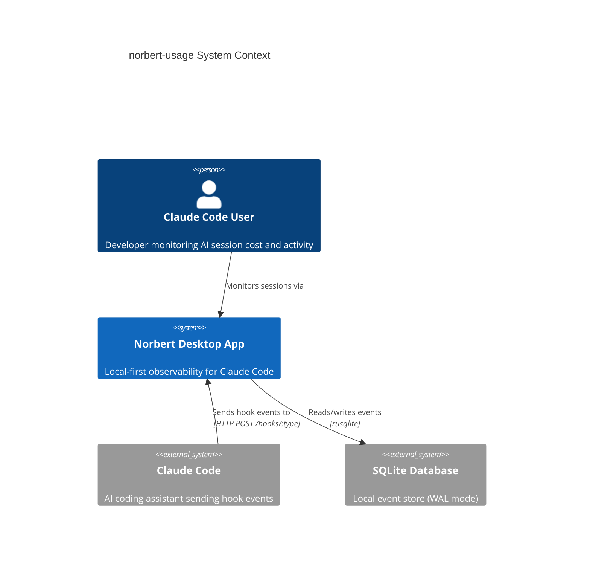
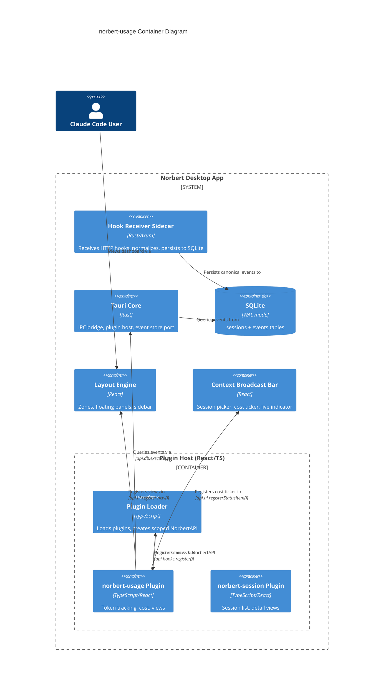

# Architecture Design: norbert-usage Plugin

## System Overview

norbert-usage is a first-party Norbert plugin that extracts token and cost data from Claude Code hook events stored in SQLite, computes real-time metrics, and surfaces them through three views (Gauge Cluster, Oscilloscope, Usage Dashboard), a sidebar tab, and a status bar cost ticker. It uses only the public NorbertPlugin API.

## Assumptions

- A1: Claude Code hook event payloads for `PostToolUse` (tool_call_end) and `Stop` (session_end) include `usage` or `token_usage` fields containing `input_tokens` and `output_tokens` counts. Events that lack these fields (e.g., `PreToolUse`, `SessionStart`) are handled gracefully.
- A2: The `model` field is present in event payloads where token counts exist, enabling per-model pricing.
- A3: The `events` table `payload` column contains the full raw JSON from Claude Code, including any token/cost metadata Claude Code provides.
- A4: The EventsAPI (`api.events`) will support subscribe/unsubscribe for real-time event streaming before norbert-usage ships. If not, the plugin polls via `api.db.execute()` with a 1-second interval as fallback.
- A5: Gauge Cluster renders as 5 metric cards (Tachometer, Fuel Gauge, Odometer, RPM Counter, Warning/Clock combined row) matching the mockup's compact layout. The 6-instrument spec maps to 5 visual positions (warning cluster + clock share a bottom row).

## C4 System Context (L1)



## C4 Container (L2)



## C4 Component (L3) -- norbert-usage Plugin Internals

```mermaid
C4Component
    title norbert-usage Plugin Components

    Container_Boundary(usagePlugin, "norbert-usage Plugin") {

        Component(entryPoint, "Plugin Entry", "TS", "NorbertPlugin impl: manifest, onLoad, onUnload")
        Component(hookProc, "Hook Processor", "TS", "Receives event payloads, dispatches to pipeline")

        Component_Boundary(domain, "Domain (Pure Functions)") {
            Component(tokenExtractor, "Token Extractor", "TS", "Extracts input/output tokens + model from payload")
            Component(pricingModel, "Pricing Model", "TS", "Maps model + token counts to dollar cost")
            Component(metricsAggregator, "Metrics Aggregator", "TS", "Folds events into SessionMetrics snapshot")
            Component(timeSeriesSampler, "Time-Series Sampler", "TS", "Maintains ring buffer of rate samples for oscilloscope")
            Component(burnRateCalc, "Burn Rate Calculator", "TS", "Computes tok/s over rolling window")
        }

        Component_Boundary(adapters, "Adapters (Effect Boundary)") {
            Component(eventSource, "Event Source Adapter", "TS", "Polls/subscribes for new events via api.db or api.events")
            Component(stateStore, "Metrics State Store", "TS", "Holds current SessionMetrics, notifies subscribers")
        }

        Component_Boundary(views, "React Views") {
            Component(gaugeCluster, "Gauge Cluster View", "React", "5-card floating HUD with urgency zones")
            Component(oscilloscope, "Oscilloscope View", "React/Canvas", "Dual-trace waveform at ~10Hz")
            Component(dashboard, "Usage Dashboard View", "React", "6 metric cards + 7-day burn chart")
            Component(costTicker, "Cost Ticker", "React", "Status bar item with odometer animation")
        }
    }

    Rel(entryPoint, hookProc, "Registers")
    Rel(hookProc, tokenExtractor, "Passes payload to")
    Rel(tokenExtractor, pricingModel, "Feeds tokens + model to")
    Rel(pricingModel, metricsAggregator, "Feeds cost delta to")
    Rel(metricsAggregator, timeSeriesSampler, "Feeds rate sample to")
    Rel(metricsAggregator, burnRateCalc, "Feeds window data to")
    Rel(eventSource, metricsAggregator, "Provides historical events to")
    Rel(stateStore, gaugeCluster, "Notifies with updated metrics")
    Rel(stateStore, oscilloscope, "Provides time-series buffer to")
    Rel(stateStore, dashboard, "Provides session metrics to")
    Rel(stateStore, costTicker, "Provides cost value to")
    Rel(metricsAggregator, stateStore, "Emits snapshots to")
```

## Data Flow

### Event-to-Metric Pipeline

```
Claude Code hook event
  -> Hook Receiver (Rust, normalizes, persists)
  -> SQLite events table (payload JSON, event_type, session_id, received_at)
  -> norbert-usage Hook Processor (receives via api.hooks.register)
  -> Token Extractor (pure: payload -> { inputTokens, outputTokens, model } | null)
  -> Pricing Model (pure: { model, inputTokens, outputTokens } -> costDelta)
  -> Metrics Aggregator (pure: fold event into SessionMetrics snapshot)
  -> Time-Series Sampler (pure: append rate sample to ring buffer)
  -> Metrics State Store (effect boundary: holds state, notifies views)
  -> React Views (re-render on state change)
```

### Token Extraction from Event Payloads

The plugin extracts token data from the `payload` JSON column in the `events` table. Based on Claude Code hook payload structure:

- **tool_call_end** (`PostToolUse`): may contain `usage.input_tokens`, `usage.output_tokens`, `usage.model`
- **session_end** (`Stop`): may contain cumulative `usage` summary
- **prompt_submit** (`UserPromptSubmit`): may contain `usage` fields for the prompt response
- **agent_complete** (`SubagentStop`): may contain agent-level usage summary
- **tool_call_start** (`PreToolUse`): typically no token data (increment tool call counter only)
- **session_start** (`SessionStart`): no token data (initialize session tracking)

Token extraction is defensive: if `usage` fields are absent, the event is processed for non-token metrics only (tool call count, agent tracking, timing).

### Time-Series Sampling for Oscilloscope

The Oscilloscope requires a 60-second rolling window of rate samples. The sampler:

1. Maintains a ring buffer of fixed capacity (600 samples at 10Hz = 60s)
2. On each event, computes instantaneous token rate and cost rate
3. At each render tick (~10Hz via requestAnimationFrame), the latest samples drive the waveform
4. When no events arrive, rate decays toward zero (flat baseline)
5. Both token rate (brand color) and cost rate (amber) traces share the same time axis

### Broadcast Context Integration

All views subscribe to the broadcast context session ID. When the user selects a different session in the Context Broadcast Bar:

1. Event Source Adapter reloads events for the new session
2. Metrics Aggregator recomputes the full SessionMetrics from historical events
3. Time-Series Sampler reinitializes with historical rate data
4. Views re-render with new session's data
5. For ended sessions: views switch to playback mode (historical data, no live updates)

## Plugin Registration

During `onLoad(api: NorbertAPI)`:

| Registration | API Call | Parameters |
|---|---|---|
| Gauge Cluster view | `api.ui.registerView()` | id: "gauge-cluster", primaryView: false, floatMetric: "session_cost" |
| Oscilloscope view | `api.ui.registerView()` | id: "oscilloscope", primaryView: false, floatMetric: null |
| Usage Dashboard view | `api.ui.registerView()` | id: "usage-dashboard", primaryView: true |
| Usage tab | `api.ui.registerTab()` | id: "usage", order: 1 |
| Cost ticker | `api.ui.registerStatusItem()` | id: "cost-ticker", position: "right" |
| Hook processor | `api.hooks.register()` | hookName: "session-event" |

During `onUnload()`: release all subscriptions and clear internal state.

## Technology Stack

| Component | Technology | License | Rationale |
|---|---|---|---|
| Plugin runtime | TypeScript 5.x | Apache-2.0 | Project standard |
| View framework | React 18 | MIT | Project standard |
| Oscilloscope rendering | HTML Canvas API | N/A (browser built-in) | 10Hz update rate requires Canvas over SVG for performance |
| State notification | Custom pub/sub (functional) | N/A | Minimal dependency; single module, pure FP pattern |
| Number formatting | Intl.NumberFormat | N/A (browser built-in) | Zero-dependency currency/number formatting |

No new external dependencies required. All rendering uses browser APIs already available in the Tauri webview.

## Quality Attribute Strategies

### Performance
- Oscilloscope renders on Canvas at ~10Hz via requestAnimationFrame
- Metric updates propagate within 1 second of event arrival
- Ring buffer is fixed-size (no unbounded growth)
- Historical event loading is a single SQL query per session switch

### Accuracy
- Cost derived from actual token counts in event payloads, not estimates
- Pricing model is configurable (model rates stored as data, not hardcoded)
- Running totals verified: sum of per-event costs equals session total

### Maintainability
- Pure domain core: all computation functions are pure (input -> output)
- Effect boundary at adapters only (event source, state store)
- Views are stateless renderers of metrics snapshots
- FP paradigm: algebraic types, composition pipelines, immutable data

### Resilience
- Missing token fields: event processed for available metrics, no crash
- Missing model field: default to most expensive model pricing (safe estimate)
- API method unavailable: log warning, continue with degraded functionality
- No active session: display zero/dim state, show onboarding prompt

### Security
- Plugin operates within the sandbox defined in ADR-014 (API-layer scoping)
- SQL queries are read-only (SELECT only); plugin cannot modify events or sessions tables
- No filesystem access beyond plugin scope
- No network access; all data sourced from local SQLite
- No user credentials or API keys handled by this plugin

### Accessibility
- All animations respect `prefers-reduced-motion` system setting
- Oscilloscope falls back to static snapshot when motion reduced
- Color is never the sole indicator (urgency zones use shape + color)

## Rejected Simpler Alternatives

### Alternative 1: Derive all metrics from a single SQL query on demand
- What: Each view runs a SQL query against the events table when it needs data
- Expected Impact: ~70% of functionality (metrics work, no real-time updates)
- Why Insufficient: 10Hz oscilloscope cannot query SQLite per frame. Multiple views querying independently creates consistency issues. No streaming update path.

### Alternative 2: Reuse norbert-session's hook processor and extend it
- What: Add token extraction logic to norbert-session's existing hook processor
- Expected Impact: ~50% (token data available, but no separate metric pipeline)
- Why Insufficient: Violates plugin isolation. norbert-usage has zero dependencies on norbert-session per spec. Different lifecycle and metric concerns. Would couple two independently deployable plugins.
