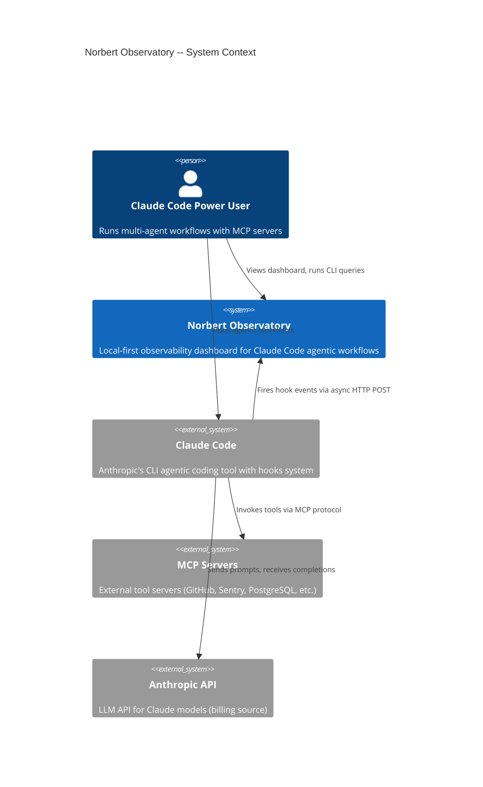
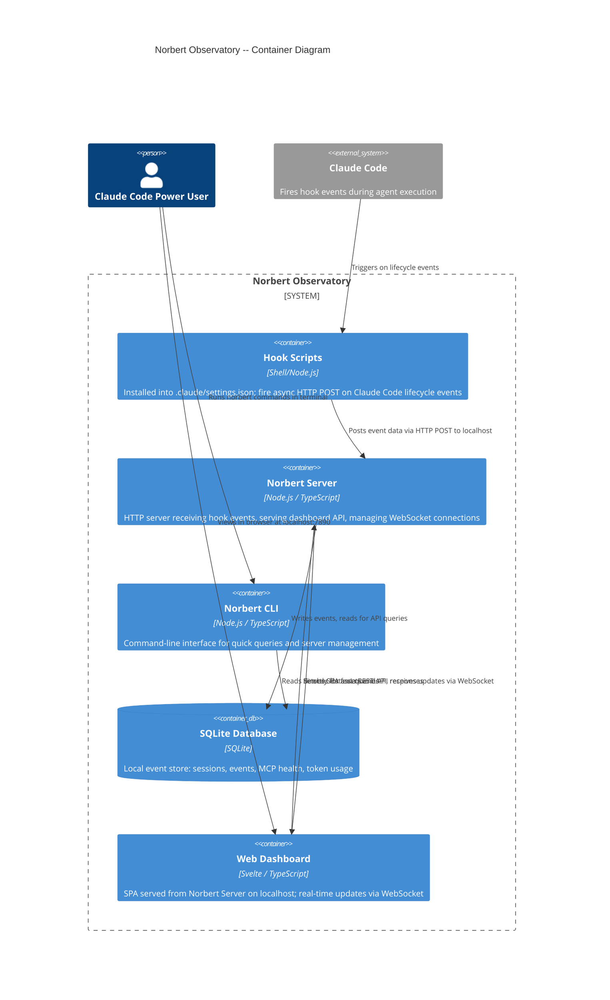
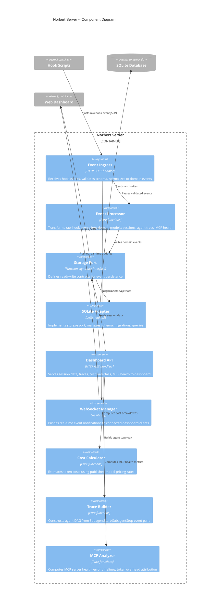

# Architecture Design: Norbert -- The Agentic Workflow Observatory

**Feature ID**: norbert
**Architect**: Morgan (Solution Architect)
**Date**: 2026-03-02
**Status**: DRAFT -- pending peer review

---

## 1. System Overview

Norbert is a local-first observability tool for Claude Code. It captures agentic workflow data via Claude Code hooks, stores it in SQLite, and presents it through a web dashboard, CLI, and (Phase 2) Norbert-as-MCP-server.

**Two pillars**: Agent Observability + MCP Observability.
**Primary interface**: Web dashboard on localhost.
**Design philosophy**: Observation-first, post-hoc dominant, progressive disclosure.

---

## 2. Quality Attribute Priorities

| Priority | Attribute | Business Driver | Measurable Target |
|----------|-----------|-----------------|-------------------|
| 1 | Time-to-market | Solo developer, ship fast | MVP in 20 dev-days |
| 2 | Maintainability | Easy to evolve, extend features over time | New dashboard view addable in < 1 day |
| 3 | Reliability | Must not affect Claude Code operation | Hook failure = silent, zero Claude Code impact |
| 4 | Portability | macOS, Linux, Windows (Claude Code platforms) | Cross-platform Node.js, no native deps |
| 5 | Performance | Dashboard responsive, hooks non-blocking | Dashboard < 2s load, hooks async fire-and-forget |

---

## 3. Architectural Decision: Modular Monolith with Dependency Inversion

**Selected style**: Modular monolith with ports-and-adapters per module.

**Rationale from quality attributes**:
- Solo developer (team = 1) eliminates microservices, distributed systems
- Time-to-market priority favors single deployment unit
- Maintainability addressed through module boundaries and dependency inversion
- Data pipeline nature (hooks -> processing -> storage -> display) maps to clean module decomposition

**Rejected alternatives**:
1. **Microservices**: Team = 1. Operational overhead unjustifiable. No independent deployment need.
2. **Monolith without module boundaries**: Would ship faster initially but erode maintainability as features accumulate. Dashboard views, CLI commands, and data processing would couple.
3. **Pipe-and-filter pure**: Data flow is pipeline-shaped, but the system also has interactive query interfaces (dashboard, CLI) that do not fit pure pipe-and-filter. Pipe-and-filter applies within the ingestion module only.

See **ADR-001** for full decision record.

---

## 4. Development Paradigm: Functional-Leaning TypeScript

**Recommendation**: Functional-leaning TypeScript with pure core / effect shell.

**Justification**:
- Data pipeline nature: hooks -> transform -> store -> query -> render maps naturally to composition pipelines
- TypeScript discriminated unions model hook event types precisely (algebraic data types)
- Pure transformation functions for event processing enable testing without infrastructure
- Effect boundaries at adapter layer only (HTTP server, SQLite, filesystem)
- Solo developer benefits from explicit data flow over hidden state mutation

**Paradigm rules for this project**:
- Types-first: define event types and domain models as discriminated unions before implementation
- Pure core: event processing, cost calculation, trace building are pure functions
- Effect shell: HTTP server, SQLite operations, filesystem access are at the boundary
- Function-signature ports: adapters implement function types, not class interfaces
- No class inheritance; composition over inheritance throughout
- Result types for error handling over thrown exceptions in domain logic

See **ADR-002** for full decision record.

---

## 5. C4 Diagrams

### 5.1 System Context (L1)



### 5.2 Container Diagram (L2)



### 5.3 Component Diagram (L3) -- Norbert Server

The Norbert Server has 6+ internal components, warranting L3 detail.



---

## 6. Component Architecture and Boundaries

### 6.1 Module Map

```
norbert/
  packages/
    core/           -- Pure domain: types, event processing, cost calc, trace building, MCP analysis
    server/         -- HTTP server, event ingress, API layer, WebSocket
    storage/        -- Storage port definition + SQLite adapter
    cli/            -- CLI commands, terminal output formatting
    dashboard/      -- Svelte SPA, components, WebSocket client
    hooks/          -- Hook script templates for .claude/settings.json
    config/         -- Configuration loading, defaults, validation
```

### 6.2 Module Responsibilities and Dependencies

| Module | Responsibility | Depends On | Depended On By |
|--------|---------------|------------|----------------|
| **core** | Domain types, pure event processing, cost calculation, trace building, MCP analysis | Nothing (zero deps) | server, cli, storage |
| **config** | Configuration loading, validation, defaults | Nothing | server, cli, hooks |
| **storage** | Storage port (interface) + SQLite adapter | core (types only) | server, cli |
| **server** | HTTP ingress, dashboard API, WebSocket | core, storage, config | dashboard (via HTTP) |
| **cli** | CLI commands, terminal formatting | core, storage, config | Nothing (entry point) |
| **dashboard** | Svelte SPA, visualization components | Nothing (consumes server API) | Nothing (browser app) |
| **hooks** | Hook script templates | config (port, URL) | Nothing (installed into Claude Code) |

### 6.3 Dependency Rule

All dependencies point inward toward **core**. Core has zero external dependencies.

```
dashboard --> [HTTP] --> server --> core <-- storage
                                   core <-- cli
hooks --> [HTTP POST] --> server
```

The **storage** module defines the port (function-signature interface) in terms of core types. The SQLite adapter implements the port. Server and CLI depend on the port, not the adapter. This allows testing with in-memory stores and future database swaps.

---

## 7. Integration Patterns

### 7.1 Claude Code Hooks -> Norbert Server

**Pattern**: Async fire-and-forget HTTP POST
**Transport**: HTTP POST to `http://localhost:{port}/api/events`
**Reliability**: Best-effort. Hook scripts use async HTTP with no retry. If server is down, events are lost silently. Claude Code is never blocked.
**Data format**: JSON payload from Claude Code hook system (event_type, session_id, timestamp, tool_name, mcp_server, mcp_tool_name, etc.)

**Critical constraint**: Hooks MUST NOT add latency to Claude Code. The hook script fires an async HTTP POST and exits immediately. The Norbert server processes asynchronously.

### 7.2 Norbert Server -> SQLite

**Pattern**: Synchronous write-through
**Concurrency**: SQLite single-writer. Server is the sole writer. CLI reads are concurrent-safe (WAL mode).
**Schema**: Versioned with migration support. Schema version tracked in metadata table.

### 7.3 Dashboard -> Norbert Server

**Pattern**: REST API for data + WebSocket for real-time updates
**REST**: GET endpoints for sessions, traces, costs, MCP health
**WebSocket**: Push notifications when new events arrive (dashboard updates without polling)
**SPA serving**: Norbert server serves the dashboard's static assets

### 7.4 CLI -> SQLite

**Pattern**: Direct read access
**Rationale**: CLI bypasses the server for reads to work even when server is not running. CLI reads from the same SQLite database file.
**Write operations**: CLI writes (e.g., `norbert init` creating config) go through config module, not through server.

---

## 8. Data Flow

```
Claude Code Hook Event
    |
    v
Hook Script (shell/node) ---------> HTTP POST (async, non-blocking)
    |                                     |
    v                                     v
Claude Code continues              Norbert Server: Event Ingress
(zero impact)                           |
                                        v
                                  Event Processor (validate, normalize, enrich)
                                        |
                                  +-----+-----+
                                  |           |
                                  v           v
                            SQLite Write   WebSocket Push
                            (persistent)   (real-time to dashboard)
                                  |
                          +-------+-------+
                          |       |       |
                          v       v       v
                       Dashboard  CLI   MCP Server
                       (REST+WS) (direct (Phase 2)
                                  SQLite)
```

---

## 9. Cross-Cutting Concerns

### 9.1 Error Handling Strategy

| Layer | Strategy |
|-------|----------|
| Hook scripts | Silent failure. Log to stderr, exit 0. Never block Claude Code. |
| Event ingress | Validate schema, reject malformed events with 400. Log warning. Never crash server. |
| Event processing | Pure functions return Result types. Invalid events produce domain errors, not exceptions. |
| Storage | SQLite errors logged and surfaced to caller. Write failures do not crash server. |
| Dashboard API | Errors returned as structured JSON with HTTP status codes. |
| CLI | Errors printed to stderr with actionable suggestions. Exit codes follow convention. |

### 9.2 Configuration

Single source of truth: `~/.norbert/config.json`
- `port`: Server port (default 7890)
- `dbPath`: SQLite database path (default `~/.norbert/norbert.db`)
- `retentionDays`: Data retention (default 30)
- `costRates`: Token pricing rates per model

All components resolve configuration from this file. No component has its own configuration.

### 9.3 Logging

Structured JSON logging to `~/.norbert/logs/norbert.log`. Levels: error, warn, info, debug. Default: info. No logging in pure core functions (they return values, they do not log).

### 9.4 Security

Local-only. Server binds to `127.0.0.1` exclusively. No authentication required (local trust boundary). No data leaves the machine. SQLite file permissions follow OS user permissions.

---

## 10. Quality Attribute Strategies

### 10.1 Time-to-Market

- Single deployment unit (monolith) -- no distributed system overhead
- Svelte for dashboard (smallest bundle, fastest to develop for solo dev)
- SQLite for storage (zero-config, no external process)
- Leverage existing OSS libraries for visualization (already proven)
- Walking skeleton first (US-001) validates architecture before building features

### 10.2 Maintainability

- Module boundaries enforced by TypeScript project references
- Pure core with zero dependencies -- testable in isolation
- Dependency inversion via function-signature ports -- swap adapters without touching core
- Each dashboard view is an independent Svelte component
- CLI commands are independently testable functions
- Architecture tests (ArchUnitTS or equivalent) enforce dependency rules in CI

### 10.3 Reliability

- Hooks are async fire-and-forget -- Norbert never blocks Claude Code
- Server crash does not affect Claude Code (hooks fail silently)
- SQLite WAL mode for concurrent reads
- Schema migrations versioned and backward-compatible
- Graceful degradation: dashboard shows stale data if server restarts

### 10.4 Portability

- Node.js runtime (cross-platform)
- SQLite via better-sqlite3 (prebuilt binaries for all platforms)
- No platform-specific code paths
- Hook scripts use Node.js (not bash) for Windows compatibility
- Path handling uses Node.js path module (OS-aware)

### 10.5 Performance

- Hook scripts: async HTTP POST, exit immediately (< 50ms overhead)
- SQLite writes: synchronous but fast (< 5ms per event)
- Dashboard load: < 2 seconds for 100 sessions
- WebSocket: push only (no polling), minimal bandwidth
- Cost calculations: pure functions, computed on demand, cached per session

---

## 11. Deployment Architecture

```
User's Machine (localhost only)
+-------------------------------------------------------+
|                                                       |
|  Claude Code                     Norbert              |
|  +-----------+                   +------------------+ |
|  | Agent     |--hooks--> | Hook Scripts     | |
|  | Execution |           | (Node.js)        | |
|  +-----------+           +--------+---------+ |
|                                   |             |
|                          HTTP POST (async)      |
|                                   |             |
|                          +--------v---------+   |
|                          | Norbert Server   |   |
|                          | (localhost:7890)  |   |
|                          +--------+---------+   |
|                                   |             |
|                          +--------v---------+   |
|                          | SQLite DB        |   |
|                          | (~/.norbert/)    |   |
|                          +------------------+   |
|                                                 |
|  Browser: http://localhost:7890                  |
|  Terminal: norbert [command]                     |
+-------------------------------------------------------+
```

**No cloud dependency. No external services. Everything runs locally.**

---

## 12. Phase 2 Extension Points

The architecture is designed to accommodate Phase 2 features without structural changes:

| Phase 2 Feature | Extension Point |
|-----------------|-----------------|
| Norbert-as-MCP-server | New adapter in server module; reads from same storage port |
| Context window pressure gauge | New pure function in core; new component in dashboard |
| MCP token overhead analyzer | New pure function in core; new panel in dashboard |
| Extensibility inspector | New core analysis functions + dashboard components |
| OTel export | New adapter implementing storage port's read interface, exporting to OTel format |

---

## 13. Requirements Traceability

| User Story | Component(s) | Module(s) |
|------------|-------------|-----------|
| US-001: Walking Skeleton | Hook scripts, Event ingress, SQLite adapter, Minimal dashboard | hooks, server, storage, dashboard |
| US-002: Event Capture Pipeline | Event processor, All hook types, MCP attribution | core, server, storage, hooks |
| US-003: Dashboard Overview | Dashboard API, Summary cards, Session table, MCP health table | server, dashboard, core |
| US-004: Execution Trace Graph | Trace builder, DAG visualization component | core, dashboard |
| US-005: MCP Health Dashboard | MCP analyzer, MCP panel components | core, dashboard, server |
| US-006: Token Cost Waterfall | Cost calculator, Waterfall component | core, dashboard, server |
| US-007: Session Comparison | Comparison functions, Comparison view | core, cli, dashboard |
| US-008: Session History | Session query functions, History page, CSV export | core, server, cli, dashboard |

---

## 14. Risks and Mitigations

| Risk | Probability | Impact | Mitigation |
|------|------------|--------|------------|
| Hook API instability | Medium | High | Abstract hook data format behind event processor; version schema; graceful handling of unknown event shapes |
| SQLite concurrent access issues | Low | Medium | WAL mode; single writer (server); CLI read-only |
| better-sqlite3 native binding issues | Low | Medium | Prebuilt binaries for all platforms; fallback to sql.js (pure JS) if native fails |
| Dashboard framework choice lock-in | Low | Low | Dashboard is isolated module; communicates via REST API only; swappable |
| Hook event data insufficiency | Low | Medium | Design schema to capture raw event payload alongside structured fields; unknown fields preserved |
