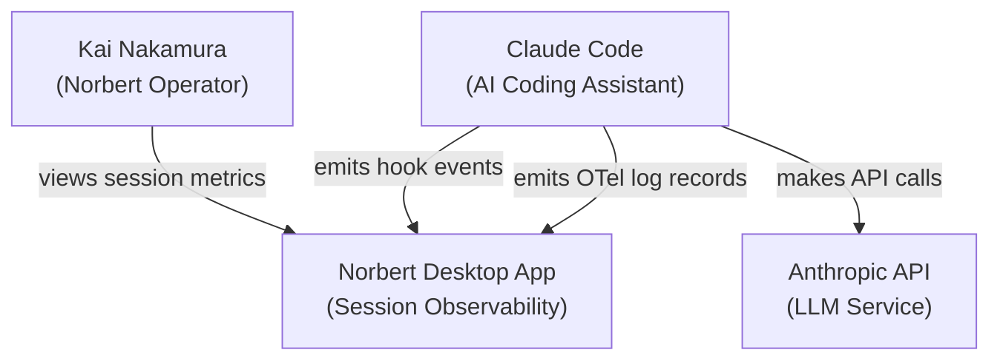
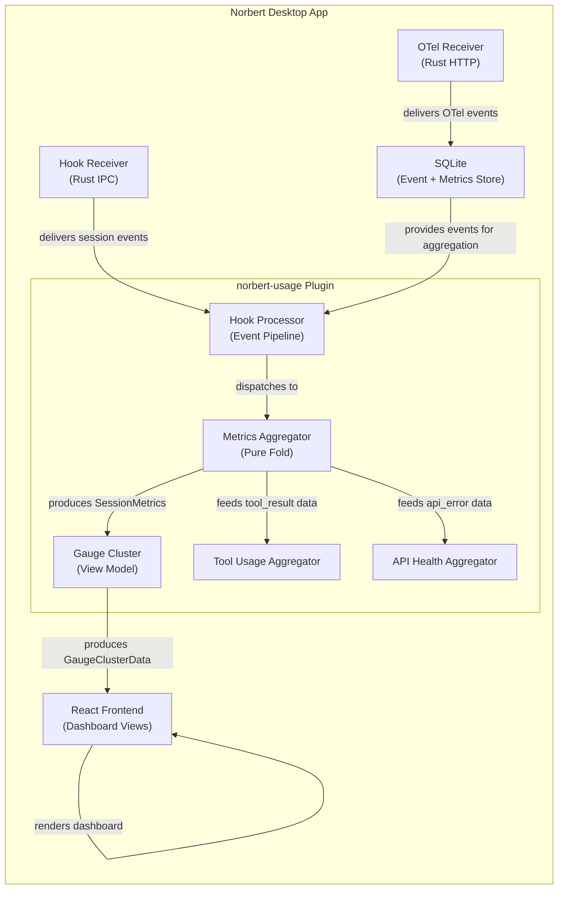
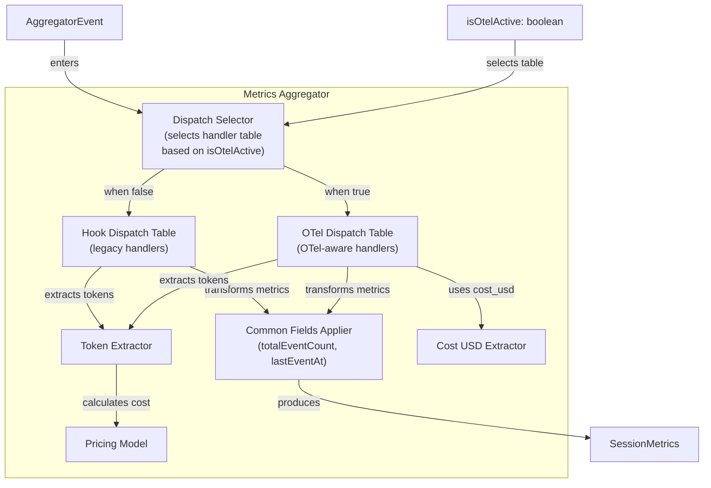

# OTel-First Metrics Pipeline -- Architecture Document

## System Context

Norbert is a local-first desktop app (Tauri: Rust backend + TypeScript/React frontend) that observes Claude Code sessions. The norbert-usage plugin aggregates session metrics from two data sources: Claude Code hooks (legacy) and OTel log records (preferred when available).

This feature migrates the metrics aggregation pipeline from hook-first to OTel-first data sourcing, eliminating double-counting and enriching tool/error visibility.

## Quality Attribute Priorities

1. **Correctness** -- No double-counting of tokens/cost across data sources
2. **Maintainability** -- Single dispatch mechanism with clear source-selection logic
3. **Testability** -- All aggregation logic remains pure functions; OTel-active flag is a parameter, not ambient state

## C4 System Context (L1)

## C4 Container (L2)

## C4 Component (L3) -- Metrics Aggregator Detail

The aggregator is the core component being refactored. It warrants L3 detail because of its 5+ internal responsibilities and the dual-dispatch-table design.

## Component Architecture

### Existing Components (Modified)

| Component | File | Change |
|-----------|------|--------|
| metricsAggregator | `domain/metricsAggregator.ts` | Dual dispatch table; `aggregateEvent` gains `isOtelActive` parameter |
| types | `domain/types.ts` | SessionMetrics: rename `hookEventCount` to `totalEventCount`, add `apiErrorCount`, `apiRequestCount` |
| gaugeCluster | `domain/gaugeCluster.ts` | `WarningClusterData` type change: `hookHealth` to `dataHealth`; `buildWarningCluster` takes `totalEventCount`, `lastEventAt`, `now` |
| dashboard | `domain/dashboard.ts` | Rename hookHealth card to dataHealth; update onboarding check |
| hookProcessor | `hookProcessor.ts` | Pass `isOtelActive` to `aggregateEvent` |
| GaugeClusterView | `views/GaugeClusterView.tsx` | Consume `dataHealth` instead of `hookHealth` |
| UsageDashboardView | `views/UsageDashboardView.tsx` | Consume renamed card |

### Existing Components (Wired, Not Modified)

| Component | File | Role |
|-----------|------|------|
| toolUsageAggregator | `domain/toolUsageAggregator.ts` | Already has `aggregateToolUsage()` + `ToolResultEvent` -- needs pipeline wiring only |
| apiHealthAggregator | `domain/apiHealthAggregator.ts` | Already has `aggregateApiHealth()` + `ApiErrorEvent` -- needs pipeline wiring only |
| otelDetection | `src/domain/otelDetection.ts` | Already has `isOtelActiveSession()` -- used as-is |
| tokenExtractor | `domain/tokenExtractor.ts` | Unchanged |
| pricingModel | `domain/pricingModel.ts` | Unchanged |

## Technology Stack

No new dependencies. All changes are within existing TypeScript domain modules.

| Technology | Version | License | Rationale |
|-----------|---------|---------|-----------|
| TypeScript | existing | MIT | Project standard |
| Vitest | existing | MIT | Test runner |
| React | existing | MIT | Frontend framework |

## Integration Patterns

### OTel-Active Flag Propagation

**Decision**: Pass `isOtelActive` as an explicit boolean parameter to `aggregateEvent`. See ADR-044.

Flow: `App.tsx` computes `isOtelActiveSession(events)` per session (already done for transcript suppression) -> passes to `hookProcessor` -> `hookProcessor` passes to `aggregateEvent`.

### Dual Dispatch Table

Two static handler tables: `hookEventHandlers` (current behavior) and `otelEventHandlers` (OTel-aware behavior). The `aggregateEvent` function selects the table based on `isOtelActive`. This is a compile-time decision -- no runtime registration.

### Mid-Session Transition

When a session starts hook-only and later receives `api_request` events:
- Pre-OTel cost is preserved (accumulated before flag changed)
- Subsequent hook token/cost events are suppressed (flag now true)
- One-way transition: once OTel-active, stays OTel-active (consistent with ADR-034)

### api_error Integration

The `api_error` handler in the OTel dispatch table increments `apiErrorCount` and `apiRequestCount` fields on SessionMetrics. The `apiErrorRate` is computed on read (not stored) to avoid stale derived state.

Wait -- the user stories specify `apiErrorRate = apiErrorCount / (apiErrorCount + apiRequestCount)`. Since both are stored, rate can be computed on read. However, `apiRequestCount` must also be incremented by `api_request` handler. This is straightforward: add `apiRequestCount++` to `applyApiRequestTokenUsage`.

### tool_result Integration

When OTel active, `tool_result` events:
1. Increment `toolCallCount` (in metricsAggregator)
2. Are collected for batch summary via `toolUsageAggregator`

The aggregator handles (1). For (2), the tool_result events are already available in the session event list -- `aggregateToolUsage` can be called at read time on filtered events, similar to how `apiHealthAggregator` works.

## Quality Attribute Strategies

### Correctness
- Dual dispatch table ensures mutual exclusion: hook token/cost handlers are identity functions in OTel table
- Property: for OTel-active sessions, `sessionCost == sum(api_request cost_usd)` within $0.001
- Mid-session transition preserves pre-OTel accumulated cost

### Maintainability
- Two small, static dispatch tables instead of conditional logic in every handler
- Each handler remains a focused pure function
- Type system enforces the new field names at compile time

### Testability
- `isOtelActive` as parameter (not ambient state) enables deterministic testing
- All functions remain pure: (prev, event, pricingTable, isOtelActive) => next
- `buildWarningCluster(totalEventCount, lastEventAt, now)` -- `now` as parameter for deterministic time testing

## Deployment Architecture

No deployment changes. All modifications are within the existing Tauri frontend bundle.

## Rejected Simple Alternatives

### Alternative 1: Conditional logic within each handler
- **What**: Add `if (isOtelActive)` checks inside `applyTokenUsage`, `applyToolCallStart`, etc.
- **Expected Impact**: 100% functional
- **Why Insufficient**: Scatters OTel-awareness across 5+ handler functions. Each handler becomes a conditional fork. Adding a third data source later requires touching all handlers again. Dispatch table selection is cleaner and more maintainable.

### Alternative 2: Post-processing deduplication
- **What**: Let both sources contribute, then deduplicate by comparing timestamps/amounts
- **Expected Impact**: ~80% (heuristic matching is imperfect)
- **Why Insufficient**: Fuzzy matching between hook and OTel events is unreliable. Different event shapes, timing, and granularity make dedup error-prone. Prevention (suppress at dispatch) is simpler than cure (deduplicate after).

## Why Dual Dispatch Table Is Necessary
1. Conditional-per-handler scatters OTel logic across functions (Alternative 1)
2. Post-processing dedup is unreliable (Alternative 2)
3. Dual table isolates the concern in one place (dispatch selection), keeping handlers pure and focused
