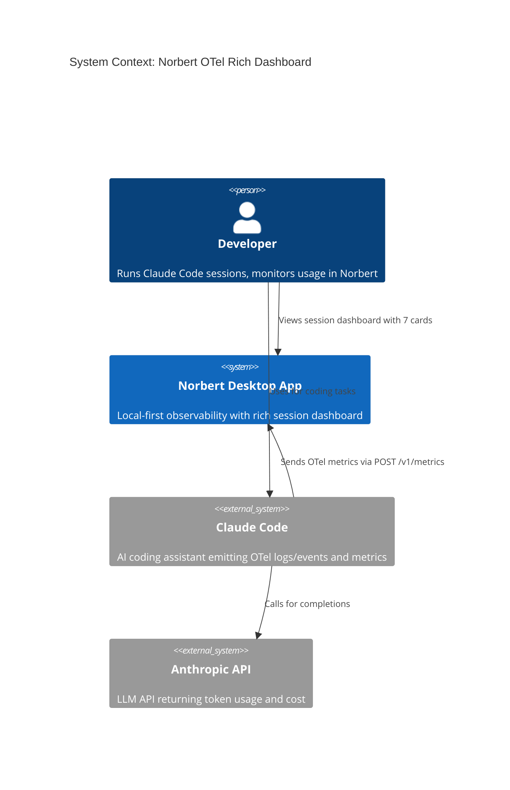
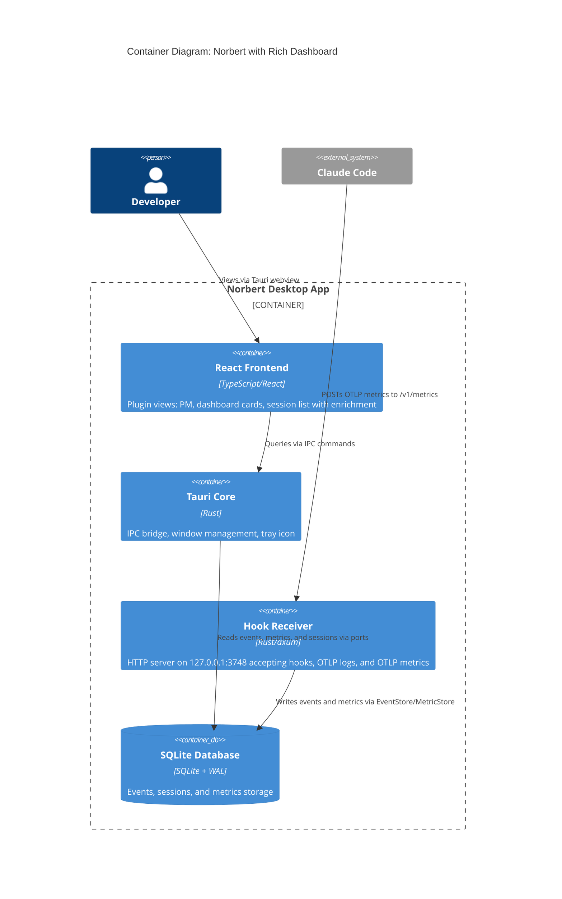
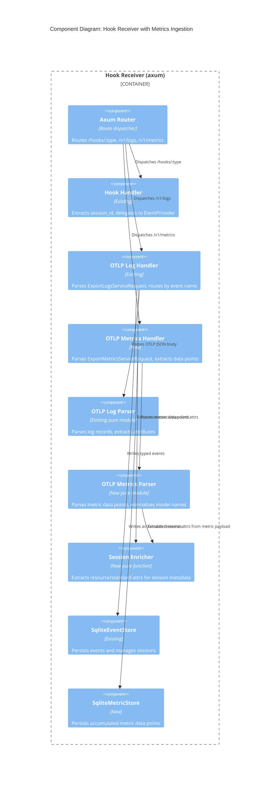
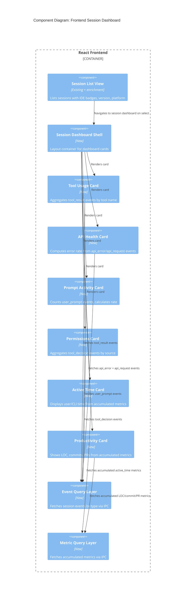

# Architecture Design: OTel Rich Dashboard

**Feature ID**: otel-rich-dashboard
**Date**: 2026-03-24
**Architect**: Morgan (solution-architect)
**Predecessor**: claude-otel-integration (completed)

---

## System Context

Norbert is a local-first desktop observability app for Claude Code. The predecessor feature established `/v1/logs` ingestion with 5 event types. This feature adds `/v1/metrics` ingestion, enriches sessions with metadata, and surfaces all event/metric data through dashboard cards.

### C4 Level 1: System Context



### C4 Level 2: Container Diagram



### C4 Level 3: Component Diagram (Hook Receiver with Metrics)



### C4 Level 3: Component Diagram (Frontend Dashboard)



---

## Architecture Approach

**Style**: Modular monolith with ports-and-adapters (existing). Extends the existing architecture with a new ingestion route, new storage port, and new frontend views.

**Justification**: Solo developer, sub-second latency requirement, existing infrastructure. Adding `/v1/metrics` to the existing axum server and new cards to the existing plugin system is the simplest viable approach. See ADR-035.

### Rejected Simpler Alternatives

1. **Frontend-only with existing events**: Display only the 4 non-api_request event types that are already persisted. Impact: ~40% of problem solved. Why insufficient: misses all `/v1/metrics` data (active time, productivity, git activity, cost supplementation) which covers 3 of the top 6 job stories by opportunity score.

2. **Metrics as synthetic events**: Store metric data points as regular events in the existing events table (event_type = "metric_cost_usage" etc). Impact: 90% of problem solved with no schema change. Why insufficient: metric data points have fundamentally different shape (delta accumulation, model+type compound keys, no prompt.id). Querying accumulated totals would require scanning and summing all synthetic events on every frontend render, degrading performance for sessions with 60+ metric exports.

---

## Key Design Decisions

### 1. Dedicated Metrics Table (ADR-035)

Metric data points stored in a dedicated `metrics` table, not as synthetic events. Schema designed for accumulated totals with compound key (session_id, metric_name, attribute_key). Backend accumulates deltas on write, so reads return current totals without computation.

### 2. Backend Delta Accumulation (ADR-036)

Accumulate delta values in the backend (SQLite upsert) rather than frontend. Running totals persisted to database survive page refreshes and app restarts. Frontend reads pre-accumulated values.

### 3. Session Metadata Enrichment via Separate Table (ADR-037)

Resource attributes (service.version, os.type, host.arch) and standard attributes (terminal.type) stored in a `session_metadata` table. Extracted from first OTLP payload per session. Queried by frontend for session list enrichment.

### 4. Model Name Normalization at Ingestion (ADR-038)

Strip trailing `[...]` suffix from model names in metric data points during parsing. Applied in the OTLP metrics parser (pure function). Events already arrive without suffix, so no change to log parser.

### 5. Dashboard Cards as New Plugin Views

Dashboard cards register as a new view in the existing norbert-usage plugin (not a new plugin). The session dashboard is a new view alongside the existing Performance Monitor, Gauge Cluster, and Usage Dashboard views.

### 6. OTel Metrics Parser Reuses Existing Infrastructure

The metrics parser reuses the existing `find_attribute`, `get_string_attribute`, `get_f64_attribute` helpers from the OTel log parser module. Shared extraction utilities, separate envelope parsing.

---

## Data Flow

### Metrics Ingestion Flow

```
Claude Code session active
    |
    +-- Every 60s: POST /v1/metrics (ExportMetricsServiceRequest)
    |                    |
    |                    v
    |              otlp_metrics_handler (axum)
    |                    |
    |              Parse ExportMetricsServiceRequest
    |              Traverse resourceMetrics[].scopeMetrics[].metrics[].sum.dataPoints[]
    |              For each data point:
    |                Extract session.id from data point attributes
    |                Extract metric name from parent metric
    |                Normalize model name (strip [1m] suffix)
    |                Build compound key (session_id, metric_name, attribute_key)
    |                    |
    |                    v
    |              MetricStore.accumulate_delta()
    |                    |
    |                    v
    |              SQLite: UPSERT metrics SET value = value + delta
    |
    +-- Also extract resource attributes on first payload per session:
         service.version, os.type, host.arch -> session_metadata table
```

### Session Enrichment Flow

```
First OTLP payload for session (log or metric)
    |
    v
Extract resource attributes:
    service.version, os.type, host.arch
Extract standard attributes (from log records):
    terminal.type
    |
    v
SessionMetadata { session_id, terminal_type, service_version, os_type, host_arch }
    |
    v
session_metadata table (INSERT OR IGNORE -- first-write wins)
    |
    v
Frontend: IPC get_session_metadata(session_id) -> badges + version + platform
```

### Dashboard Card Data Flow

```
Frontend selects session
    |
    +-- IPC: get_events_for_session(session_id) -> all events
    |       |
    |       +-- Filter by event_type in frontend:
    |           tool_result    -> Tool Usage card (aggregate by tool_name)
    |           api_error      -> API Health card (compute error rate)
    |           api_request    -> API Health denominator + Cost card (existing)
    |           user_prompt    -> Prompt Activity card (count, rate, avg length)
    |           tool_decision  -> Permissions card (group by source)
    |
    +-- IPC: get_metrics_for_session(session_id) -> accumulated metrics
            |
            +-- active_time.total (type=user, type=cli) -> Active Time card
            +-- lines_of_code.count (type=added, type=removed) -> Productivity card
            +-- commit.count -> Productivity card
            +-- pull_request.count -> Productivity card
            +-- cost.usage -> Cost supplementation (cross-validation)
            +-- token.usage -> Token supplementation
```

---

## Quality Attribute Strategies

| Attribute | Strategy | Measurable Target |
|-----------|----------|-------------------|
| **Latency** | Backend accumulation (no scan-and-sum); single IPC call returns pre-computed totals | <200ms dashboard load for 500+ events |
| **Correctness** | Delta accumulation via atomic upsert; model name normalization at ingestion | Metric totals match Claude Code's cumulative counters |
| **Maintainability** | Pure parser modules; each card is an independent component with own domain logic | New card addable without modifying existing cards |
| **Testability** | Metrics parser is pure (no IO); card domain logic is pure (aggregation functions) | All aggregation logic testable without HTTP/DB |
| **Backward Compatibility** | New routes and tables are additive; existing /v1/logs and events table unchanged | Zero regression for existing users |

---

## Deployment Architecture

No change. The new `/v1/metrics` route is added to the same axum router on the same port (3748). No new processes, ports, or configuration files.

User enablement: The existing norbert-cc-plugin already sets `OTEL_EXPORTER_OTLP_ENDPOINT=http://127.0.0.1:3748`. To enable metrics export, add:
```
OTEL_METRICS_EXPORTER=otlp
```
This is an additive configuration change. If not set, metric-dependent cards show "No data" with guidance.
