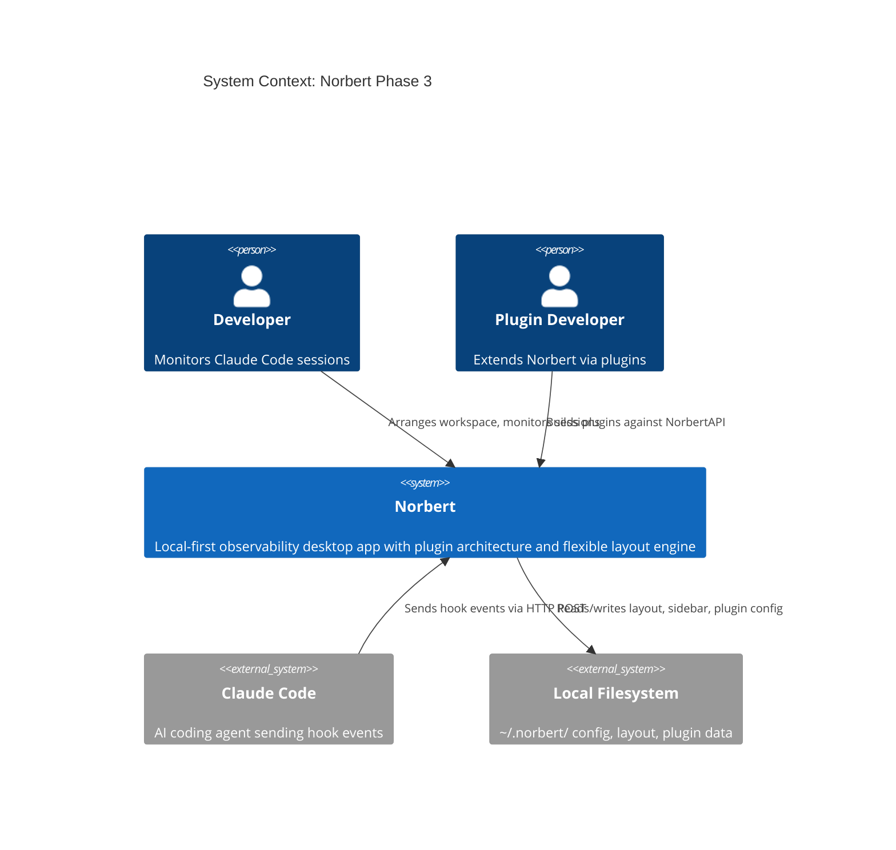
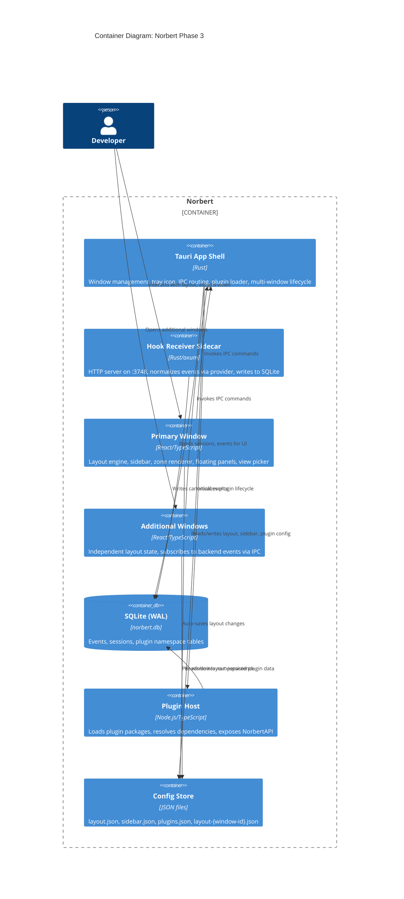
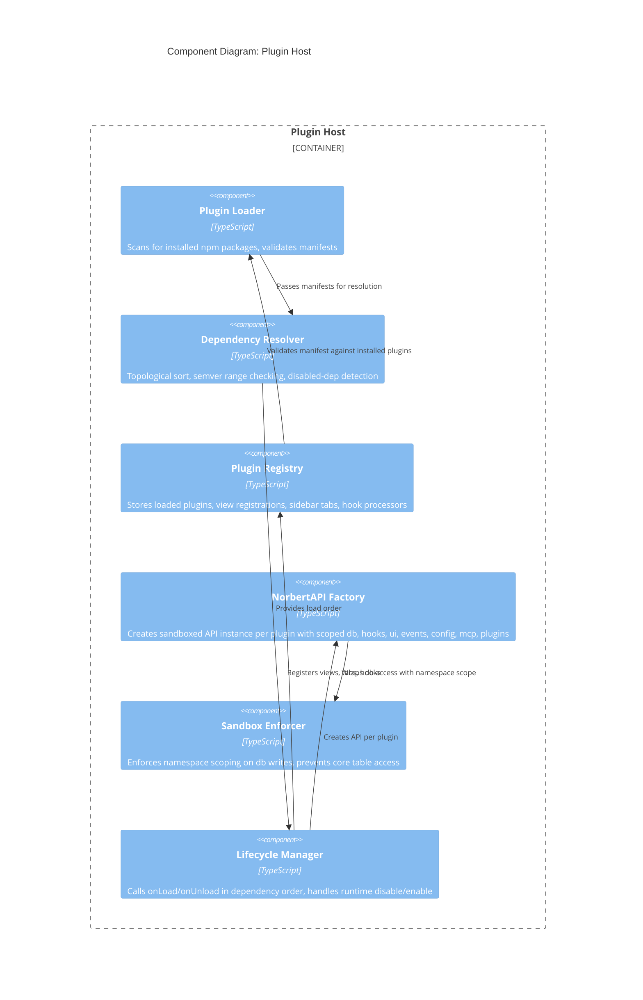
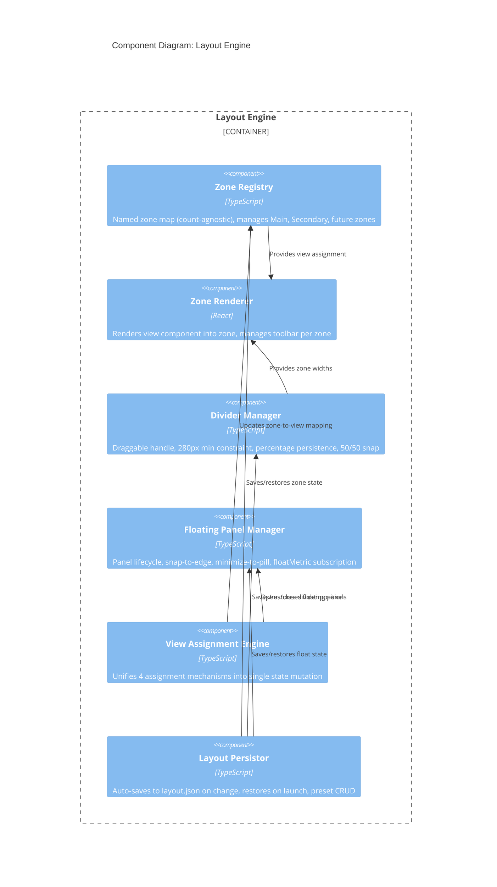

# Architecture Design: Plugin Architecture and Layout Engine (Phase 3)

## System Context

Phase 3 introduces plugin infrastructure, a layout engine, and multi-window support into Norbert's existing modular monolith. The system boundary remains a single-user desktop app receiving hook events from AI coding agents and presenting observability UI.

### Actors

- **Developer (Kai/Reina)** -- Uses Norbert to observe Claude Code sessions via the desktop UI
- **Plugin Developer (Tomasz)** -- Builds extensions against the NorbertPlugin interface
- **Claude Code** -- Sends hook events via HTTP POST to the hook receiver sidecar
- **Filesystem** -- Persists layout, sidebar, and plugin configuration in `~/.norbert/`

### C4 System Context (L1)

### C4 Container (L2)

### C4 Component (L3) -- Plugin Host

The Plugin Host warrants L3 decomposition due to its internal complexity (6+ components).

### C4 Component (L3) -- Layout Engine

---

## Component Architecture

### Boundary 1: Plugin Host (Backend -- Tauri/Node.js bridge)

**Responsibility**: Load, validate, resolve, and manage plugin lifecycle. Expose NorbertAPI to each plugin.

| Sub-component | Responsibility |
|---|---|
| Plugin Loader | Scan `node_modules` for packages matching NorbertPlugin interface |
| Dependency Resolver | Topological sort on manifest.dependencies; semver range validation |
| NorbertAPI Factory | Create per-plugin API instances with sandboxed access |
| Sandbox Enforcer | Namespace-scope plugin db writes; reject core table writes |
| Plugin Registry | Central store of loaded plugins, registered views, tabs, hooks |
| Lifecycle Manager | Call onLoad/onUnload in order; handle runtime disable/enable |

### Boundary 2: Layout Engine (Frontend -- React)

**Responsibility**: Manage zone model, view assignment, divider, floating panels, persistence.

| Sub-component | Responsibility |
|---|---|
| Zone Registry | Named zone map (`Map<string, ZoneState>`), count-agnostic |
| Zone Renderer | Mount React component into zone, per-zone toolbar |
| Divider Manager | 4px draggable handle, min 280px, percentage-based, double-click snap |
| Floating Panel Manager | Panel lifecycle, snap-to-edge (20px), pill minimize, floatMetric |
| View Assignment Engine | Unifies right-click, drag, picker, preset into one state mutation |
| Layout Persistor | Auto-save on change, restore on launch, named presets |

### Boundary 3: Multi-Window Manager (Backend -- Tauri)

**Responsibility**: Create/destroy windows, per-window IPC subscription, layout file management.

| Sub-component | Responsibility |
|---|---|
| Window Factory | Create new Tauri webview windows |
| IPC Router | Per-window event subscription via Tauri event system |
| Window State Manager | Track open windows, labels, persist window set for restart |

### Boundary 4: Sidebar Manager (Frontend -- React)

**Responsibility**: Icon rendering, visibility toggle, drag-to-reorder, persistence.

| Sub-component | Responsibility |
|---|---|
| Sidebar Renderer | Render icons from ordered config, active indicator, badges |
| Visibility Controller | Right-click toggle list, command palette fallback for hidden |
| Order Controller | Drag-to-reorder with separator handling |
| Sidebar Persistor | Read/write `sidebar.json` |

### Boundary 5: norbert-session Plugin (First-Party)

**Responsibility**: Migrate Phase 2 session list into plugin using only public NorbertAPI.

| Sub-component | Responsibility |
|---|---|
| Plugin Entry | Implements NorbertPlugin interface with manifest |
| Session List View | Existing SessionListView adapted for plugin API registration |
| Session Detail View | Existing EventDetailView adapted |
| Hook Processor | Registers for session events via api.hooks |

---

## Integration Patterns

### Plugin-to-Core Communication

- **Inbound (driving)**: Plugins call NorbertAPI methods (api.db, api.ui, api.hooks, etc.)
- **Outbound (driven)**: Core delivers hook events to registered plugin handlers
- **Sandboxing**: API layer enforces namespace scoping; no direct db/filesystem access

### Multi-Window Event Distribution

- **Pattern**: Publish-subscribe via Tauri IPC events
- **Flow**: Hook receiver writes to SQLite -> Tauri app emits event -> All windows receive via IPC subscription
- **Guarantee**: WAL mode allows concurrent reads; writes serialized through backend

### Layout State Flow

- **Pattern**: Unidirectional state with auto-persist
- **Flow**: User action -> Assignment Engine mutates zone registry -> Persistor debounce-saves to JSON
- **Restore**: On launch, Persistor reads JSON -> validates view IDs against plugin registry -> populates zone registry

### Plugin View Registration Flow

- **Pattern**: Registration + discovery
- **Flow**: Plugin onLoad calls api.ui.registerView() -> Plugin Registry stores ViewRegistration -> View Picker, sidebar, context menus discover views from registry
- **Zone agnostic**: Views declare what they are (id, label, icon, minWidth, floatMetric); layout engine decides where they go

---

## Quality Attribute Strategies

### Workspace Flexibility (ISO 25010: Usability -- Operability) -- Priority 1

- Four assignment mechanisms (right-click, drag, picker, preset) all produce identical state
- Floating panels for ambient info without consuming zone space
- Multi-window for dual-monitor workflows

### Zone Abstraction Future-Proofing (ISO 25010: Maintainability -- Modifiability) -- Priority 2

- Zone registry is `Map<zoneName, ZoneState>`, not positional fields
- Plugin API never references zone names or zone count
- Context menu items generated dynamically from zone registry
- Presets store zones as key-value pairs
- Adding a new zone requires only layout engine changes

### Layout Persistence Reliability (ISO 25010: Reliability -- Recoverability) -- Priority 3

- Auto-save on every layout change (debounced)
- Atomic write (write-then-rename) prevents corruption on crash
- Graceful degradation: missing/invalid view IDs show empty state with explanation
- "Reset to Default" escape hatch always available
- Built-in presets cannot be deleted

### Plugin API Stability (ISO 25010: Maintainability -- Reusability) -- Priority 4

- NorbertPlugin interface is the sole contract (manifest + onLoad/onUnload)
- NorbertAPI sub-APIs (db, hooks, ui, mcp, events, config, plugins) are the stable surface
- norbert-session validation gate ensures API sufficiency before Phase 4
- Friction log from norbert-session migration feeds back into API refinement

### Performance (ISO 25010: Performance Efficiency)

- Single backend process regardless of window count
- Windows are pure UI shells; opening a window adds render cost only
- SQLite WAL mode for concurrent read access across windows
- Writes serialized through backend (rare from UI)
- Layout auto-save debounced to prevent excessive writes

### Security (ISO 25010: Security -- Integrity)

- Plugin sandbox: API-layer enforcement (not OS-level)
- Plugins cannot write to core tables, modify hook config, access keychain
- Plugin db access scoped to `plugin_{pluginId}_*` tables
- Core tables read-only for plugins
- api.plugins.get() only returns declared dependency APIs

### Testability (ISO 25010: Maintainability -- Testability)

- Ports-and-adapters maintained from Phase 2
- Plugin Host components testable via mock NorbertAPI
- Layout Engine testable via mock zone registry and view registrations
- norbert-session validates the full integration path

---

## Deployment Architecture

Single-user desktop deployment (unchanged from Phase 2):

- **Tauri binary**: Main app + tray icon + window management + plugin host
- **Hook receiver sidecar**: axum HTTP server on :3748
- **SQLite database**: `~/.norbert/norbert.db` (WAL mode)
- **Config files**: `~/.norbert/layout.json`, `sidebar.json`, `plugins.json`, `layout-{window-id}.json`
- **Plugin packages**: npm global packages scanned at startup
- **First-party plugins**: Bundled with Norbert install
