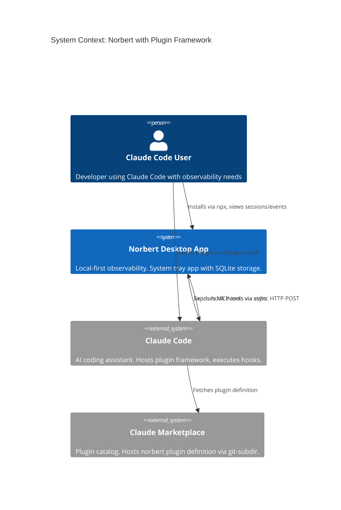
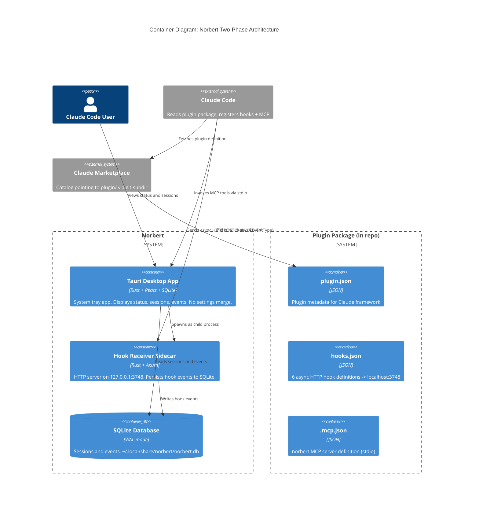

# Architecture Design: Plugin Install Split

## System Context

Split Norbert's installation into two independent phases:
1. **App Install** -- binary download to `~/.norbert/bin/`, no Claude config modification
2. **Plugin Install** -- Claude's `/plugin install` registers hooks + MCP via plugin framework

### C4 System Context (L1)



### C4 Container (L2)



## Component Boundary Changes

### Removed Components

| Component | Location | Reason |
|-----------|----------|--------|
| `SettingsMergeAdapter` | `src-tauri/src/adapters/settings/mod.rs` | Plugin framework manages hook registration |
| `SettingsManager` port | `src-tauri/src/ports/mod.rs` | No consumers after adapter removal |
| `run_settings_merge()` | `src-tauri/src/lib.rs` | No longer called on startup |
| Settings merge domain fns | `src-tauri/src/domain/mod.rs` | `merge_hooks_into_config`, `hooks_are_merged`, `build_hooks_only_config`, `build_merged_config`, `build_merged_hooks`, `MergeOutcome` |
| `build_hook_entry()` | `src-tauri/src/domain/mod.rs` | Only used by settings merge |
| `build_hooks_object()` | `src-tauri/src/domain/mod.rs` | Only used by settings merge |
| Restart banner logic | `src/App.tsx`, `src/domain/status.ts` | `shouldShowRestartBanner`, `bannerWasShown` state, banner JSX |
| `adapters::settings` module | `src-tauri/src/adapters/mod.rs` | Module declaration removed |

### Preserved Components (unchanged)

| Component | Location | Why Preserved |
|-----------|----------|---------------|
| `HOOK_EVENT_NAMES` | `src-tauri/src/domain/mod.rs` | Used by sidecar route matching and plugin hooks.json validation |
| `HOOK_PORT` | `src-tauri/src/domain/mod.rs` | Used by sidecar bind address and app status display |
| `build_hook_url()` | `src-tauri/src/domain/mod.rs` | Useful for plugin file validation; also reusable |
| `parse_event_type()` | `src-tauri/src/domain/mod.rs` | Used by sidecar request handler |
| `EventStore` port | `src-tauri/src/ports/mod.rs` | Used by sidecar and app |
| `SqliteEventStore` | `src-tauri/src/adapters/db/mod.rs` | Core persistence unchanged |
| Hook receiver sidecar | `src-tauri/src/hook_receiver.rs` | Unchanged -- still listens on 3748 |

### Added Components

| Component | Location | Purpose |
|-----------|----------|---------|
| `plugin.json` | `plugin/.claude-plugin/plugin.json` | Plugin manifest for Claude framework |
| `hooks.json` | `plugin/hooks/hooks.json` | 6 async HTTP hook definitions |
| `.mcp.json` | `plugin/.mcp.json` | MCP server registration |
| "No plugin connected" status | `src-tauri/src/domain/mod.rs` | New status state when no events have arrived |
| Empty state UI with plugin hint | `src/App.tsx`, `src/domain/status.ts` | Guides user to install plugin |

### Modified Components

| Component | Change |
|-----------|--------|
| `lib.rs` `.setup()` | Remove `run_settings_merge()` call |
| `lib.rs` imports | Remove `SettingsMergeAdapter`, `SettingsManager` imports |
| `adapters/mod.rs` | Remove `pub mod settings;` |
| `domain/mod.rs` status derivation | Add "No plugin connected" when session_count=0 AND event_count=0 |
| `App.tsx` | Replace restart banner with plugin install hint in empty state |
| `status.ts` | Replace `shouldShowRestartBanner` with plugin connection guidance; update `EMPTY_STATE_MESSAGE` |
| `postinstall.js` | Add terminal output: plugin install hint after successful install |
| ADR-006 | Status changed from "Accepted" to "Superseded" |

## Plugin Directory Structure

### `plugin/.claude-plugin/plugin.json`

```json
{
  "name": "norbert",
  "description": "Local-first observability for Claude Code sessions",
  "version": "0.1.0"
}
```

### `plugin/hooks/hooks.json`

```json
{
  "hooks": {
    "PreToolUse": [
      { "type": "http", "url": "http://localhost:3748/hooks/PreToolUse", "async": true }
    ],
    "PostToolUse": [
      { "type": "http", "url": "http://localhost:3748/hooks/PostToolUse", "async": true }
    ],
    "SubagentStop": [
      { "type": "http", "url": "http://localhost:3748/hooks/SubagentStop", "async": true }
    ],
    "Stop": [
      { "type": "http", "url": "http://localhost:3748/hooks/Stop", "async": true }
    ],
    "SessionStart": [
      { "type": "http", "url": "http://localhost:3748/hooks/SessionStart", "async": true }
    ],
    "UserPromptSubmit": [
      { "type": "http", "url": "http://localhost:3748/hooks/UserPromptSubmit", "async": true }
    ]
  }
}
```

### `plugin/.mcp.json`

```json
{
  "mcpServers": {
    "norbert": {
      "type": "stdio",
      "command": "norbert-cc",
      "args": ["mcp"]
    }
  }
}
```

## Status State Machine

The app currently has two states: "Listening" and "Active session". This feature adds a third:

```
                    first event arrives
  No plugin   ──────────────────────────>  Listening
  connected   <──────────────────────────
                 session_count=0 AND
                 event_count=0 (fresh install)
                 OR timeout (no events for N seconds)

  Listening   ──────────────────────────>  Active session
                 latest session has no ended_at

  Active      ──────────────────────────>  Listening
  session        latest session ended_at set
```

"No plugin connected" is displayed when `session_count == 0 AND event_count == 0`. Once any event arrives, the app transitions to "Listening" or "Active session" and never returns to "No plugin connected" (historical data prevents it). This is the simplest implementation -- no explicit plugin detection handshake needed.

## Integration Patterns

### Hook Event Flow (unchanged)

```
Claude Code -> HTTP POST -> localhost:3748/hooks/{EventType} -> Sidecar -> SQLite -> Tauri IPC -> React UI
```

The plugin framework replaces the surgical JSON merge as the registration mechanism. The runtime data flow is identical to the walking skeleton.

### MCP Flow (unchanged)

```
Claude Code -> stdio -> norbert-cc mcp -> Tool response
```

Registration moves from `~/.claude.json` (manual merge) to plugin framework management.

### Shared Artifact Consistency

Port 3748 appears in:
- `plugin/hooks/hooks.json` (all 6 hook URLs)
- `src-tauri/src/domain/mod.rs` (`HOOK_PORT` constant)
- `src-tauri/src/hook_receiver.rs` (bind address)

Plugin install command `/plugin install norbert@pmvanev-plugins` appears in:
- `postinstall.js` terminal output
- `src/App.tsx` empty state UI
- README.md

## Quality Attribute Strategies

| Attribute | Strategy |
|-----------|----------|
| **Installability** | Two-phase: app install touches only `~/.norbert/`, plugin install managed by Claude framework |
| **Maintainability** | ~330 lines of settings merge code removed; plugin files are static JSON |
| **Reliability** | App functions fully without plugin; sidecar always listens regardless of plugin state |
| **Security** | App never reads/writes `~/.claude/settings.json`; reduced attack surface |
| **Testability** | Plugin JSON files are statically verifiable; no complex merge logic to test |

## Rejected Simpler Alternatives

### Alternative 1: Keep settings merge but make it opt-in (flag/prompt)

- **What**: Add `--with-hooks` flag or first-launch prompt before merging
- **Expected Impact**: Solves trust/anxiety issue (~60% of problem)
- **Why Insufficient**: Still requires Norbert to own settings merge code. Plugin framework is the officially supported path. Maintaining merge code for an opt-in path adds maintenance burden for diminishing returns.

### Alternative 2: Configuration-only change (remove merge call, no plugin directory)

- **What**: Remove `run_settings_merge()` call, instruct users to manually install hooks
- **Expected Impact**: Solves settings modification concern (~40% of problem)
- **Why Insufficient**: Leaves users with no supported integration path. Manual JSON editing is error-prone and the primary anxiety from JTBD analysis.

### Why the selected approach is necessary

1. Simple alternatives fail because they either maintain dead merge code or leave users without an integration mechanism
2. Plugin framework is Claude's officially supported channel -- aligning with it removes maintenance burden AND provides clean install/uninstall lifecycle
