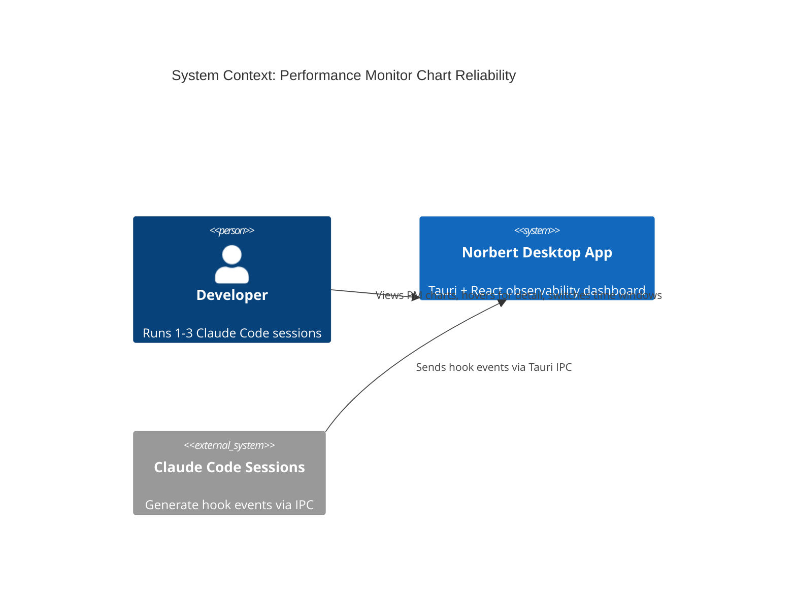
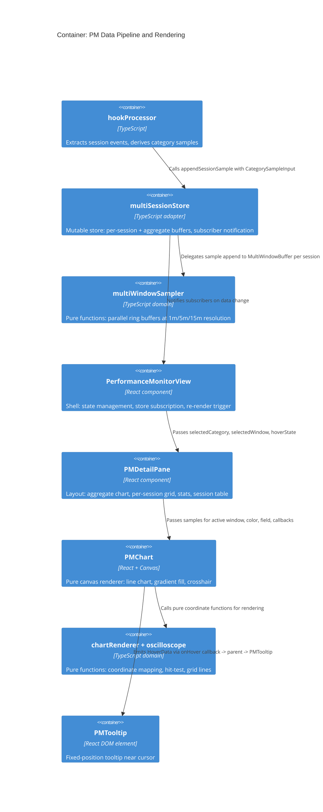
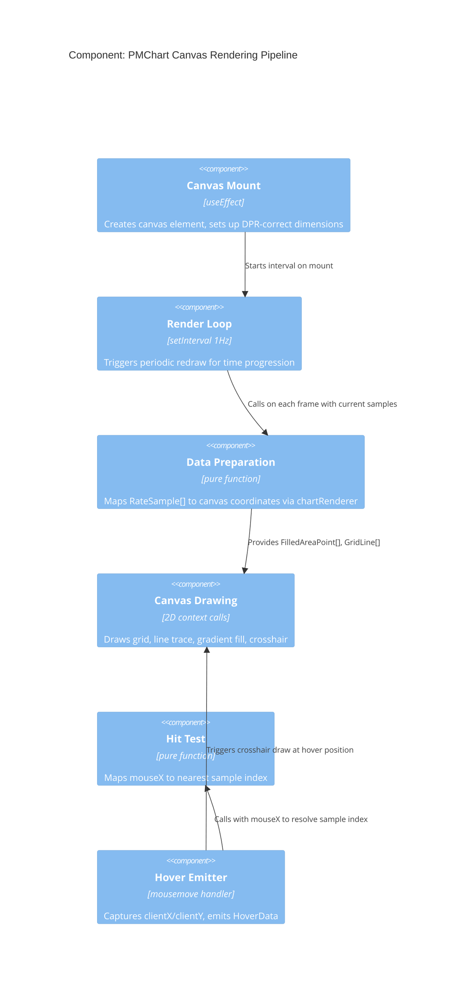

# Architecture Design: pm-chart-reliability

## System Context

Norbert is a local-first Tauri desktop app. The Performance Monitor (PM) is a plugin view within the norbert-usage plugin that renders real-time time-series charts for token consumption, cost, agent count, and context window usage across active Claude Code sessions.

This design fixes three broken capabilities: blank charts, offset tooltips, and non-functional time windows.

## C4 System Context (L1)



## C4 Container (L2)



## C4 Component (L3): PMChart Rendering Pipeline

The PMChart is the most complex subsystem with the most bugs. This L3 diagram shows its internal architecture after the redesign.



## Root Cause Analysis

### Bug 1: Blank Charts

**Evidence from codebase**: PMChart creates a uPlot instance on mount with `scales: { x: { time: false }, y: { range: [0, effectiveYMax] } }`. The `effectiveYMax` is computed from samples at mount time. If samples are empty at mount, `effectiveYMax = yMax ?? 1` (from categoryConfig, e.g., 2000 for tokens). However, `x: { time: false }` means uPlot treats x-axis values as plain numbers. Timestamps divided by 1000 (epoch seconds like 1742515200) create an enormous x-range. uPlot's auto-ranging may produce a scale where all data points compress to a single pixel. The periodic `redraw()` at 1Hz does not call `setScale("x", ...)` to update the x-axis range.

The oscilloscope works because it uses direct canvas rendering with `prepareWaveformPoints` that normalizes x-coordinates by evenly distributing samples across the drawable width, independent of timestamp values.

**Diagnosis**: uPlot's x-scale mismanagement is the primary cause. The chart library is fighting the data model rather than helping.

### Bug 2: Tooltip/Crosshair Offset

**Evidence from codebase**: PMChart correctly captures `clientX/clientY` from mousemove on `plot.over`. PMTooltip uses CSS `position: fixed` with these values. The tooltip positioning itself should be DPI-independent. However, uPlot's internal `cursor.idx` resolution (which data point the cursor maps to) depends on uPlot's internal scale calculations. If the x-scale is wrong (Bug 1), the cursor index is wrong, and the crosshair draws at the wrong position. Additionally, uPlot's built-in crosshair uses `cursor.left` which may be DPI-affected when `pxAlign: 0`.

**Diagnosis**: Crosshair offset is a symptom of Bug 1's x-scale problem, compounded by uPlot's internal DPI handling. Solving the rendering approach solves both.

### Bug 3: Time Windows Unwired

**Evidence from codebase**: `multiSessionStore.ts` uses `DEFAULT_BUFFER_CAPACITY = 60` single buffers per category per session. `multiWindowSampler.ts` exists with complete, tested domain logic but is not imported by `multiSessionStore`. PMDetailPane always passes `aggregateBuffer.samples` regardless of `selectedWindow`.

**Diagnosis**: Integration gap. The domain logic exists; the adapter and view layers need wiring.

## Architecture Decision: Replace uPlot with Canvas Rendering

See ADR-029 for full decision record.

**Summary**: Replace uPlot with direct canvas rendering using the existing proven `chartRenderer.ts` + `oscilloscope.ts` pure functions. The oscilloscope view already demonstrates correct rendering with DPI handling, and the domain layer already contains all needed coordinate computation functions.

**Rationale**:
- uPlot's internal scale management fights the data model (timestamps as x-values with `time: false`)
- uPlot's DPI handling is opaque and causes crosshair offset on Windows
- The existing `chartRenderer.ts` already has `prepareFilledAreaPoints`, `computeHitTest`, `computeCrosshairPosition`, and `prepareHorizontalGridLines`
- The existing `oscilloscope.ts` already has `prepareWaveformPoints`, `computeGridLines`, `computeCanvasDimensions`
- OscilloscopeView demonstrates the canvas pattern works correctly at 10Hz with DPI scaling
- Removing uPlot eliminates a dependency and its associated CSS import

## Component Architecture After Redesign

### Domain Layer (pure, no changes needed)

| Component | Responsibility | Status |
|---|---|---|
| `chartRenderer.ts` | Coordinate mapping, hit-test, crosshair, grid lines | Exists, extend for PM-specific needs |
| `oscilloscope.ts` | Waveform point preparation, canvas dimensions | Exists, reuse as-is |
| `multiWindowSampler.ts` | Multi-resolution ring buffers (1m/5m/15m) | Exists, complete and tested |
| `timeSeriesSampler.ts` | Ring buffer core operations | Exists, reuse as-is |
| `categoryConfig.ts` | Category metadata, formatting | Exists, reuse as-is |

### Adapter Layer (wire multiWindowSampler)

| Component | Change | Responsibility |
|---|---|---|
| `multiSessionStore.ts` | MODIFY | Integrate MultiWindowBuffer per session + per aggregate. Expose `getWindowBuffer(sessionId, categoryId, windowId)` and `getAggregateWindowBuffer(categoryId, windowId)` |

### View Layer (replace uPlot with canvas)

| Component | Change | Responsibility |
|---|---|---|
| `PMChart.tsx` | REWRITE | Canvas-based renderer using `chartRenderer` + `oscilloscope` domain functions. DPI-correct via explicit `devicePixelRatio` scaling (same pattern as OscilloscopeView) |
| `PMDetailPane.tsx` | MODIFY | Select buffer by `selectedWindow` instead of always using single buffer. Pass window-specific samples to PMChart |
| `PMTooltip.tsx` | MINOR MODIFY | Pass `window.innerWidth` as containerWidth for edge-flip accuracy |
| `PerformanceMonitorView.tsx` | NO CHANGE | Shell already manages all needed state |

### Removed Dependencies

| Component | Action |
|---|---|
| `uplot` npm package | REMOVE from dependencies |
| `uplot/dist/uPlot.min.css` | REMOVE import |

## Data Flow After Redesign

```
hookProcessor.appendSessionSample(sessionId, categorySamples)
  -> multiSessionStore.appendSessionSample()
    -> for each category:
      -> appendMultiWindowSample(sessionMultiWindowBuffer, rateSample)
         (appends to 1m/5m/15m buffers based on interval)
      -> recomputeAggregateMultiWindowBuffer()
    -> notifySubscribers()

PerformanceMonitorView receives subscriber notification
  -> setRenderTick (force re-render)
  -> PMDetailPane receives (selectedCategory, selectedWindow)
    -> multiSessionStore.getAggregateWindowBuffer(categoryId, windowId)
    -> passes samples to PMChart

PMChart receives samples
  -> prepareFilledAreaPoints(samples, dimensions, yMax)
  -> computeGridLines(dimensions, windowDuration, gridInterval)
  -> draws on canvas: grid, line trace, gradient fill
  -> on mousemove: computeHitTest(mouseX) -> emits HoverData with clientX/clientY
  -> parent sets hoverState -> PMTooltip renders at fixed position
```

## Quality Attribute Strategies

### Correctness (Priority 1)
- Canvas rendering with explicit coordinate computation (no library black box)
- All coordinate functions are pure and unit-testable
- DPI handled at one place: canvas setup (same as working OscilloscopeView)
- Hit-test is a pure function of (mouseX, canvasWidth, bufferLength)

### Responsiveness (Priority 2)
- 1Hz redraw interval (same as current PMChart timer)
- Canvas drawing is O(n) where n = buffer length (max 900 points)
- ResizeObserver for container-responsive canvas sizing
- Tooltip uses CSS fixed positioning (no canvas re-render needed)

### Maintainability (Priority 3)
- Pure domain functions testable without React or canvas
- Single rendering pattern (canvas) across oscilloscope and PM charts
- No uPlot internals to debug
- multiWindowSampler is already tested; wiring is the only new integration

## Integration Patterns

### Store -> View (subscriber pattern, existing)
`multiSessionStore.subscribe(() => void)` triggers React re-render via `setRenderTick`. No change needed.

### View -> Domain (pure function calls, existing)
PMChart calls `prepareFilledAreaPoints`, `computeHitTest`, etc. directly. No async, no side effects.

### Hover -> Tooltip (callback + state lift, existing)
PMChart emits `HoverData` via `onHover` callback. Parent lifts to `hoverState`. PMTooltip renders from `hoverState`. No change to flow; canvas implementation replaces uPlot cursor hook.

## Deployment Architecture

No deployment changes. This is a frontend-only change within the existing Tauri webview. No Rust backend changes. No IPC changes. No database changes.

## Rejected Simpler Alternatives

### Alternative 1: Fix uPlot configuration
- **What**: Correct the x-scale configuration, add proper DPI handling, debug cursor offset
- **Expected impact**: Could fix 80% of blank chart issue
- **Why insufficient**: uPlot's DPI handling on Windows with Tauri webview is opaque. Multiple prior attempts to fix cursor offset have failed (documented in US-PMR-02). The library's internal coordinate system fights the data model. Debugging is time-consuming with low confidence of resolution. Each new uPlot version may regress fixes.

### Alternative 2: Switch to a different charting library (e.g., Chart.js, Recharts)
- **What**: Replace uPlot with another library that handles DPI and scales better
- **Expected impact**: 70% -- new library may have its own DPI/Tauri quirks
- **Why insufficient**: Introduces a new dependency with unknown Tauri webview compatibility. The existing canvas rendering pattern in OscilloscopeView is proven. Adding a library to replace a library when the non-library approach already works is unnecessary complexity.

### Why canvas rendering is necessary
1. Simple alternatives (fix config) have been attempted and failed (multiple prior fix attempts)
2. The canvas approach is already proven in the same codebase (OscilloscopeView)
3. Domain functions for coordinate computation already exist (`chartRenderer.ts`)
4. Removes a dependency rather than adding one
