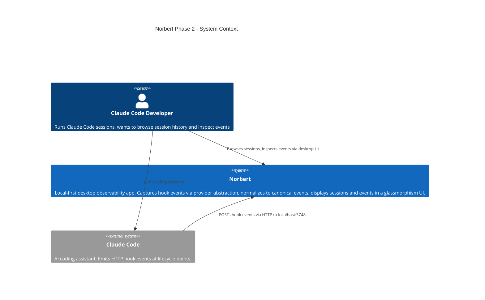
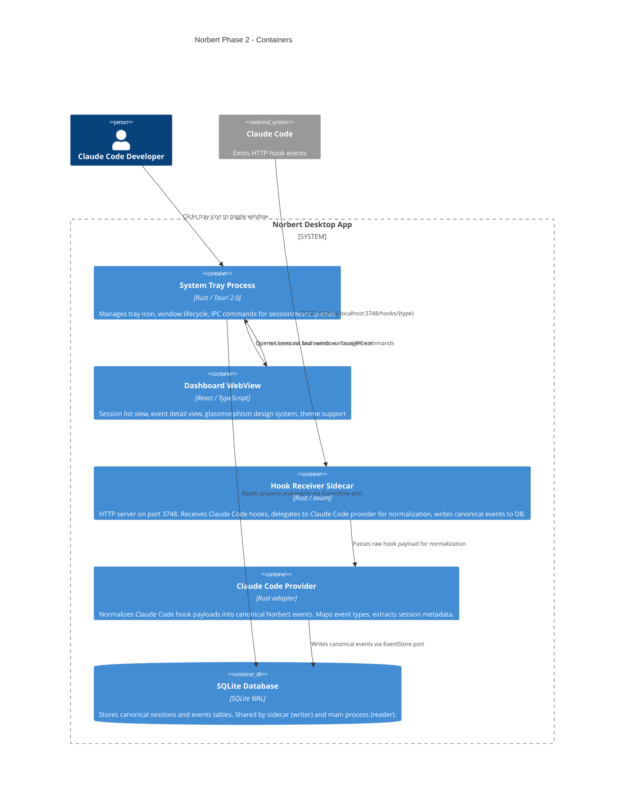
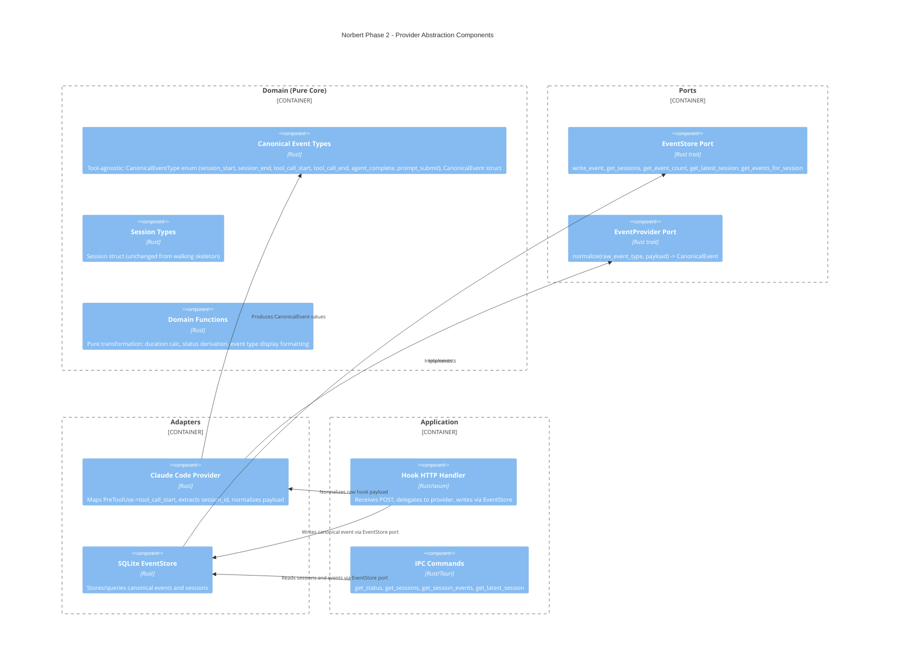

# Session Event Viewer Architecture

**Feature ID**: session-event-viewer
**Status**: Proposed
**Date**: 2026-03-12

---

## System Context and Capabilities

Phase 2 transforms Norbert from a walking skeleton into a useful product. Users see sessions listed with metadata, drill into event details, and experience the glassmorphism design system. Event ingestion gains a provider abstraction layer so canonical (tool-agnostic) events flow through all layers above the adapter.

### Phase 2 Scope

| Story | Responsibility |
|-------|---------------|
| US-SEV-001 | Session list view with timestamp, duration, event count, live/completed status |
| US-SEV-002 | Event detail view with chronological events, type labels, payload snippets |
| US-SEV-003 | Design system application: glassmorphism, fonts, all 5 themes with theme switching |

### Quality Attribute Priorities (Phase 2)

| Priority | Attribute | Rationale |
|----------|-----------|-----------|
| 1 | **Time-to-market** | Solo developer, Phase 2 is the "becoming real" moment |
| 2 | **Testability** | FP paradigm, pure core, effect shell |
| 3 | **Maintainability** | Provider abstraction, ports-and-adapters |

---

## C4 System Context (L1)



---

## C4 Container (L2)



---

## C4 Component (L3) -- Provider Abstraction and Data Flow

The provider abstraction is the significant new component. This diagram shows internal boundaries.



---

## Component Architecture

### Architectural Style

**Modular monolith with dependency inversion (ports-and-adapters)**. Continues ADR-001. Phase 2 adds:
- Provider port and Claude Code adapter (new port + adapter pair)
- Canonical event types in domain (replaces Claude Code-specific types)
- Extended EventStore port (new `get_events_for_session` method)
- New IPC commands for frontend queries
- React frontend views with design system

### Module Boundaries (Updated for Phase 2)

| Module | Responsibility | Depends On |
|--------|---------------|------------|
| **domain** | Canonical event types, session types, pure transformation functions | Nothing |
| **ports** | EventStore trait (extended), EventProvider trait (new) | domain |
| **adapters/db** | SQLite EventStore implementation, extended with event query | domain, ports |
| **adapters/providers/claude_code** | Claude Code provider: normalizes hook payloads to canonical events | domain, ports |
| **hook-receiver** | HTTP sidecar: receives hooks, uses provider, writes via EventStore | domain, ports, adapters |
| **app** | Tauri lifecycle, IPC commands (get_sessions, get_session_events) | domain, ports, adapters |
| **ui** | React views: session list, event detail, design system | Tauri IPC only |

### Dependency Direction (Updated)

```
ui --> [Tauri IPC] --> app --> ports <-- adapters (db, providers/claude_code)
                        |        ^
                        |        |
                        |      domain (canonical types, pure functions)
                        |
                        +--[Sidecar]--> hook-receiver --> ports, domain, adapters/providers
```

### Data Flow (Updated with Provider)

```
Claude Code
    |
    | HTTP POST /hooks/{PascalCase event type}
    v
Hook Receiver Sidecar (port 3748)
    |
    | Raw event type name + JSON payload
    v
Claude Code Provider (adapter)
    |
    | Normalizes: PascalCase -> canonical event type
    | Extracts: session_id, tool name, relevant payload fields
    | Produces: CanonicalEvent value
    v
EventStore (port, implemented by SQLite adapter)
    |
    | INSERT canonical event into events table
    | UPSERT session record
    v
SQLite (WAL mode, shared by both processes)
    |
    | Tauri IPC: get_sessions, get_session_events
    v
React UI (session list, event detail views)
```

---

## Technology Stack

No new dependencies required. Phase 2 uses the existing stack from ADR-002.

| Component | Technology | Version | License | Change from WS |
|-----------|-----------|---------|---------|----------------|
| Desktop shell | Tauri | 2.x | MIT/Apache-2.0 | No change |
| Backend | Rust | stable | MIT/Apache-2.0 | No change |
| Frontend | React | 18.x | MIT | No change |
| Frontend lang | TypeScript | 5.x | Apache-2.0 | No change |
| Build | Vite | 5.x | MIT | No change |
| Database | SQLite | 3.x | Public Domain | No change |
| HTTP server | axum | 0.7 | MIT | No change |
| Fonts | Google Fonts (Rajdhani, Share Tech Mono) | N/A | OFL 1.1 | **New** -- loaded via CSS |

No new Rust crates, no new npm packages for Phase 2. Fonts are loaded via Google Fonts CDN link in the HTML head (OFL 1.1 license, free for all use).

---

## Integration Patterns

### Frontend to Backend (Tauri IPC) -- Extended

| Command | Input | Output | New? |
|---------|-------|--------|------|
| `get_status` | none | AppStatus | Existing |
| `get_latest_session` | none | Session or null | Existing |
| `get_sessions` | none | Session[] ordered by started_at DESC | **New** |
| `get_session_events` | session_id: string | CanonicalEvent[] ordered by received_at ASC | **New** |

`get_sessions` already exists in the EventStore port but has no IPC command wrapper. Phase 2 exposes it.

`get_session_events` requires both a new EventStore method and a new IPC command.

### Hook Receiver to Provider (In-process)

The hook receiver calls the Claude Code provider synchronously during request handling. The provider is a pure function (no IO): it maps event type names and extracts fields from the payload. No async, no network calls.

---

## Data Model

### Canonical Event Type Mapping

The domain's EventType enum is replaced by a canonical CanonicalEventType. The Claude Code-specific names exist only inside the Claude Code provider adapter.

| Canonical Type | Display Label | Source (Claude Code) |
|---|---|---|
| session_start | SESSION_START | SessionStart |
| session_end | SESSION_END | Stop |
| tool_call_start | TOOL_CALL_START | PreToolUse |
| tool_call_end | TOOL_CALL_END | PostToolUse |
| agent_complete | AGENT_COMPLETE | SubagentStop |
| prompt_submit | PROMPT_SUBMIT | UserPromptSubmit |

### Events Table (unchanged schema, new content)

The `event_type` column now stores canonical snake_case names (`session_start`, `tool_call_start`) instead of Claude Code names (`session_start`, `pre_tool_use`). The column type is TEXT, so no schema migration needed.

### Sessions Table (unchanged)

No schema changes. Session aggregation logic unchanged.

### New Query: Events for Session

```sql
SELECT id, session_id, event_type, payload, received_at
FROM events
WHERE session_id = ?
ORDER BY received_at ASC
```

Uses existing `idx_events_session_id` index.

---

## Frontend Architecture

### View Structure

```
App
 +-- SessionListView (default view, selectedSessionId = null)
 |    +-- SessionRow (repeated, one per session)
 |    +-- EmptyState (when no sessions)
 |
 +-- EventDetailView (when selectedSessionId != null)
 |    +-- SessionHeader (metadata: timestamp, duration, count, status)
 |    +-- BackNavigation ("< Back to Sessions")
 |    +-- EventRow (repeated, one per event)
 |    +-- EmptyEventState (when no events)
 |
 +-- StatusBar (always visible, existing status data)
```

### Navigation Model

Simple state-driven: `selectedSessionId: string | null`.
- `null` -> render SessionListView
- non-null -> render EventDetailView for that session

No router needed. No URL-based navigation. Just React state.

### Design System Integration

CSS custom properties from `norbert-mockup-v5.html` are extracted into a stylesheet. Phase 2 ships with all 5 themes from the mockup (Norbert, Claude Dark, VS Code Dark, Claude Light, VS Code Light) and a theme switching mechanism. Theme selection persisted to localStorage.

Key patterns to apply:
- `.srow` -> session row card styling (glassmorphism border, hover state)
- `.sdot` -> status dot (`.live` pulsing green, `.done` dim)
- `.sname` -> session name (monospace, ellipsis overflow)
- `.statusbar` -> bottom status bar
- Font loading: Rajdhani (UI labels) + Share Tech Mono (data values)
- Color scheme: `--brand`, `--text-p`, `--text-s`, `--text-m`, `--bg-card`, `--border-card`

### Polling Strategy

Reuse existing 1-second polling interval. Both `get_sessions` and `get_session_events` (when in detail view) poll at this interval. Simple and consistent with walking skeleton.

---

## Quality Attribute Strategies

### Time-to-market

- Reuse all existing infrastructure (EventStore, IPC, polling, domain functions)
- Only one new EventStore method needed
- Only one new IPC command needed
- Design system is CSS extraction from an existing mockup -- no design work
- Provider abstraction is a trait + one implementation -- minimal overhead

### Testability

- Provider normalization is a pure function: input (event type name, payload) -> output (canonical event)
- Domain functions remain pure
- EventStore extended with one new method, testable with existing in-memory stub
- Frontend views testable via IPC mocks (same pattern as walking skeleton)

### Maintainability

- Provider abstraction enforces the "no Claude Code above adapter" rule at compile time
- Canonical types mean all code above the adapter is provider-agnostic
- Module boundaries unchanged (new adapter fits existing structure)
- Future providers implement the same trait, no core changes needed

---

## Risks and Mitigations

| Risk | Probability | Impact | Mitigation |
|------|------------|--------|------------|
| Provider refactoring breaks existing walking skeleton tests | Medium | Medium | Walking skeleton tests use HookEvent directly; refactor to CanonicalEvent in same step |
| Design system CSS extraction is more complex than expected | Low | Low | Mockup CSS is well-structured with custom properties; extract variables only |
| Event query performance with large sessions (100+ events) | Low | Low | Phase 2 targets < 100 sessions, < 1000 events per session; idx_events_session_id handles this |
| Frontend state management for navigation becomes complex | Low | Low | Simple null/non-null pattern; no router, no deep navigation |

---

## What Is NOT In Scope (Phase 2 Boundaries)

- Event filtering, search, or sorting controls
- Event payload expansion (click to see full JSON)
- Plugin architecture or plugin API
- Cost tracking display (shown in mockup but not in Phase 2 stories)
- Session name derivation from first prompt (deferred -- show session ID)
- Provider registry or dynamic provider loading
- Pagination for large session lists
