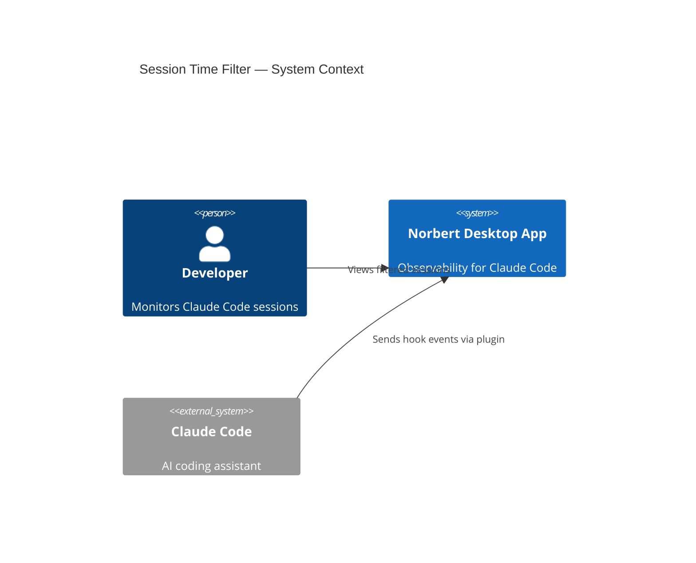
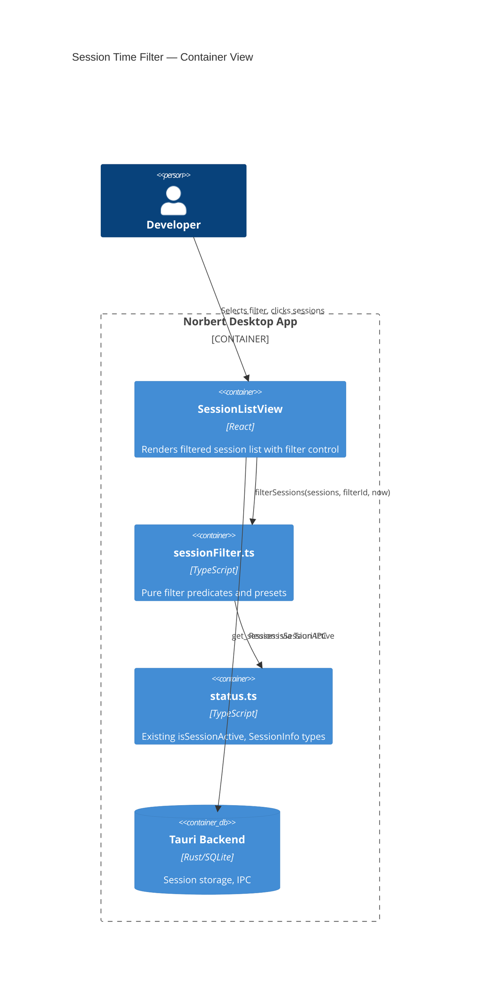
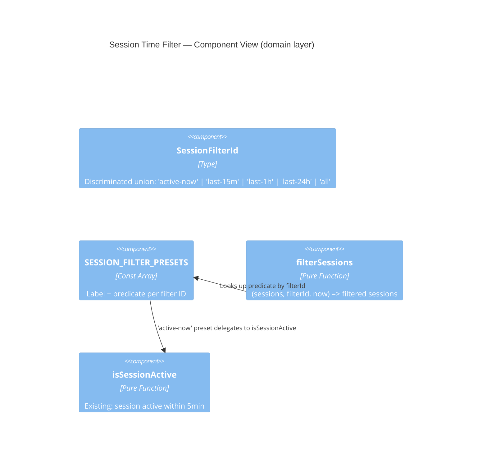

# Architecture Design: Session Time Filter

## Business Drivers

- **J1 (score 14)**: Focus on active sessions without scanning noise
- **J2 (score 12)**: Scope to recent time windows after breaks
- **J3 (score 5)**: Session count reflects the active filter

## Quality Attributes

| Attribute | Priority | Rationale |
|-----------|----------|-----------|
| Testability | High | Pure filter functions, no DOM coupling |
| Maintainability | High | Adding new filter options should require only a config entry |
| Time-to-market | High | Small feature, no backend changes |

## Architecture Decision

**Client-side pure filter function** composed with existing `SessionListView`.

No new components, services, or backend changes. The entire feature is:
1. A discriminated union type for filter IDs
2. A const array of filter presets (id, label, predicate)
3. A pure `filterSessions` function
4. React `useState` in `SessionListView` for the selected filter
5. A filter control rendered in the existing `sec-hdr` area

This follows the existing codebase pattern: pure domain logic in `src/domain/`, thin view components that delegate to domain functions.

## C4 System Context



## C4 Container



## C4 Component



## Integration Points

| Component | Change | Rationale |
|-----------|--------|-----------|
| `src/domain/sessionFilter.ts` | **New** | Pure filter types, presets, and `filterSessions` function |
| `src/views/SessionListView.tsx` | **Modified** | Add `useState` for filter, render filter control in header, apply filter before rendering rows |
| `src/domain/status.ts` | **None** | Reuse `isSessionActive` and `SessionInfo` as-is |
| Tauri backend | **None** | No backend changes (NFR-2) |

## Data Flow

```
App.tsx polls get_sessions → sessions prop → SessionListView
                                                  ↓
                                        useState(selectedFilter)
                                                  ↓
                                    filterSessions(sessions, selectedFilter, Date.now())
                                                  ↓
                                          filteredSessions
                                                  ↓
                                    ┌─────────────┴──────────────┐
                                    ↓                            ↓
                          Header: "N sessions"          SessionRow[] (mapped)
                                                    or empty state message
```

## Filter Preset Design

Each preset is a record with an id, label, and predicate function:

```
type SessionFilterId = 'active-now' | 'last-15m' | 'last-1h' | 'last-24h' | 'all'

type SessionFilterPreset = {
  id: SessionFilterId
  label: string
  predicate: (session: SessionInfo, now: number) => boolean
}
```

The `filterSessions` function looks up the preset by id and applies the predicate. The "all" preset always returns true.

Time window presets check: `session.last_event_at !== null && (now - parseTime(session.last_event_at)) < windowMs`. Active sessions are always included in time window filters (they have recent activity by definition).

## Development Paradigm

Already set to **functional programming** in CLAUDE.md. This feature aligns naturally: pure predicates, const data, no mutation.
