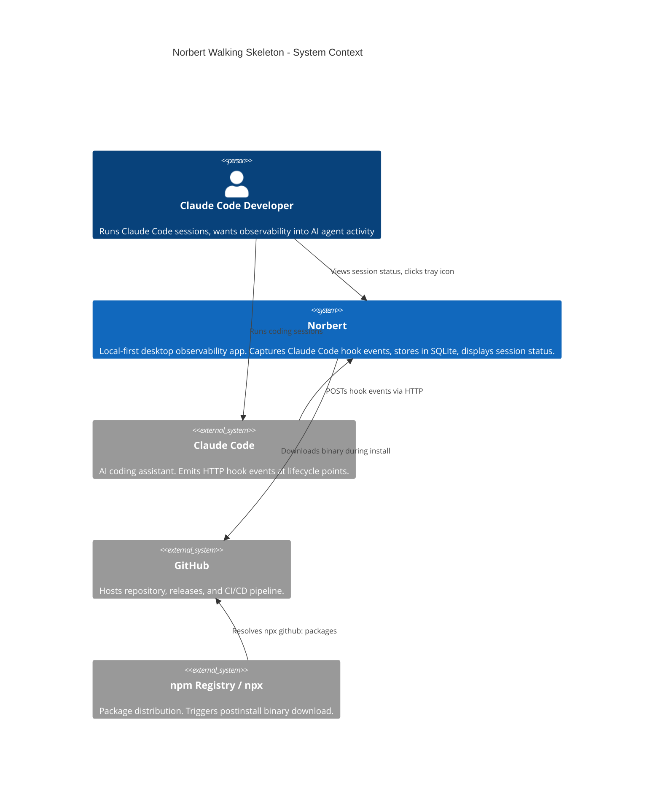
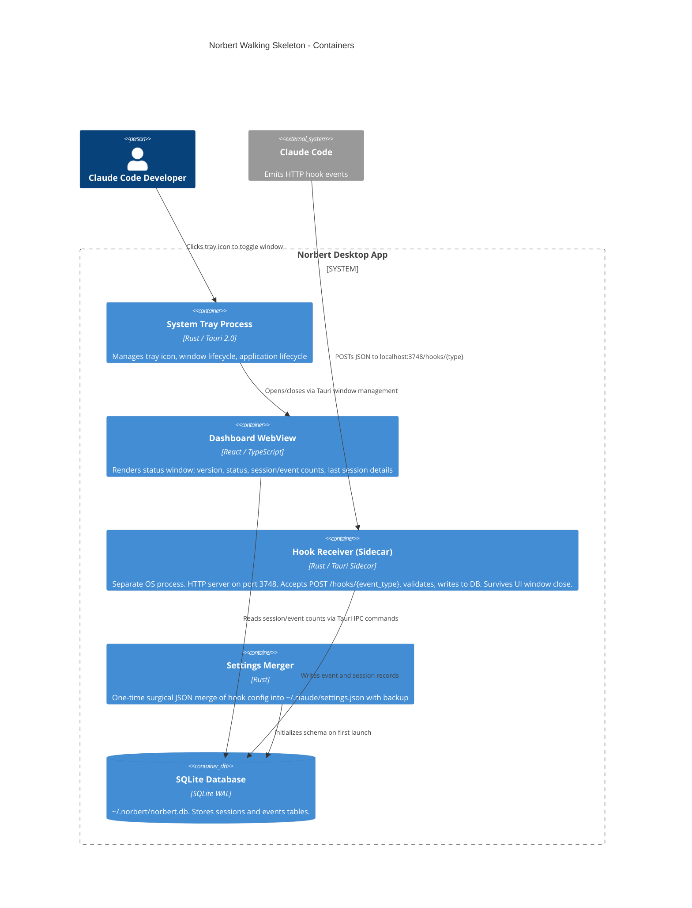

# Walking Skeleton Architecture

**Feature ID**: walking-skeleton
**Status**: Proposed
**Date**: 2026-03-08

---

## System Context and Capabilities

Norbert is a local-first observability desktop app for Claude Code. The walking skeleton proves the thinnest possible end-to-end data path: Claude Code emits HTTP hook events, Norbert receives and stores them in SQLite, and a desktop UI displays session records.

### Walking Skeleton Scope

| Story | Responsibility |
|-------|---------------|
| US-WS-000 | CI/CD: GitHub Actions builds Tauri binary, npx install works |
| US-WS-001 | App Shell: Tauri window, system tray icon, status display |
| US-WS-002 | Data Pipeline: Settings merge, HTTP hook server, SQLite init |
| US-WS-003 | End-to-End: Real session data visible in UI |

### Quality Attribute Priorities

| Priority | Attribute | Rationale |
|----------|-----------|-----------|
| 1 | **Reliability** | No silent data loss. Every received event persists. |
| 2 | **Usability** | Zero-config install. Immediate feedback. |
| 3 | **Maintainability** | Walking skeleton must support future plugin architecture without rewrite. |
| 4 | **Performance** | Handle 100+ events/second during multi-agent bursts. |
| 5 | **Installability** | Single command, under 30 seconds, under 15MB. |

---

## C4 System Context (L1)



---

## C4 Container (L2)



---

## C4 Component (L3) -- Tauri Backend

The system has two process boundaries: the Tauri main process (tray, window, IPC) and the sidecar process (HTTP hook receiver). Both share the SQLite database.

```mermaid
C4Component
    title Norbert Walking Skeleton - Component Diagram

    Container_Boundary(tauri_main, "Tauri Main Process (Rust)") {
        Component(app_lifecycle, "App Lifecycle", "Rust", "Startup sequence: init DB, merge settings, spawn sidecar, show tray icon")
        Component(tray_mgr, "Tray Manager", "Tauri Tray API", "Creates system tray icon, handles click events, manages tooltip text")
        Component(window_mgr, "Window Manager", "Tauri Window API", "Creates/toggles main window, prevents app exit on window close")
        Component(settings_merge, "Settings Merger", "Rust JSON", "Reads ~/.claude/settings.json, backs up, merges hook entries, writes back")
        Component(db_init, "Database Initializer", "Rust SQLite", "Creates ~/.norbert/norbert.db, sets WAL+NORMAL pragmas, creates schema")
        Component(ipc_queries, "IPC Query Handler", "Tauri Commands", "Handles frontend queries: get_status, get_sessions, get_event_count")
    }

    Container_Boundary(sidecar, "Hook Receiver Sidecar (Rust)") {
        Component(hook_receiver, "Hook Receiver", "Rust HTTP Server (axum)", "Binds 127.0.0.1:3748, routes POST /hooks/{type}, validates payload, returns 200")
        Component(event_writer, "Event Writer", "Rust", "Receives validated hook payload, writes to events table, upserts session record")
    }

    Rel(app_lifecycle, db_init, "Initializes on startup")
    Rel(app_lifecycle, settings_merge, "Runs on first launch")
    Rel(app_lifecycle, sidecar, "Spawns sidecar process via Tauri sidecar API")
    Rel(app_lifecycle, tray_mgr, "Creates tray icon")
    Rel(tray_mgr, window_mgr, "Delegates window toggle on click")
    Rel(hook_receiver, event_writer, "Passes validated event payload")
```

---

## Component Architecture

### Architectural Style

**Modular monolith with dependency inversion (ports-and-adapters)**. See ADR-001.

The walking skeleton is a Tauri application with a sidecar process for the HTTP hook receiver. The sidecar runs as a separate OS process (bundled via Tauri's sidecar feature), ensuring hook events are captured even when the UI window is closed. Both processes share the SQLite database (WAL mode enables concurrent readers and writers). Dependencies point inward: domain logic depends on abstractions, not on SQLite or HTTP specifics.

### Module Boundaries

| Module | Responsibility | Depends On |
|--------|---------------|------------|
| **core** | Domain types: HookEvent, Session, EventType. Pure data transformation. | Nothing |
| **ports** | Trait definitions: EventStore, SettingsManager, HookReceiver | core |
| **hook-receiver** | Sidecar process. HTTP server adapter. Accepts POST, validates, delegates to EventStore | core, ports |
| **db** | SQLite adapter implementing EventStore. WAL mode, schema init. | core, ports |
| **settings** | Settings merge adapter implementing SettingsManager | core, ports |
| **app** | Tauri lifecycle, tray, window management, IPC commands, sidecar spawn | core, ports, adapters |
| **ui** | React frontend. Status display, event counts, session details. | Tauri IPC only |

### Dependency Direction

```
ui --> [Tauri IPC] --> app --> ports <-- adapters (db, settings)
                        |        ^
                        |        |
                        |      core (domain types)
                        |
                        +--[Tauri Sidecar API]--> hook-receiver --> ports, core
```

All adapters depend on ports (traits). Ports depend on core types. The app module composes adapters with ports at startup and spawns the hook-receiver sidecar. The sidecar is a separate Rust binary that shares the same core/ports/db crates. The UI communicates only through Tauri IPC commands -- never directly to SQLite or the sidecar.

### Data Flow

```
Claude Code
    |
    | HTTP POST /hooks/{event_type}
    v
Hook Receiver Sidecar (port 3748, separate OS process)
    |
    | Validates payload, extracts event type
    v
Event Writer (EventStore trait)
    |
    | INSERT into events table
    | UPSERT session record
    v
SQLite (WAL mode) <-- shared by both processes
    |
    | Tauri IPC command: get_status (main process reads)
    v
React UI (displays counts, session details)
```

---

## Technology Stack

All choices are OSS. See ADR-002 for detailed rationale.

| Component | Technology | Version | License | Rationale |
|-----------|-----------|---------|---------|-----------|
| Desktop shell | Tauri | 2.x | MIT/Apache-2.0 | Native tray, small binary, WebView2 on Win11 |
| Backend language | Rust | stable | MIT/Apache-2.0 | Tauri requirement, memory safety, concurrency |
| Frontend framework | React | 18.x | MIT | Product spec requirement, rich ecosystem |
| Frontend language | TypeScript | 5.x | Apache-2.0 | Type safety for frontend |
| Build tool | Vite | 5.x | MIT | Fast dev server, Tauri integration |
| Database | SQLite | 3.x | Public Domain | Local-first, WAL mode, zero infrastructure |
| Rust SQLite binding | rusqlite | latest | MIT | Mature, well-maintained SQLite wrapper |
| Rust HTTP server | axum | latest | MIT | Lightweight, async, Tokio-based. Runs in sidecar process. |
| CI/CD | GitHub Actions | N/A | N/A | Free for public repos, Tauri action available |
| Tauri build action | tauri-apps/tauri-action | latest | MIT | Official Tauri CI/CD action |
| Package manager | npm/npx | N/A | N/A | Target audience has Node.js installed |

---

## Integration Patterns

### Claude Code to Norbert (Hook Events)

- **Pattern**: Async HTTP POST (fire-and-forget from Claude Code's perspective)
- **Endpoint**: `POST http://localhost:3748/hooks/{event_type}`
- **Payload**: JSON body from Claude Code hook system
- **Response**: HTTP 200 (after event persisted to SQLite)
- **Event types**: PreToolUse, PostToolUse, SubagentStop, Stop, SessionStart, UserPromptSubmit
- **Registration**: `async: true` in settings.json hook entries

### Frontend to Backend (Tauri IPC)

- **Pattern**: Tauri invoke commands (synchronous request/response over IPC)
- **Commands**:
  - `get_status` -> { status, port, session_count, event_count }
  - `get_latest_session` -> { session_id, started_at, duration, event_count } | null
- **Event push**: Tauri emit events from backend to frontend for real-time UI updates when new events arrive

### Settings Merge (One-time)

- **Pattern**: Read-backup-merge-write with validation
- **Source**: `~/.claude/settings.json`
- **Backup**: `~/.norbert/settings.json.bak`
- **Merge strategy**: Deep merge. Add `hooks` key entries. Preserve all existing keys.
- **Error handling**: Malformed JSON -> skip merge, warn user. Missing file -> create new.

---

## Data Model

### sessions table

| Column | Type | Description |
|--------|------|-------------|
| id | TEXT PRIMARY KEY | Session ID from Claude Code |
| started_at | TEXT (ISO 8601) | Timestamp of SessionStart event |
| ended_at | TEXT (ISO 8601) NULL | Timestamp of Stop event |
| event_count | INTEGER | Running count, incremented per event |

### events table

| Column | Type | Description |
|--------|------|-------------|
| id | INTEGER PRIMARY KEY AUTOINCREMENT | Local event ID |
| session_id | TEXT NOT NULL | FK to sessions.id |
| event_type | TEXT NOT NULL | PreToolUse, PostToolUse, etc. |
| payload | TEXT NOT NULL | Raw JSON payload from Claude Code |
| received_at | TEXT (ISO 8601) | Timestamp when Norbert received the event |

### Indexes

- `idx_events_session_id` on events(session_id)
- `idx_events_received_at` on events(received_at)

### Pragmas

```sql
PRAGMA journal_mode=WAL;
PRAGMA synchronous=NORMAL;
```

---

## Shared Artifact Constants

These values must be single constants, never hardcoded in multiple places.

| Artifact | Value | Consumers |
|----------|-------|-----------|
| `HOOK_PORT` | 3748 | HTTP server bind, settings.json URLs, UI display |
| `DB_PATH` | `~/.norbert/norbert.db` | DB init, event writer, IPC queries |
| `DATA_DIR` | `~/.norbert/` | DB path, settings backup, binary location |
| `SETTINGS_PATH` | `~/.claude/settings.json` | Settings merger |
| `BACKUP_PATH` | `~/.norbert/settings.json.bak` | Settings merger |
| `HOOK_EVENT_TYPES` | [PreToolUse, PostToolUse, SubagentStop, Stop, SessionStart, UserPromptSubmit] | Settings merger, HTTP routes |

---

## Deployment Architecture

### Build Pipeline

```
Developer pushes v{x.y.z} tag
    |
    v
GitHub Actions (tauri-apps/tauri-action)
    |
    | Builds Windows x64 binary
    v
GitHub Release (norbert-v{x.y.z}-win32-x64.tar.gz)
    |
    v
User: npx github:pmvanev/norbert-cc
    |
    | postinstall detects win32-x64
    | Downloads binary from GitHub Release
    | Extracts to ~/.norbert/bin/
    v
User: norbert-cc
    |
    | First launch: init DB, merge settings, spawn sidecar, show tray
    v
Running Norbert (system tray + sidecar HTTP server + SQLite)
```

### File System Layout

```
~/.norbert/
    bin/
        norbert-cc.exe          # Tauri main binary
        norbert-hook-server.exe # Sidecar binary (HTTP hook receiver)
    norbert.db                  # SQLite database (WAL mode)
    norbert.db-wal              # WAL file
    norbert.db-shm              # Shared memory file
    settings.json.bak           # Backup of original settings.json

~/.claude/
    settings.json               # Merged with Norbert hook entries
```

---

## Quality Attribute Strategies

### Reliability (No Silent Data Loss)

- Hook receiver runs as sidecar process -- survives UI window close, captures events continuously
- Event persisted to SQLite BEFORE HTTP 200 response
- WAL mode enables concurrent reads (main process) during writes (sidecar)
- Database survives app restarts (SQLite durability)
- Settings backup before any modification

### Usability (Zero-Config)

- Single install command: `npx github:pmvanev/norbert-cc`
- Auto-merge settings on first launch
- Tray icon provides ambient awareness
- Clear empty state ("Waiting for first Claude Code session...")
- Restart notification after settings merge

### Maintainability (Future Plugin Architecture)

- Ports-and-adapters: adapters replaceable without core changes
- IPC command layer: frontend decoupled from backend internals
- Module boundaries match future plugin extraction points
- Data model extensible (payload column stores full JSON)

### Performance (Event Throughput)

- SQLite WAL handles thousands of writes/second
- HTTP server async (Tokio runtime)
- Events processed independently (no ordering dependency between event types)
- UI updates via event push, not polling

### Installability

- Tauri binary under 15MB (vs 150MB+ Electron)
- postinstall handles platform detection invisibly
- No Docker, no separate services, no configuration

### Security (Local-First Posture)

- HTTP server binds to `127.0.0.1` ONLY -- no remote access, no network exposure
- No authentication on hook endpoint (unnecessary: localhost-only, Claude Code is the only client)
- No outbound network connections (walking skeleton scope)
- SQLite file inherits user's filesystem permissions -- no world-readable
- Settings backup stored in user-owned `~/.norbert/` directory
- No secrets stored (Admin API key integration deferred to later phases)
- Settings merge never sends user configuration data anywhere

---

## Paradigm

**Functional-leaning for both Rust and TypeScript.** See ADR-004.

- **Rust backend**: Idiomatic Rust with traits (ports), Result types for error handling, immutable data by default, pure functions for data transformation. Ownership system naturally enforces effect boundaries.
- **TypeScript frontend**: React functional components with hooks. Pure transformation functions for data formatting. Effects isolated to Tauri IPC calls.
- **Domain**: Event processing is naturally functional -- events are immutable values flowing through a transformation pipeline.

This is not dogmatic FP. Rust's ownership model and TypeScript's React hooks are already functional-adjacent. The recommendation is to lean into that natural fit rather than fight it with class hierarchies.

---

## Risks and Mitigations

| Risk | Probability | Impact | Mitigation |
|------|------------|--------|------------|
| Tauri 2.0 system tray API instability on Windows | Low | High | Tauri 2.0 stable; tray well-supported on Win11 |
| Settings merge corrupts user config | Low | Critical | Backup-first pattern; parse-validate-merge; byte-identical backup |
| Port 3748 conflict | Medium | Medium | Detect and report clearly; future: configurable port |
| WebView2 availability | Very Low | High | Ships with Windows 11 |
| SQLite concurrent write contention | Low | Medium | WAL mode handles this; event volume modest |

---

## Walking Skeleton Boundaries (What Is NOT In Scope)

- Plugin architecture (Phase 3)
- Plugin loader, NorbertAPI, layout engine
- Rich visualizations (graphs, charts, constellation)
- Cost tracking, token counting
- Agent diagrams, session replay
- MCP server
- Config drift detection
- Auto-launch on boot
- macOS/Linux support
- Code signing
- Configurable port
- Theme system
